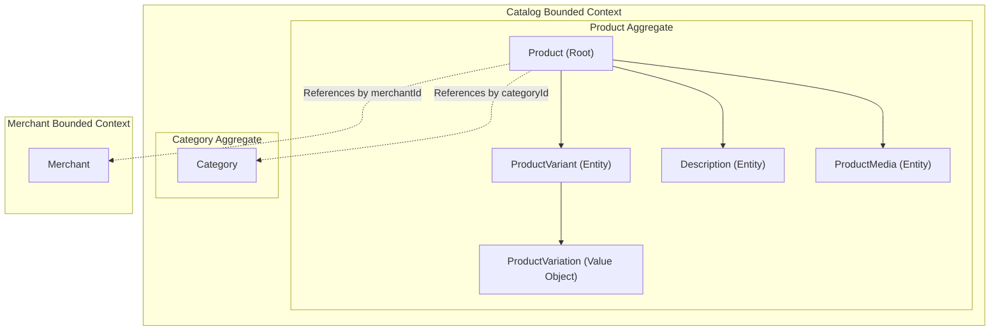
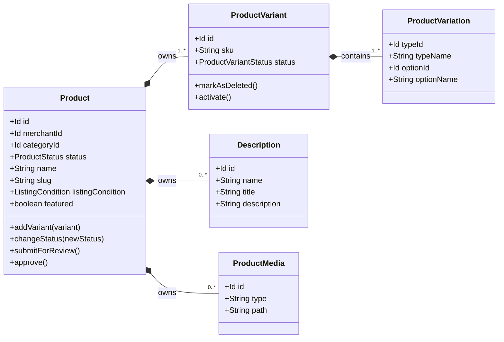
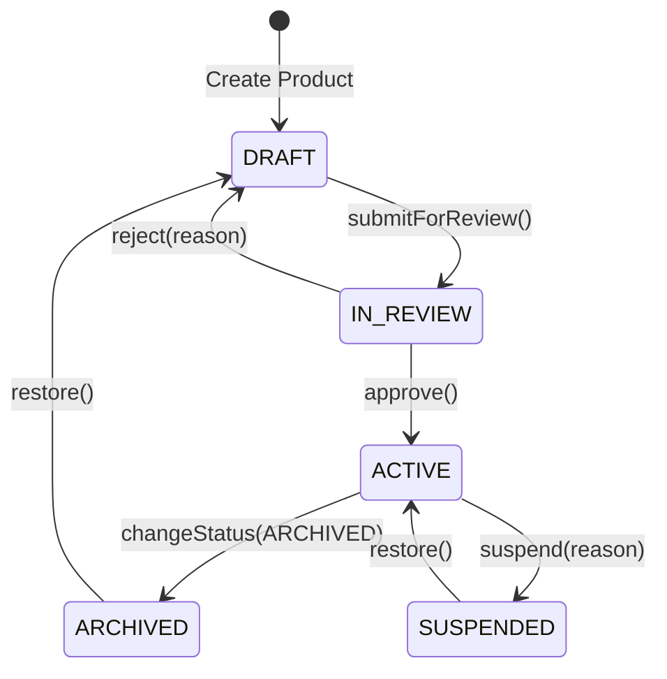

# Domain Specification: Catalog Product

> **Bounded Context:** Catalog  
> **Primary Purpose:** Manages the lifecycle, variants, descriptions, and storefront visibility of sellable products.  
> **Module Root:** `catalog-domain` / `catalog-infrastructure` / `store/catalog`  
> **Related Workflows:** [Create Sellable Product](../../workflows/create-sellable-product-workflow-spec.md), [Update Sellable Product](../../workflows/update-sellable-product-workflow-spec.md), [Update Product Variant](../../workflows/update-product-variant-workflow-spec.md)

---

## 1. Boundary & Context Map

### Ownership

- **This aggregate OWNS:** Product core details, variants, descriptions, media, and product lifecycle status (draft, active, archived).
- **This aggregate DOES NOT OWN:** Variant types/options definition (Variant Reference Model), pricing details, inventory levels, category structures.

### Context Map

---

## 2. Ubiquitous Language

| Business Term | Domain Concept | Business Definition |
| :--- | :--- | :--- |
| **Product** | `Product` (Aggregate Root) | The parent entity grouping a cohesive set of sellable variations, containing common descriptions and media. |
| **Variant** | `ProductVariant` (Entity) | A specific, purchasable iteration of a product identified by a unique SKU and a set of variations (e.g., Color: Red, Size: S). |
| **Variation** | `ProductVariation` (Value Object) | A key-value pair specifying a single dimension of a variant (e.g., Color = Red). |
| **Standalone Product** | Business Concept | A product with no explicit variants provided by the merchant; the system auto-materializes a single default variant behind the scenes. |
| **Slug** | `slug` (Property) | An SEO-friendly, human-readable URL identifier generated from the product name. |
| **Active Listing** | `ProductStatus.ACTIVE` | A product that is visible on the storefront and available for search, discovery, and purchase. |

---

## 3. Domain Aggregate Model

### Model Diagram

### Property & Attribute Rationale

| Property | Type | Belongs To | Business Rationale |
| :--- | :--- | :--- | :--- |
| `id` | `Id` | Root | Unique aggregate identity across the platform. |
| `merchantId` | `Id` | Root | Associates the product with its merchant owner for multi-tenant isolation. |
| `categoryId` | `Id` | Root | Links the product to a category for browsing and filtering. |
| `status` | `ProductStatus` | Root | Controls lifecycle visibility (e.g., only ACTIVE products appear on storefronts). |
| `name` | `String` | Root | Primary product identity displayed to customers. |
| `slug` | `String` | Root | SEO-friendly URL identifier, auto-generated from name. |
| `featured` | `boolean` | Root | Marks products for curated storefront promotion (e.g., homepage highlights). |
| `listingCondition`| Enum | Root | Captures product condition (`NEW`, `USED`, `REFURBISHED`) for buyer expectations. |
| `sku` | `String` | Variant | Unique stock-keeping unit required for inventory tracking and fulfillment per variant. |

---

## 4. Business Invariants & Rules

| Rule ID | Invariant Rule | Violation Outcome | Enforced By |
| :--- | :--- | :--- | :--- |
| **INV-01** | A product must always possess at least one variant. | Automatically materializes a default synthetic variant upon creation if omitted. | `SaveProductCommandHandler` / Aggregate |
| **INV-02** | Variant SKU must be unique across all active variants in the catalog. | Operation rejected with duplicate SKU error. | `UniqueSkuSpec` |
| **INV-03** | Each variant within a product must have a unique combination of variations. | Operation rejected with duplicate combination error. | `UniqueProductVariantSpec` |
| **INV-04** | A product cannot transition to `ACTIVE` directly from `DRAFT` without review (if moderation is enabled). | State transition rejected. | `Product.changeStatus()` |

---

## 5. State Lifecycle & Transitions

### State Machine

### Transition Matrix

| Current State | Trigger / Event | Next State | Guard Condition / Prerequisite |
| :--- | :--- | :--- | :--- |
| `DRAFT` | `submitForReview()` | `IN_REVIEW` | All required properties and at least one variant must exist. |
| `IN_REVIEW` | `approve()` | `ACTIVE` | Moderation approval. |
| `ACTIVE` | `changeStatus(ARCHIVED)` | `ARCHIVED` | None (merchant action). |
| `ACTIVE` | `suspend(reason)` | `SUSPENDED` | Admin/Moderator action only. |
| `SUSPENDED` | `restore()` | `ACTIVE` | Suspension reason resolved. |

---

## 6. Domain Events

### Emitted Events (What Happened)

| Event Name | Trigger | Key Attributes | Target Consumers |
| :--- | :--- | :--- | :--- |
| `SellableProductProductCreatedEvent` | Aggregate creation | `productId`, `merchantId` | Orchestrated Workflows (e.g. Create Sellable Product) |
| `ProductStatusChangedEvent` | State transition | `productId`, `oldStatus`, `newStatus` | Search Indexers, Workflows |
| `ProductVariantAddedEvent` | New variant synced | `productId`, `variantId`, `sku` | Pricing, Inventory sync pipelines |
