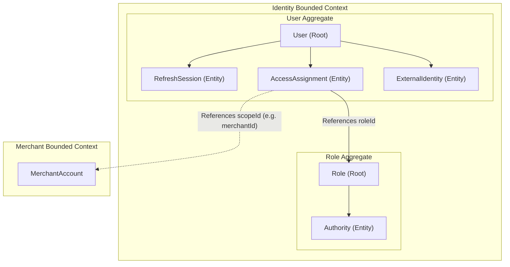
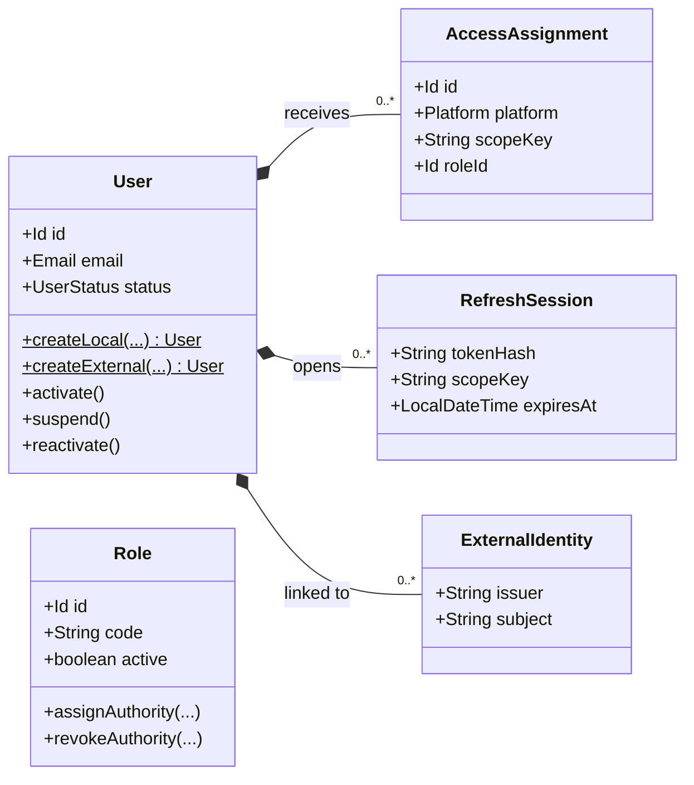
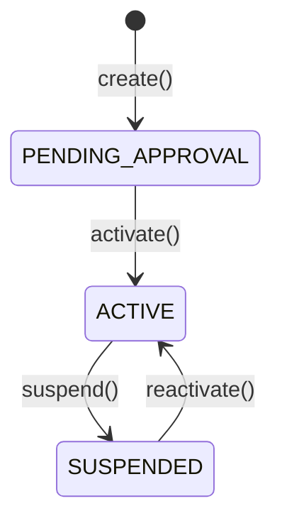

# Domain Specification: Identity & Access

> **Bounded Context:** Identity  
> **Primary Purpose:** Manages platform-wide users, credentials, role-based access assignments, platform scopes, and token sessions.  
> **Module Root:** `identity-domain` / `identity-infrastructure` / `store/identity`  

---

## 1. Boundary & Context Map

### Ownership

- **This aggregate OWNS:** `User` profiles (email, local credentials), `Role` and `Authority` definitions, `AccessAssignment` (Platform Scope + Role), `ExternalIdentity` linking (OAuth2/OIDC), and token `RefreshSession`.
- **This aggregate DOES NOT OWN:** Merchant business data, storefront logic, catalog items, or order lifecycles. It only holds stable scope identifiers (like `merchantId` or `storefrontId`) as opaque strings.

### Context Map

---

## 2. Ubiquitous Language

| Business Term | Domain Concept | Business Definition |
| :--- | :--- | :--- |
| **User** | `User` (Aggregate Root) | A human actor or system account interacting with the platform. |
| **Role** | `Role` (Aggregate Root) | A named collection of authorities (e.g., `CATALOG_MANAGER`). |
| **Authority** | `Authority` | A specific granular permission (e.g., `PRODUCT_WRITE`). |
| **Platform** | `Platform` | High-level application surfaces: `CUSTOMER_APP`, `SELLER_PORTAL`, `ADMIN_CONSOLE`. |
| **Access Assignment** | `AccessAssignment` | Binds a User to a Role within a specific Platform and Resource Scope (e.g., SELLER_PORTAL for Merchant A). |
| **Context-Bound Session** | `RefreshSession` | An active token session tied explicitly to a selected scope, ensuring actions are authorized for that specific business resource. |
| **External Identity** | `ExternalIdentity` | Links a local `User` to a stable provider key `(issuer, subject)` from Keycloak/Auth0/Cognito. |

---

## 3. Domain Aggregate Model

### Model Diagram

### Property & Attribute Rationale

| Property | Type | Belongs To | Business Rationale |
| :--- | :--- | :--- | :--- |
| `email` | `Email` | User | Unique identifier for communication and local login. |
| `status` | `UserStatus` | User | Determines global login capability (`ACTIVE`, `SUSPENDED`). |
| `scopeKey` | `String` | AccessAssignment | Combines type and resource (e.g. `merchant.account:UUID`). Opaque to Identity, meaningful to target contexts. |
| `platform` | `Platform` | AccessAssignment | Restricts a role to a specific application surface. |
| `tokenHash` | `String` | RefreshSession | Hashed refresh token to detect compromise and allow targeted session revocation. |

---

## 4. Business Invariants & Rules

| Rule ID | Invariant Rule | Violation Outcome | Enforced By |
| :--- | :--- | :--- | :--- |
| **INV-01** | Suspended users cannot authenticate, obtain new tokens, or use existing refresh sessions. | Access Denied / 401. | `PlatformIdentityResolver` / Token Issuer |
| **INV-02** | A caller must explicitly select a scope context if their identity possesses multiple scopes for a platform. | Selection token issued instead of active access token. | Auth API / Session Selection |
| **INV-03** | `ExternalIdentity` pairs `(issuer, subject)` must be globally unique. | DB constraint violation. | Unique DB Constraint |
| **INV-04** | Target business modules MUST trust the `scopeKey` derived from the `SecurityPrincipal` and ignore caller-provided IDs in the payload/URL. | Bypassing authorization checks. | Module `SecurityPrincipal` evaluation |

---

## 5. State Lifecycle & Transitions

### State Machine (User)

### Transition Matrix (User)

| Current State | Trigger / Event | Next State | Guard Condition / Prerequisite |
| :--- | :--- | :--- | :--- |
| `PENDING_APPROVAL` | `activate()` | `ACTIVE` | Email verification or admin approval (depending on platform policy). |
| `ACTIVE` | `suspend()` | `SUSPENDED` | Admin action; revokes all active refresh sessions. |

---

## 6. Domain Events

### Emitted Events (What Happened)

| Event Name | Trigger | Key Attributes | Target Consumers |
| :--- | :--- | :--- | :--- |
| `UserCreatedEvent` | `createLocal()` / `createExternal()` | `userId`, `email` | Communications (Welcome Email) |
| `UserSuspendedEvent` | `suspend()` | `userId` | Audit Logs |
| `AccessAssignmentGrantedEvent` | Role assigned | `userId`, `scopeKey`, `roleId` | Notifications |
| `AccessAssignmentRevokedEvent` | Role revoked | `userId`, `scopeKey`, `roleId` | Session Revocation Workers |

### Consumed Events (Cross-Domain Signals)

| Consumed Event | Source Bounded Context | Reaction |
| :--- | :--- | :--- |
| `MerchantApprovedEvent` | Merchant | Identity provisions an `AccessAssignment` linking the applicant `userId` to the newly approved `merchantId` with an `OWNER` role. |
