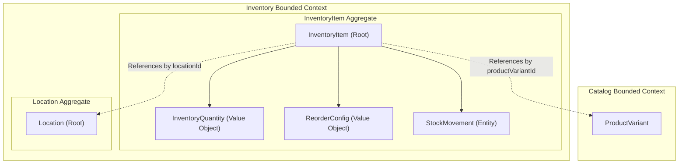
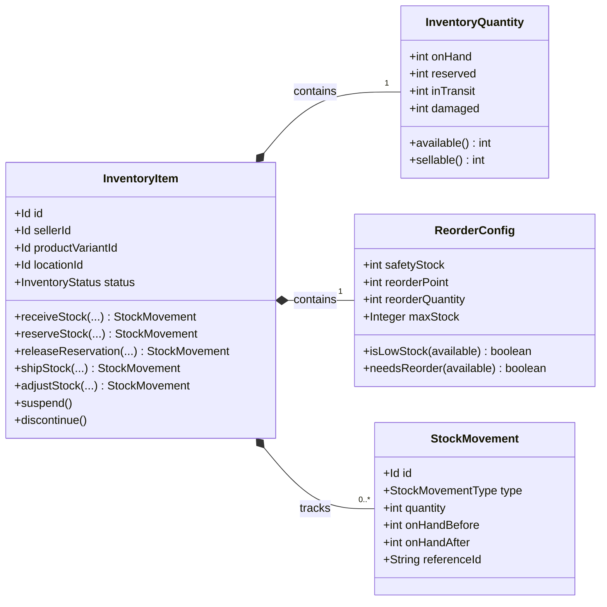
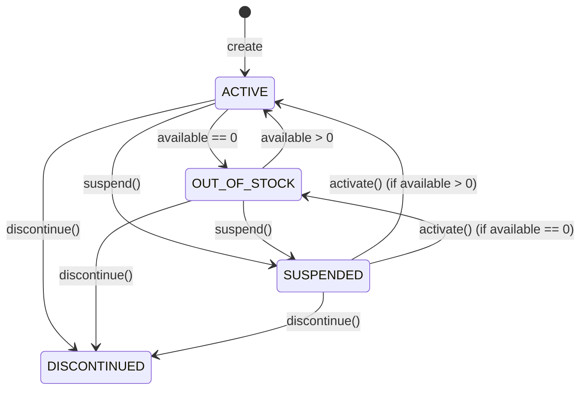

# Domain Specification: Inventory Item

> **Bounded Context:** Inventory  
> **Primary Purpose:** Manages product stock levels, multi-dimensional quantities (on-hand, reserved, in-transit, damaged), and reorder logic per location.  
> **Module Root:** `inventory-domain` / `inventory-infrastructure` / `store/inventory`  
> **Related Workflows:** [Create Sellable Product](../../workflows/create-sellable-product-workflow-spec.md)

---

## 1. Boundary & Context Map

### Ownership

- **This aggregate OWNS:** Inventory quantities across all dimensions, reorder configurations, inventory lifecycle status, and the append-only stock movement audit trail.
- **This aggregate DOES NOT OWN:** Physical locations, bins, catalog products, or orders.

### Context Map

---

## 2. Ubiquitous Language

| Business Term | Domain Concept | Business Definition |
| :--- | :--- | :--- |
| **Inventory Item** | `InventoryItem` (Aggregate Root) | The central record tracking stock for a specific product variant at a specific location. |
| **Stock Movement** | `StockMovement` (Entity) | An immutable, append-only audit record detailing exactly how quantities changed (before/after) during an operation. |
| **On Hand** | `onHand` (Quantity) | The physical count of items currently residing at the location. |
| **Available** | `available()` | `onHand - reserved - damaged`. The true quantity that can be promised to new orders. |
| **Reserved** | `reserved` (Quantity) | Stock allocated to customer orders but not yet shipped. |
| **Reorder Point** | `reorderPoint` | The threshold of available stock that triggers a replenishment request. |

---

## 3. Domain Aggregate Model

### Model Diagram

### Property & Attribute Rationale

| Property | Type | Belongs To | Business Rationale |
| :--- | :--- | :--- | :--- |
| `sellerId` | `Id` | Root | Enforces multi-tenant ownership and ensures sellers only see their own inventory. |
| `productVariantId` | `Id` | Root | Links stock to the specific catalog variant being sold. |
| `locationId` | `Id` | Root | Identifies which physical or logical warehouse holds this stock. |
| `status` | `InventoryStatus` | Root | Controls whether operations (like reserving stock) are permitted. |
| `available` | `int` | Quantity | Prevents overselling by subtracting reserves and damages from physical stock. |
| `referenceId` | `String` | Movement | Links the movement to the external business action (Order ID, PO Number). |

---

## 4. Business Invariants & Rules

| Rule ID | Invariant Rule | Violation Outcome | Enforced By |
| :--- | :--- | :--- | :--- |
| **INV-01** | Stock dimensions (onHand, reserved, damaged, inTransit) can never be negative. | Operation rejected. | `InventoryQuantity` |
| **INV-02** | Cannot reserve more stock than is currently `available`. | Operation rejected; `InsufficientStockException`. | `InventoryQuantity.reserve()` |
| **INV-03** | Operations (receive, reserve, ship) are blocked if item is `SUSPENDED` or `DISCONTINUED`. | Operation rejected. | `InventoryItem` |
| **INV-04** | Every quantity mutation must produce a corresponding `StockMovement` capturing exact before/after states. | Enforced by domain design; mutations return `StockMovement`. | `InventoryItem` methods |

---

## 5. State Lifecycle & Transitions

### State Machine

### Transition Matrix

| Current State | Trigger / Event | Next State | Guard Condition / Prerequisite |
| :--- | :--- | :--- | :--- |
| `ACTIVE` | Stock mutation | `OUT_OF_STOCK` | `available` drops to exactly 0. |
| `OUT_OF_STOCK` | Stock mutation | `ACTIVE` | `available` becomes > 0 (e.g., via `receiveStock`). |
| `ACTIVE / OOS` | `suspend()` | `SUSPENDED` | Manual action; halts selling operations without deleting. |
| `Any` | `discontinue()` | `DISCONTINUED` | Permanently retires the item. |

---

## 6. Domain Events

### Emitted Events (What Happened)

| Event Name | Trigger | Key Attributes | Target Consumers |
| :--- | :--- | :--- | :--- |
| `InventoryItemCreatedEvent` | Initial creation | `inventoryItemId`, `locationId` | Data Warehouse |
| `InventoryStockLevelChangedEvent` | Any mutation | `inventoryItemId`, `newAvailable`, `newOnHand` | Storefront Indexing, Reorder Engine |
| `InventoryItemDiscontinuedEvent` | Discontinued | `inventoryItemId` | Catalog Sync |
