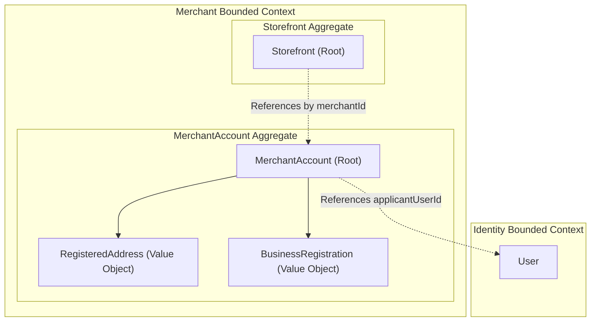
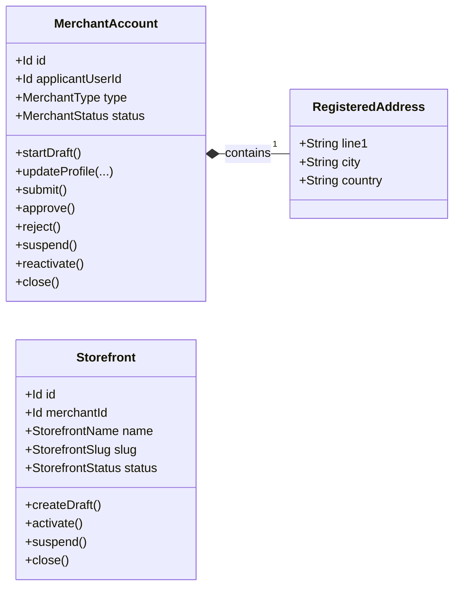
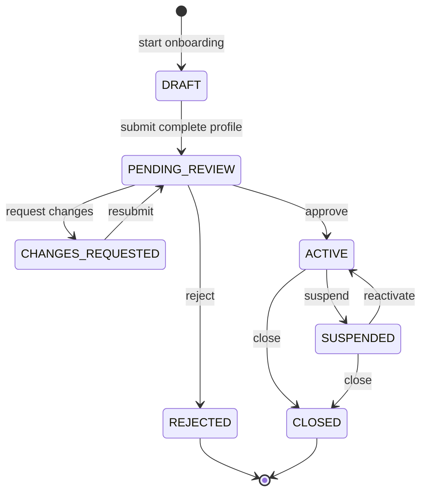

# Domain Specification: Merchant

> **Bounded Context:** Merchant  
> **Primary Purpose:** Manages merchant business onboarding, identity governance, storefront branding, and seller lifecycle statuses.  
> **Module Root:** `merchant-domain` / `merchant-infrastructure` / `store/merchant`  

---

## 1. Boundary & Context Map

### Ownership

- **This aggregate OWNS:** The `MerchantAccount` (business registration, contact info, status) and the `Storefront` (branded customer-facing presence). 
- **This aggregate DOES NOT OWN:** `User` accounts or authentication (Identity), Products/Listings (Catalog), or Physical fulfillment centers (Inventory).

### Context Map

---

## 2. Ubiquitous Language

| Business Term | Domain Concept | Business Definition |
| :--- | :--- | :--- |
| **Merchant Account** | `MerchantAccount` (Aggregate Root) | The business entity/profile representing a seller on the platform. Acts as the primary authorization scope. |
| **Storefront** | `Storefront` (Aggregate Root) | A branded, customer-facing sales presence owned by one MerchantAccount. Can be suspended independently of the merchant. |
| **Applicant** | `applicantUserId` | The Identity user who originally initiated the merchant onboarding process. |
| **Business Registration** | `BusinessRegistration` (VO) | Immutable government/tax identity details (e.g. tax ID, company registration number). |
| **Draft Onboarding** | `MerchantStatus.DRAFT` | A merchant profile that is actively being filled out by the applicant but not yet submitted for review. |

---

## 3. Domain Aggregate Model

### Model Diagram

### Property & Attribute Rationale

| Property | Type | Belongs To | Business Rationale |
| :--- | :--- | :--- | :--- |
| `applicantUserId` | `Id` | MerchantAccount | Links the business account back to the physical person who created it. Identity manages actual access control. |
| `type` | `MerchantType` | MerchantAccount | Differentiates between Retailer, Third-Party, or Consumer sellers for distinct business rules. |
| `status` | `MerchantStatus` | MerchantAccount | Enforces onboarding review cycles (Draft -> Review -> Active). |
| `merchantId` | `Id` | Storefront | A Storefront must belong to a MerchantAccount (cross-aggregate ID reference). |
| `slug` | `String` | Storefront | SEO-friendly URL path for the storefront. |

---

## 4. Business Invariants & Rules

| Rule ID | Invariant Rule | Violation Outcome | Enforced By |
| :--- | :--- | :--- | :--- |
| **INV-01** | A Storefront cannot be activated if the owning MerchantAccount is not `ACTIVE`. | Activation rejected. | Application Service |
| **INV-02** | A MerchantAccount cannot be submitted for review unless all mandatory profile fields (registration, address, contact) are complete. | State transition rejected. | `MerchantAccount.submit()` |
| **INV-03** | Only one active merchant application is allowed per Identity User at a time. | Registration rejected. | Domain Policy / Unique Constraint |
| **INV-04** | A Storefront slug must be globally unique across all storefronts. | Update rejected. | `UniqueStorefrontSlugSpec` |

---

## 5. State Lifecycle & Transitions

### State Machine (MerchantAccount)

### Transition Matrix (MerchantAccount)

| Current State | Trigger / Event | Next State | Guard Condition / Prerequisite |
| :--- | :--- | :--- | :--- |
| `DRAFT` | `submit()` | `PENDING_REVIEW` | All required registration fields must be populated. |
| `PENDING_REVIEW` | `approve()` | `ACTIVE` | Executed by admin/moderator only. |
| `ACTIVE` | `suspend()` | `SUSPENDED` | Must provide a lifecycle reason. Disables storefront and listings. |

---

## 6. Domain Events

### Emitted Events (What Happened)

| Event Name | Trigger | Key Attributes | Target Consumers |
| :--- | :--- | :--- | :--- |
| `MerchantOnboardingSubmittedEvent` | `submit()` | `merchantId` | Backoffice review queues |
| `MerchantApprovedEvent` | `approve()` | `merchantId` | Workflows (e.g., auto-provision Storefront, grant Identity roles) |
| `MerchantSuspendedEvent` | `suspend()` | `merchantId` | Catalog (suspend products), Identity (revoke sessions) |
