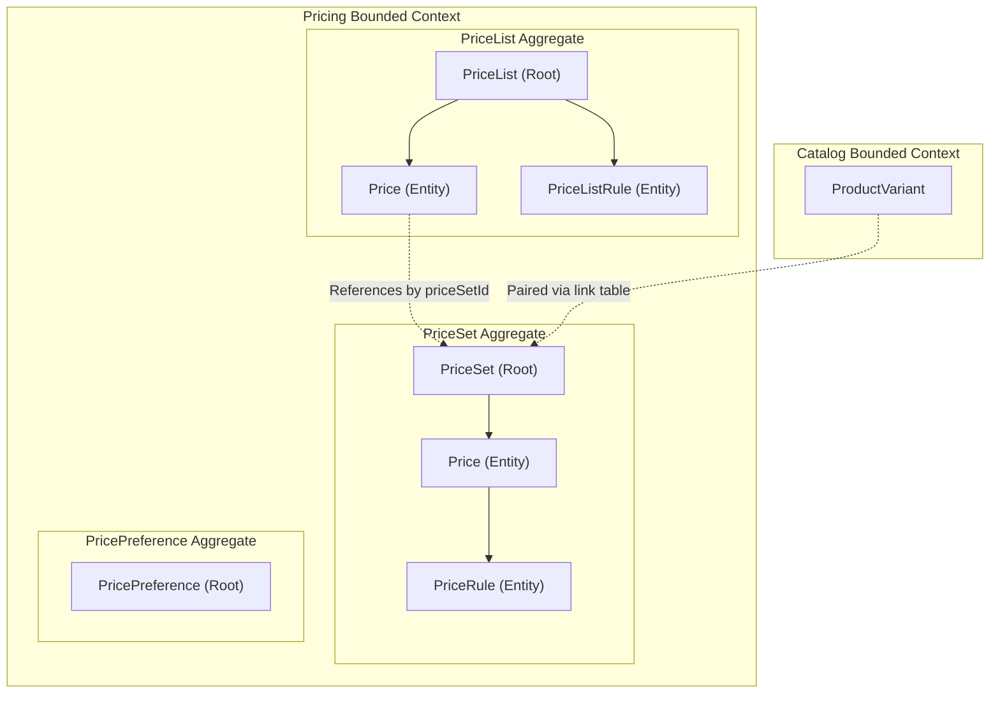
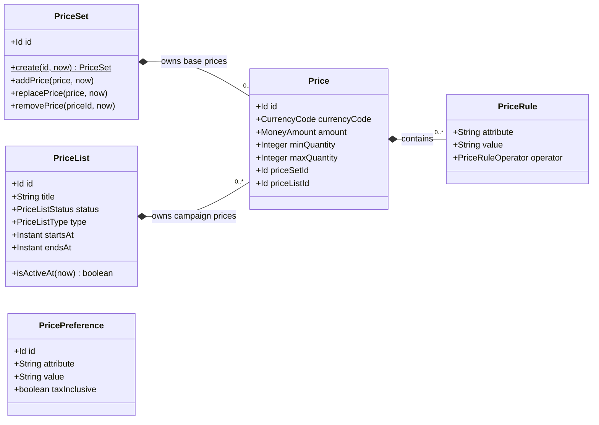
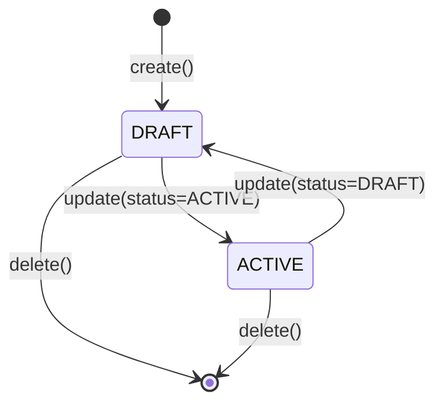

# Domain Specification: Pricing

> **Bounded Context:** Pricing  
> **Primary Purpose:** Entity-agnostic pricing engine managing base prices, volume tiers, campaign overrides, and runtime price calculation contexts.  
> **Module Root:** `pricing-domain` / `pricing-infrastructure` / `store/pricing`  
> **Related Workflows:** [Create Sellable Product](../../workflows/create-sellable-product-workflow-spec.md)

---

## 1. Boundary & Context Map

### Ownership

- **This aggregate OWNS:** Base prices (`PriceSet`), promotional campaigns (`PriceList`), tax inclusivity (`PricePreference`), and the calculation policy synthesizing base vs. sale overrides.
- **This aggregate DOES NOT OWN:** Products, variants, shipping methods, or merchants. Pricing is completely entity-agnostic.

### Context Map

---

## 2. Ubiquitous Language

| Business Term | Domain Concept | Business Definition |
| :--- | :--- | :--- |
| **Price Set** | `PriceSet` (Aggregate Root) | An opaque container of candidate base prices for one priced thing (e.g., a variant). |
| **Base Price** | `Price` | The default, non-promotional amount owned by a `PriceSet` (`priceListId` is null). |
| **Campaign Price** | `Price` | A promotional amount owned by a `PriceList` that overrides or discounts a target `PriceSet`. |
| **Price List** | `PriceList` (Aggregate Root) | A promotional campaign grouping with a type (SALE or OVERRIDE), a time window, and target rules. |
| **Pricing Context** | `PricingContext` (VO) | The runtime parameters (currency, region, group, quantity) used to evaluate price rules and synthesize the final price. |
| **Calculated Price** | `CalculatePricesPolicy` Result | The final amount to charge the customer after all rules and campaigns are ranked and applied. |
| **Original Price** | `CalculatePricesPolicy` Result | The non-sale reference price used for strikethrough display (`~100~ 80`). |

---

## 3. Domain Aggregate Model

### Model Diagram

### Property & Attribute Rationale

| Property | Type | Belongs To | Business Rationale |
| :--- | :--- | :--- | :--- |
| `currencyCode` | `CurrencyCode` | Price | Prices are strictly currency-specific; no auto-conversion occurs in the domain. |
| `amount` | `MoneyAmount` | Price | The monetary value to charge or promote. |
| `minQuantity` | `Integer` | Price | Supports tiered pricing (e.g., "$10 each when buying 5+"). |
| `priceSetId` | `Id` | Price | Associates a campaign price to its target base price set. |
| `type` | `PriceListType` | PriceList | Dictates calculation strategy (`SALE` = min(sale, base), `OVERRIDE` = replace base). |
| `startsAt`/`endsAt` | `Instant` | PriceList | Defines the time window during which the campaign is active. |

---

## 4. Business Invariants & Rules

| Rule ID | Invariant Rule | Violation Outcome | Enforced By |
| :--- | :--- | :--- | :--- |
| **INV-01** | Price amount must be non-negative. | Operation rejected. | `MoneyAmount` |
| **INV-02** | Base prices must belong to a set and cannot specify a `priceListId`. | Domain error. | `Price.createBase()` |
| **INV-03** | Campaign prices must belong to a list and MUST reference a target `priceSetId`. | Domain error. | `Price.createCampaign()` |
| **INV-04** | For volume tiers, `minQuantity` must be ≤ `maxQuantity` if both are set. | Update rejected. | `Price.replaceDetails()` |
| **INV-05** | Only `ACTIVE` price lists whose `startsAt`/`endsAt` window contains the current time are evaluated. | Campaign ignored during calculation. | `CalculatePricesPolicy` |

---

## 5. State Lifecycle & Transitions

### State Machine (PriceList)

### Transition Matrix (PriceList)

| Current State | Trigger / Event | Next State | Guard Condition / Prerequisite |
| :--- | :--- | :--- | :--- |
| `DRAFT` | `update(status=ACTIVE)` | `ACTIVE` | List acts on calculations only when within the time window. |
| `ACTIVE` | `update(status=DRAFT)` | `DRAFT` | Temporarily suspends the campaign from all runtime calculations. |

---

## 6. Domain Events

### Emitted Events (What Happened)

| Event Name | Trigger | Key Attributes | Target Consumers |
| :--- | :--- | :--- | :--- |
| `PriceSetCreatedEvent` | Initial creation | `priceSetId` | Pricing Search / Downstream |
| `PriceSetPricesChangedEvent` | Base prices modified | `priceSetId` | Storefront Indexing, Workflows |
| `PriceListStatusChangedEvent` | Campaign state change | `priceListId`, `status` | Campaign monitoring |

### Consumed Events (Cross-Domain Signals)

*Note: Pricing does not directly listen to domain events for lifecycle management. Pricing links are managed by the application via synchronous commands (e.g., Workflow orchestrators creating Price Sets for new Variants).*
