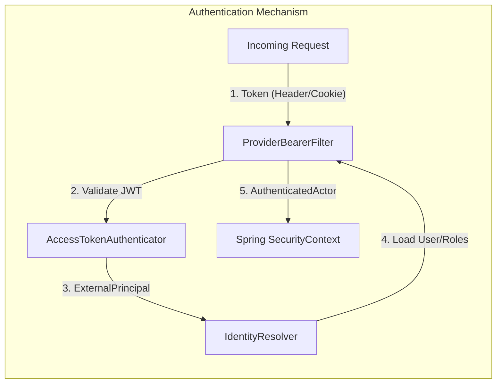
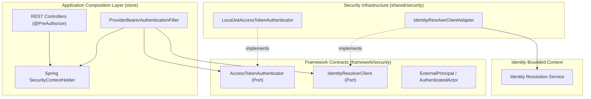
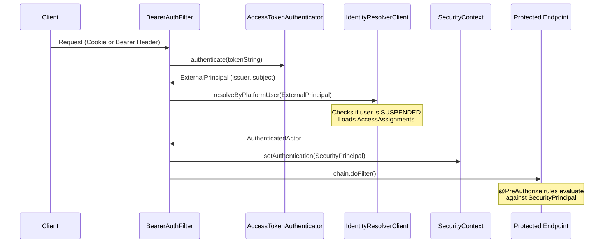

# Tech Specification: API Security & Authentication

> **Summary:** A provider-neutral JWT authentication filter that secures the platform by extracting tokens (from headers or HttpOnly cookies), validating them, and mapping the identity to a robust Spring `SecurityPrincipal` containing scoped platform roles.  
> **Classification:** Architectural Pattern / Platform Infrastructure  
> **Supporting Modules:** `store/shared/security` / `identity-domain`  
> **Related Architecture ADRs:** [ADR-005](../system/ADR_005-Api_security_architecture.md), [ADR-001 (Identity)](../domain/identity/architecture/ADR_001-Identity-module-architecture.md), [ADR-002 (Identity)](../domain/identity/architecture/ADR_002-API_security&cookie_architecture.md)

---

## 1. Why We Need It

### The Problem

If authentication logic is hardcoded to a specific JWT format or Identity Provider (like a local database), the platform becomes tightly coupled to that provider, making migration to enterprise OAuth2/OIDC (Keycloak, Auth0, Cognito) impossible. Furthermore, storing raw JWTs in browser `localStorage` exposes users to XSS token theft. 

### Technology Decision & Alternatives

| Technology Option | Decision | Evaluation Rationale |
| :--- | :--- | :--- |
| **Provider-Neutral Filter + HttpOnly Cookies** | **Adopted** | Separates token cryptographic verification from platform identity resolution. `HttpOnly` cookies completely mitigate XSS token theft. |
| Classic Spring Security Session (JSessionId) | Rejected | The platform requires stateless API scaling and needs to support mobile clients via Bearer headers alongside web browsers. |
| Exposing Raw JWTs to Frontend | Rejected | High risk of XSS token theft. |

### Key Benefits & Trade-offs

**Core Benefits:**
- Decouples token validation (signature, expiry) from business identity resolution (roles, account status, scopes).
- Easily swaps local JWT issuance for external OAuth2 providers without touching business code.
- XSS immunity for web clients via `HttpOnly` cookies.

**Known Trade-offs:**
- Increased complexity with multiple abstraction layers (`ExternalPrincipal`, `AuthenticatedActor`, `SecurityPrincipal`).
- Requires strict CORS (`withCredentials: true`) configuration across the platform.

---

## 2. What It Is

### Core Concept

The authentication process uses a custom Spring Security filter. It extracts the JWT from either an `Authorization` header or an `HttpOnly` cookie. It delegates cryptographic validation to an `AccessTokenAuthenticator`, which produces an `ExternalPrincipal`. It then passes that principal to an `IdentityResolver` to check the database for the user's active status, platform scopes, and roles, ultimately building an `AuthenticatedActor`.



### Internal Mechanics & Lifecycle

> N/A: Authentication filters are stateless and execute per-request.

---

## 3. How We Use It in This System

### Architecture & Layer Stacking



### Component Responsibilities

| Architectural Role | Layer Location | Responsibility |
| :--- | :--- | :--- |
| `ProviderBearerAuthenticationFilter` | `store` | Intercepts HTTP requests, extracts the token, orchestrates validation, and populates the Security Context. |
| `AccessTokenAuthenticator` | `framework` (Port) | Verifies the token signature, expiry, and audience without accessing the database. |
| `IdentityResolverClient` | `framework` (Port) | Calls the Identity module to verify the user is `ACTIVE` and loads their current `PlatformScope`s and Roles. |
| `Identity Module` | `identity-domain` | The source of truth for account status and access grants. |

### Runtime Flow



---

## 4. Technical Specification & Contracts

Normative specification. An implementation is compliant only when all MUST / MUST NOT statements are satisfied.

### Normative Rules

- **R-01:** The authentication filter **MUST** attempt to extract the token from the `Authorization: Bearer` header first. If absent, it MUST fallback to extracting it from an `HttpOnly` cookie.
- **R-02:** The `AccessTokenAuthenticator` **MUST NOT** perform database lookups. Its sole responsibility is cryptographic validation and claim extraction.
- **R-03:** The `IdentityResolver` **MUST** query the identity store on every request to ensure suspended users or revoked roles immediately block access, regardless of token expiry.
- **R-04:** API controllers and services **MUST NOT** parse raw JWTs to determine identity. They MUST retrieve the `AuthenticatedActor` exclusively from the Spring `SecurityContext`.
- **R-05:** Cookies containing authentication tokens **MUST** be marked `HttpOnly`, `Secure`, and `SameSite=Strict` (or `Lax` depending on cross-origin routing requirements).

### Storage & Data Contract

> Tokens are not stored in the database by this module (managed by Identity's `RefreshSession`). The internal data contract is the `AuthenticatedActor` exposed to controllers.

```java
public record AuthenticatedActor(
    String userId,
    String email,
    String activeContextScopeKey,
    Set<String> effectiveRoleCodes
) {}
```

### Configuration Knobs

| Knob Name | Default Value | Unit / Format | Description |
| :--- | :--- | :--- | :--- |
| `security.jwt.issuer` | `grab-platform` | String | The expected issuer claim (`iss`) for valid access tokens. |
| `security.cookie.name` | `access_token` | String | The name of the `HttpOnly` cookie used by web clients. |
| `security.cors.allowed-origins` | *None* | List | MUST be explicitly configured. `*` is not permitted when `allowCredentials` is true. |
