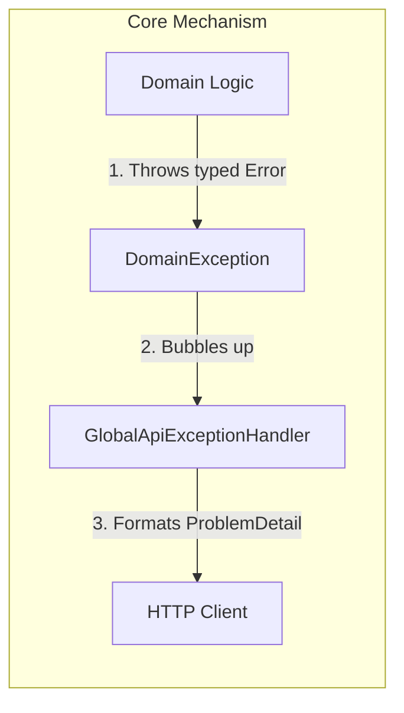
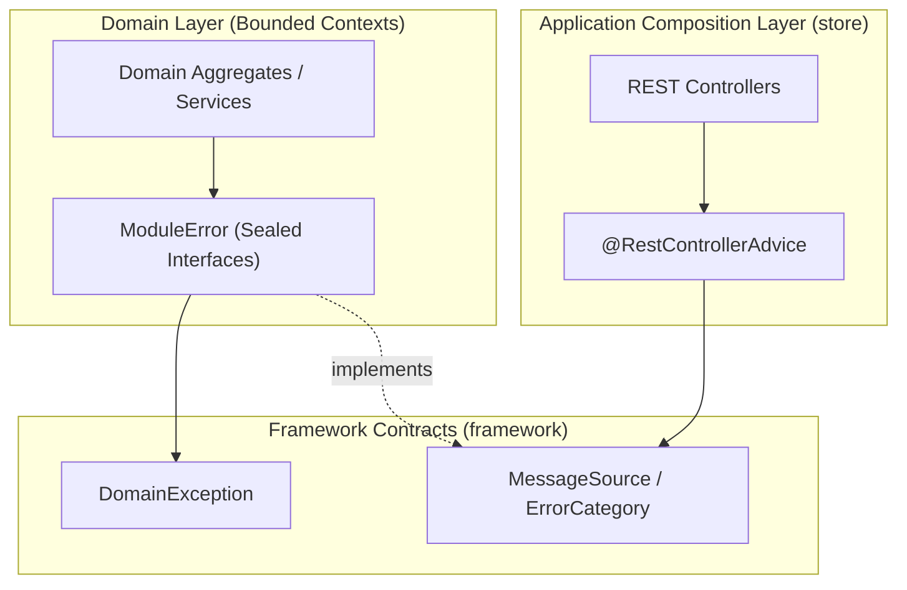
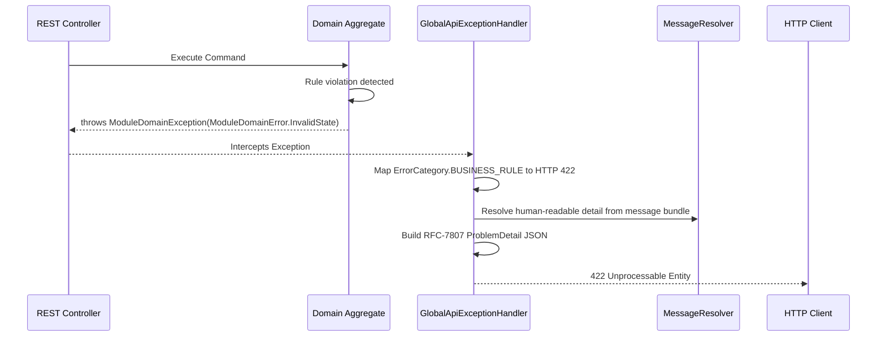

# Tech Specification: Exception Handling Framework

> **Summary:** A consistent, strongly-typed error handling framework that translates domain business rule violations into standard RFC-7807 Problem Details for API responses.  
> **Classification:** Cross-Cutting Concern / Platform Infrastructure  
> **Supporting Modules:** `framework/exception` / Global `@RestControllerAdvice`  
> **Related Architecture ADRs:** [ADR-003](../system/ADR_003-Exception_handling_framework_architecture.md)

---

## 1. Why We Need It

### The Problem

Without a unified error handling contract, bounded contexts either leak internal exception types across module boundaries, or they return opaque `500 Internal Server Error` responses. When APIs return unstructured errors, client applications cannot programmatically handle specific failure scenarios (like `INSUFFICIENT_STOCK`), and support teams struggle to trace issues without stable error codes.

### Technology Decision & Alternatives

| Technology Option | Decision | Evaluation Rationale |
| :--- | :--- | :--- |
| **`MessageSource` + Sealed Interfaces** | **Adopted** | Keeps domain errors strongly typed in code while mapping cleanly to standard HTTP status codes via `ErrorCategory`. Prevents exception class explosion. |
| Classic Java Exception Hierarchy | Rejected | Leads to hundreds of custom exception classes per module, making maintenance and global handling complex. |
| GraphQL-style Errors | Deferred | The platform uses REST APIs. RFC-7807 is the industry standard for REST problem details. |

### Key Benefits & Trade-offs

**Core Benefits:**
- Stable, machine-readable error codes (`catalog.domain.product_not_found`) that clients can rely on.
- Business logic is completely decoupled from HTTP status codes.
- `ErrorCategory` guarantees that domain invariants always result in `422 Unprocessable Entity` rather than generic `400`s or `500`s.

**Known Trade-offs:**
- Requires writing boilerplate sealed interfaces/records for every module.
- Domain developers must remember to throw wrapper `DomainException`s.

---

## 2. What It Is

### Core Concept

The framework requires developers to define business errors as Java `record`s that implement a `MessageSource`. These records define an `ErrorCategory` (which maps to HTTP status), a stable `code`, and arbitrary `args`. When a rule is violated, the domain throws a module-specific `DomainException` wrapping the record. A global HTTP interceptor catches this and formats it into an RFC-7807 JSON response.



### Internal Mechanics & Lifecycle

> N/A: Exception handling is purely stateless and request-scoped.

---

## 3. How We Use It in This System

### Architecture & Layer Stacking



### Component Responsibilities

| Architectural Role | Layer Location | Responsibility |
| :--- | :--- | :--- |
| `Domain Aggregates` | `domain` | Enforces business rules and throws specific `*Error` records when invariants are violated. |
| `MessageSource` / `ErrorCategory` | `framework` | Defines the contract for all errors: what kind of error it is, its stable code, and its arguments. |
| `GlobalApiExceptionHandler` | `store/application` | Catches bubbling exceptions and maps the `ErrorCategory` to an HTTP Status Code. |

### Runtime Flow



---

## 4. Technical Specification & Contracts

Normative specification. An implementation is compliant only when all MUST / MUST NOT statements are satisfied.

### Normative Rules

- **R-01:** Every bounded context **MUST** define its own sealed interface extending `MessageSource` for its internal errors.
- **R-02:** Domain aggregates and services **MUST NOT** throw Spring framework exceptions or bare `RuntimeException`s for expected business rule violations.
- **R-03:** Domain exceptions **MUST NOT** contain HTTP status codes. They must only return an `ErrorCategory` (e.g., `BUSINESS_RULE`, `NOT_FOUND`).
- **R-04:** The `code()` returned by a `MessageSource` **MUST** follow the dot-notation standard: `<module>.<layer>.<reason>` (e.g., `inventory.domain.insufficient_stock`).
- **R-05:** Error codes **MUST NOT** contain sensitive PII or human-readable prose. Human-readable text belongs in the resolved `detail` field or i18n message bundles.

### Storage & Data Contract

> The HTTP Response payload must strictly adhere to this RFC-7807 JSON structure.

```json
{
  "type": "about:blank",
  "title": "Unprocessable Entity",
  "status": 422,
  "detail": "Invalid state transition from ARCHIVED to ACTIVE.",
  "instance": "/api/v1/products/123",
  "code": "catalog.domain.invalid_state",
  "args": {
    "current": "ARCHIVED",
    "expected": "ACTIVE"
  },
  "timestamp": "2026-09-12T14:30:00Z",
  "traceId": "trace-456"
}
```

### Configuration Knobs

| Knob Name | Default Value | Unit / Format | Description |
| :--- | :--- | :--- | :--- |
| `spring.messages.basename` | `messages` | String | Defines the resource bundle used by the `MessageResolver` to look up localized error strings. |
| `server.error.include-stacktrace` | `never` | Enum | The global handler MUST ensure stack traces are never leaked to external API clients in production. |
