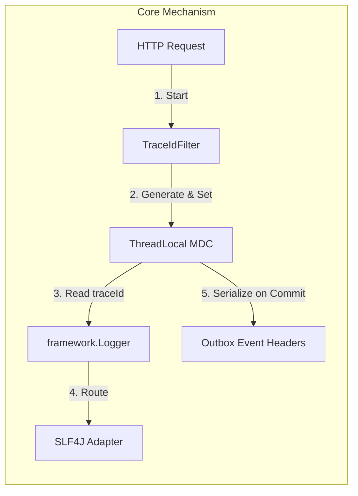
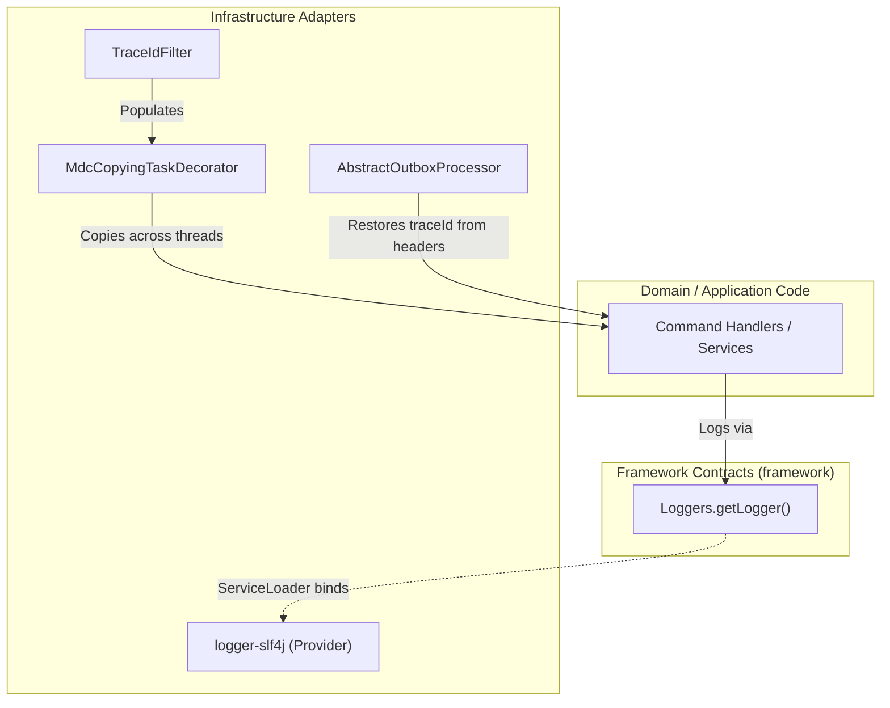
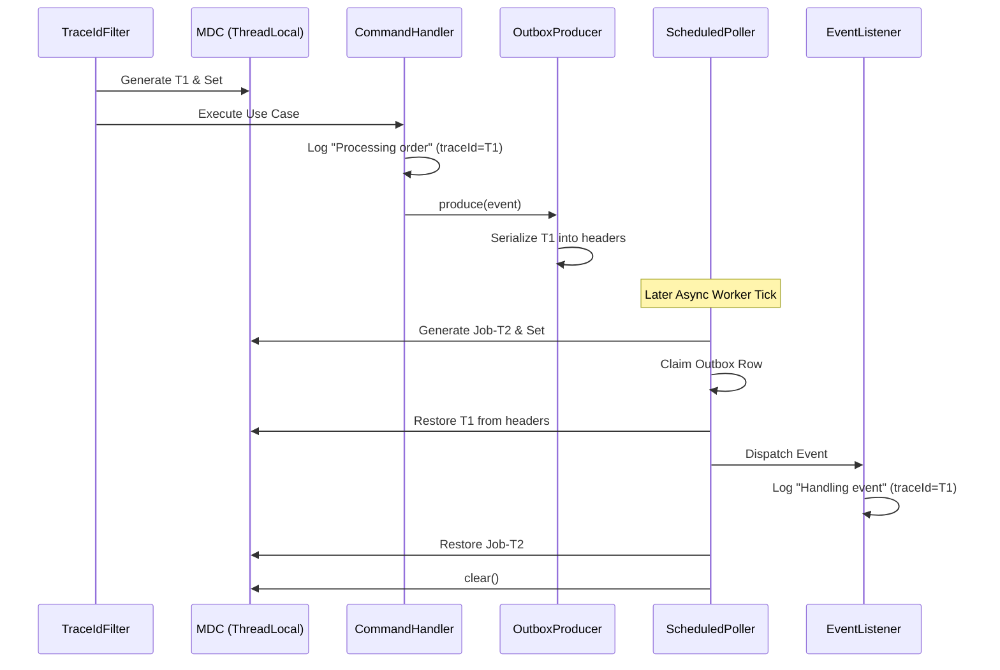

# Tech Specification: Logging Facade & Trace Context

> **Summary:** A provider-neutral logging facade that decouples domain code from specific logging frameworks (like SLF4J), combined with an automatic MDC correlation context that traces requests across thread hops and outbox boundaries.  
> **Classification:** Cross-Cutting Concern / Platform Infrastructure  
> **Supporting Modules:** `framework/logger` / `logger-slf4j`  
> **Related Architecture ADRs:** [ADR-004](../system/ADR_004-Framework_logging_facade_&_slf4j_bridge.md), [ADR-010](../system/ADR_010-Mdc_trace_context.md)

---

## 1. Why We Need It

### The Problem

If the `framework` and domain bounded contexts directly import `@Slf4j` or `org.slf4j.Logger`, they become tightly coupled to a specific external logging backend. Furthermore, in an asynchronous, event-driven system using a Transactional Outbox, standard HTTP logs lose connection to background processing logs, making it impossible to trace the full lifecycle of a request (`traceId` gets lost across thread boundaries).

### Technology Decision & Alternatives

| Technology Option | Decision | Evaluation Rationale |
| :--- | :--- | :--- |
| **Custom Logging Facade + SLF4J Bridge** | **Adopted** | The `framework` defines its own `Logger` interface. Adapters map it to SLF4J at runtime. Modules remain pure and backend-agnostic. |
| **MDC Trace Context Propagation** | **Adopted** | Automatically injects and copies a `traceId` across HTTP filters, async decorators, and outbox headers to unify distributed logs. |
| Micrometer Tracing / OpenTelemetry | Deferred | Overkill for the current modular monolith phase. The MDC plumbing introduced here paves the way for easy OTel integration later. |
| Direct `@Slf4j` (Lombok) | Rejected | Couples domain and framework code to an implementation detail. |

### Key Benefits & Trade-offs

**Core Benefits:**
- Domain code has zero dependencies on external logging libraries.
- Every HTTP request, background job, and outbox delivery is tagged with a traceable UUID (`traceId`).
- Trace contexts survive asynchronous thread hops and outbox database polling.

**Known Trade-offs:**
- Requires boilerplate helper code (`Loggers.getLogger()`) instead of a simple `@Slf4j` annotation.
- Not a full distributed tracing solution (no spans, timing, or parent/child relationships yet).

---

## 2. What It Is

### Core Concept

The system provides a two-part solution:
1. **Logging Facade:** A custom `Logger` API inside `framework`. At runtime, a `ServiceLoader` discovers an available adapter (e.g., `logger-slf4j`) and binds the facade to the actual logging engine (Logback/Log4j).
2. **Trace Context (MDC):** A `traceId` is generated at the system entry point (HTTP Filter or Scheduled Job). This ID is stored in a `ThreadLocal` MDC. When crossing boundaries (like publishing to the Outbox), the `traceId` is serialized into the event headers and restored when the event is processed.



### Internal Mechanics & Lifecycle

> N/A: Logging and Tracing are ambient, stateless cross-cutting concerns.

---

## 3. How We Use It in This System

### Architecture & Layer Stacking



### Component Responsibilities

| Architectural Role | Layer Location | Responsibility |
| :--- | :--- | :--- |
| `Loggers` | `framework/logger` | The static factory and facade API used by all domain and framework code. |
| `TraceIdFilter` | `store` | A high-precedence servlet filter that extracts or generates a `traceId` for incoming HTTP requests. |
| `TraceContext` | `logger-slf4j` | The MDC helper that safely sets, copies, and clears the `traceId`. |
| `JpaOutboxDomainEventProducer` | `outbox-infrastructure` | Merges the current `traceId` into the outbox row's JSON `headers` during event publication. |
| `AbstractOutboxProcessor` | `outbox-infrastructure` | Restores the `traceId` from the outbox headers into the MDC before dispatching the event to listeners. |

### Runtime Flow



---

## 4. Technical Specification & Contracts

Normative specification. An implementation is compliant only when all MUST / MUST NOT statements are satisfied.

### Normative Rules

- **R-01:** Domain and framework code **MUST NOT** import `org.slf4j.Logger` or use `@Slf4j`. All logging MUST route through `com.grab.framework.logger.Loggers`.
- **R-02:** The HTTP `TraceIdFilter` **MUST** be registered with highest precedence to ensure 401 Unauthorized responses generated by Spring Security are logged with a trace context.
- **R-03:** Asynchronous executors (e.g., `@Async`) **MUST** use a `TaskDecorator` to copy the MDC context from the parent thread to the worker thread.
- **R-04:** Outbox producers **MUST** copy the current `traceId` into the event headers. Outbox dispatchers **MUST** restore this `traceId` around listener invocation.
- **R-05:** Scheduled jobs (e.g., `@Scheduled`) **MUST** generate a fresh `traceId` per tick and clear the MDC in a `finally` block to prevent `ThreadLocal` leaks on pooled threads.

### Storage & Data Contract

> Outbox events store the trace context inside their JSON `headers` column.

```json
{
  "traceId": "9b1deb4d-3b7d-4bad-9bdd-2b0d7b3dcb6d",
  "contentType": "application/json"
}
```

### Configuration Knobs

| Knob Name | Default Value | Unit / Format | Description |
| :--- | :--- | :--- | :--- |
| `logger.backend` | *null* (Auto-resolve) | String | Forces a specific logger provider ID (e.g., `slf4j`). |
| `logging.pattern.level` | `%5p [traceId=%X{traceId:-}]` | SLF4J Pattern | Configured in `application.yml` to automatically output the MDC trace context. |
