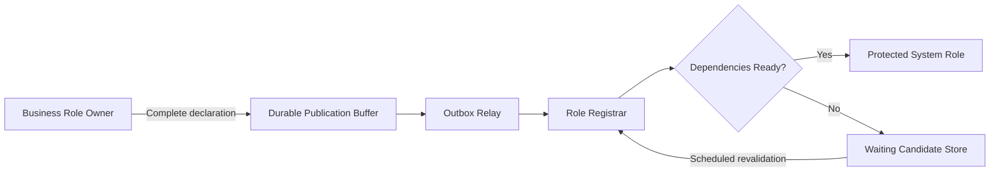
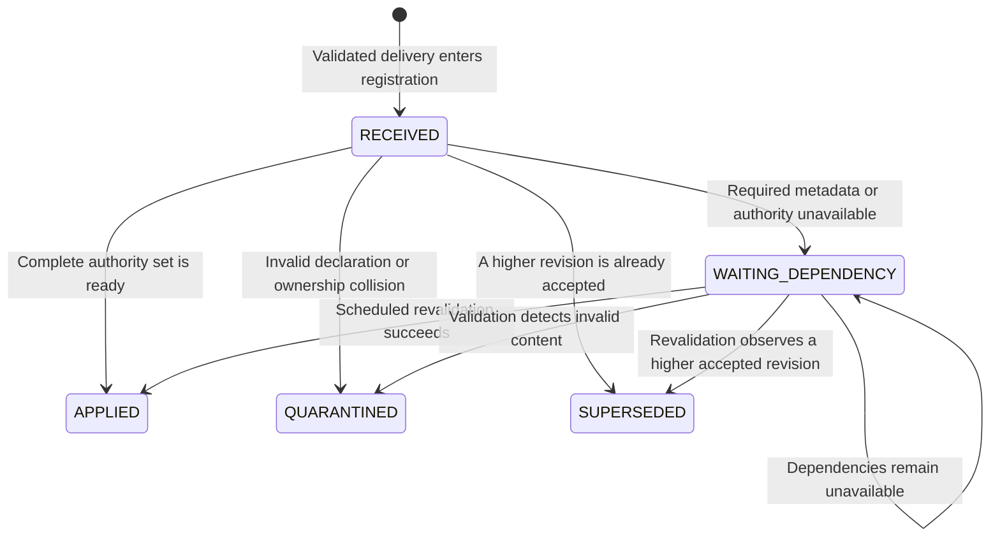
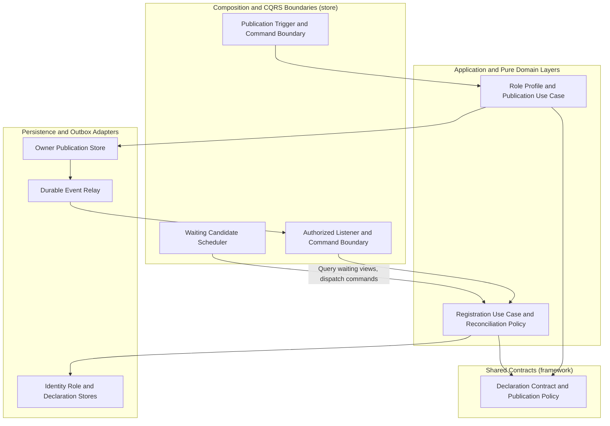

# Tech Specification: Role Declaration Framework

> **Summary:** Business role owners publish complete, versioned permission bundles through their local outbox so Identity can validate dependencies and apply protected system roles durably.\
> **Classification:** Architectural Pattern / Platform Infrastructure\
> **Supporting Modules:** `framework`, `manifest-adapter-persistence`, `outbox-infrastructure`, `merchant-application`, `merchant-adapter-persistence`, `identity-domain`, `identity-application`, `identity-adapter-persistence`, `store`\
> **Related Architecture ADRs:** [ADR-004: Distributed Security Manifest Catalog](../../dev/domain/identity/architecture/ADR_004-Distributed_security_manifest_catalog.md)\
> **Related Specifications:** [Security Manifest Consistency Tech Spec](security-manifest-consistency-tech-spec.md), [Transactional Outbox Tech Spec](transactional-outbox-tech-spec.md)

---

## 1. Why We Need It

### The Problem

Primitive permissions belong to capability owners, while a business role can require permissions from several modules. The current `MERCHANT_ADMIN` declaration combines Merchant, Catalog, Inventory, and Sales Channel permissions.

Startup order does not guarantee that Identity has those manifests or authority records when the declaration arrives. Publishing only an in-memory startup event would also leave no durable record to recover after a failure.

### Technology Decision & Alternatives

| Technology Option | Decision | Evaluation Rationale |
| :--- | :--- | :--- |
| Complete declarations, local outbox, and durable dependency waiting | Adopted | Separates capability ownership from role composition and allows recovery through replay and scheduled revalidation. |
| In-memory startup publication alone | Not used | Provides no durable publication state or outbox recovery. |
| Synchronous coordination of all module manifests at startup | Not used | Couples startup to the readiness of every required capability owner. |
| Direct cross-module database writes | Not used | Bypasses Identity ownership of roles and grants. |

### Key Benefits & Trade-offs

**Core Benefits:**

- Capability owners declare primitive permissions without depending on the business roles that consume them.
- A missing system role is created automatically and remains inactive and unassignable until its first declaration applies.
- Publication state, immutable revision payloads, and delivery receipts prevent replay from repeating role changes.
- Scheduled republication and waiting-candidate revalidation recover without coordinated restarts.

**Known Trade-offs:**

- First-time availability is eventual and depends on catalog activation, authority persistence, and relay or revalidation timing.
- A waiting upgrade preserves the previously applied role and permission set until the replacement is ready.
- Publication and registration require separate persistence records in the owner and Identity databases.
- Applied candidates are not periodically revalidated by this mechanism.

---

## 2. What It Is

### Core Concept

A role owner declares the role code, assignment scope, declaration revision, minimum manifest revisions, and explicit permission references. Its publication transaction stores a snapshot in the local outbox, and Identity validates that snapshot before replacing the system role's authorities.



### Internal Mechanics & Lifecycle

#### Declaration Candidate Lifecycle

`RECEIVED` is the initial in-memory candidate status; registration normally persists a decided status. The policy outcome `RECONCILED` becomes the durable candidate status `APPLIED`.



Digest errors, event-ID reuse, and conflicting content at an existing revision are recorded separately as conflicts. They do not overwrite the accepted revision payload, and not every quarantined delivery creates a candidate row.

#### System Role Availability

Role flags describe the applied role, while candidate status describes a proposed declaration. A newer waiting or quarantined candidate can therefore coexist with an active, assignable role from an earlier applied revision.

```mermaid
stateDiagram-v2
    state "No role" as Absent
    state "Pending first application" as Pending
    state "Applied role available" as Available
    [*] --> Absent
    Absent --> Pending : Auto-create inactive, unassignable system role
    Pending --> Pending : First declaration waits or fails policy validation
    Pending --> Available : Apply complete authority set
    Absent --> Available : First registration creates and applies atomically
    Available --> Available : Higher revision waits or is quarantined; preserve applied role
    Available --> Available : Higher revision applies; replace authority set
```



Suspending an existing system role without an applied declaration sets its flags to false but does not clear stored authority links. Newly created pending roles start with an empty authority set.

---

## 3. How We Use It in This System

### Architecture & Layer Stacking



### Component Responsibilities

| Architectural Role | Layer Location | Responsibility |
| :--- | :--- | :--- |
| Declaration contract and publication policy | `framework/security/role` | Normalize immutable declarations, calculate digests, and decide publication eligibility. |
| Business role profile and publication use case | `merchant-application` | Supply `MerchantAdminAccessProfile.DECLARATION` through `RoleDeclarationPublicationPort`. |
| Publication trigger | `store/merchant/internal/event` | Dispatch publication on asynchronous application readiness, catalog activation, and periodic repair. |
| Publication command boundary | `store/merchant/internal/command/handler` | Apply `@SecurityManifestPublicationRetryable` and `@MerchantTransactional(propagation = REQUIRES_NEW)`. |
| Shared publication adapter | `manifest-adapter-persistence` | Update owner-bound publication state and enqueue the complete event through the supplied outbox producer. |
| Owner persistence binding | `merchant-adapter-persistence` and `store/merchant/internal/config` | Bind the publication entity, pessimistic row lock, event factory, UTC clock, interval, and Merchant outbox. |
| Outbox relay | `outbox-infrastructure` and `merchant-adapter-persistence` | Deliver committed events through the configured dispatcher, using hot delivery with polling recovery. |
| Authorized registration listener | `store/identity/internal/event` | Accept only allowlisted producer event classes with the expected owner and dispatch registration commands. |
| Registration command boundary | `store/identity/internal/command/handler` | Ensure catalog state exists through `@RequiresSecurityCatalog` and execute under `@IdentityTransactional`. |
| Registration use case and domain policy | `identity-application` and `identity-domain` | Validate delivery and ownership, resolve dependencies, seed pending roles, and atomically apply complete authority sets. |
| Declaration persistence | `identity-adapter-persistence` | Store immutable candidate payloads, delivery receipts, conflicts, and the applied revision watermark. |
| Waiting candidate scheduler | `store/identity/internal/event` | Query a bounded waiting batch and independently dispatch registration commands with `revalidation = true`. |

The shared publication adapter is configured with Merchant-local persistence and never calls Identity directly. Cross-module delivery uses `MerchantRoleDeclarationDeclaredIntegrationEvent` under `store/shared/events/merchant`.

### Current Business Role Declaration

| Declaration Field | Current Value |
| :--- | :--- |
| Owner | `merchant` |
| Role code | `MERCHANT_ADMIN` |
| Assignment scope | `merchant.account` |
| Declaration revision | `1` |
| Minimum owner manifest revisions | `merchant = 1`, `catalog = 1`, `inventory = 1`, `saleschannel = 1`. |

| Permission Owner | Referenced Permission Codes |
| :--- | :--- |
| `merchant` | `MERCHANT_PROFILE_READ`, `MERCHANT_PROFILE_WRITE`, `MERCHANT_STOREFRONT_READ`, `MERCHANT_STOREFRONT_WRITE` |
| `catalog` | `CATALOG_READ`, `CATALOG_WRITE` |
| `inventory` | `INVENTORY_READ`, `INVENTORY_WRITE` |
| `saleschannel` | `SALES_CHANNEL_READ`, `SALES_CHANNEL_WRITE` |

Only the Merchant event class is currently allowlisted for role declaration registration. Other owners require explicit producer wiring and listener authorization.

### Runtime Flow

```mermaid
sequenceDiagram
    autonumber
    participant Trigger as Publication Trigger
    participant Publisher as Publication Command Boundary
    participant OwnerStore as Owner Publication Store
    participant Relay as Outbox Relay
    participant Registrar as Identity Registration Boundary
    participant IdentityStore as Identity Persistence
    participant Scheduler as Waiting Candidate Scheduler

    Trigger->>Publisher: Dispatch publication command
    Publisher->>OwnerStore: Lock state and check revision, digest, and due time
    opt Publication is eligible
        Publisher->>OwnerStore: Store snapshot and event in one new transaction
    end
    Note over OwnerStore: Commit before delivery
    Relay->>OwnerStore: Claim committed event
    Relay->>Registrar: Deliver allowlisted owner event
    Registrar->>IdentityStore: Validate receipt and digest, then lock catalog
    Registrar->>IdentityStore: Resolve role ownership and dependencies
    alt Dependencies are ready
        Registrar->>IdentityStore: Commit complete authorities, role flags, watermark, and APPLIED status
    else Dependencies are missing
        Registrar->>IdentityStore: Commit WAITING_DEPENDENCY; preserve any applied role
    else Declaration is invalid
        Registrar->>IdentityStore: Record quarantine evidence without replacing applied role
    end
    loop Scheduled waiting batch
        Scheduler->>IdentityStore: Query waiting projections in a read transaction
        Scheduler->>Registrar: Dispatch each candidate with revalidation enabled
    end
```

Catalog activation prompts Merchant to attempt republication, subject to the same publication interval gate. Identity's waiting-candidate scheduler performs dependency re-evaluation independently; ordinary redelivery returns the stored candidate outcome.

---

## 4. Technical Specification & Contracts

These rules describe the current implementation contract. They do not imply exactly-once transport or automatic suspension of previously applied roles.

### Normative Rules

- **R-01 (Declaration Identity):** Declarations **MUST** carry nonblank owner, role code, and scope key, a positive declaration revision, positive minimum owner revisions, and unique normalized permission references; changing content **MUST** use a higher revision.
- **R-02 (Atomic Publication):** The publication command **MUST** commit its owner-local publication state and complete outbox event in one `REQUIRES_NEW` transaction; startup publication **MUST NOT** rely only on an in-memory declaration event.
- **R-03 (Publication Eligibility):** A lower source revision **MUST** return `SUPERSEDED`, equal-revision changed content **MUST** return `CONFLICT`, and identical content before its next publication time **MUST** return `NOT_DUE`; a higher revision or due identical snapshot **MUST** enqueue.
- **R-04 (Delivery Identity):** Each eligible enqueue **MUST** generate a fresh UUID event ID and include the canonical digest and UTC publication time; retrying the same stored outbox event **MUST** preserve that event's payload and ID.
- **R-05 (Triggers and Isolation):** Startup publication **MUST** run asynchronously, the Merchant publisher/configuration **MUST** require `merchant.enabled = true`, and publication row races **MUST** use the configured retryable command boundary.
- **R-06 (Producer Authorization):** The registration listener **MUST** validate the concrete event class and its expected owner against `ALLOWED_OWNERS`; an unauthorized producer **MUST NOT** reach the registration use case.
- **R-07 (Digest Validation):** Identity **MUST** accept a matching canonical or legacy digest, store canonical revision identity, and quarantine digest mismatch or conflicting event-ID reuse without replacing accepted content.
- **R-08 (Immutable Revisions and Replay):** Candidate payloads **MUST** be immutable per `(owner, roleCode, revision)`; ordinary matching replay **MUST** return the stored receipt or candidate outcome without repeating role reconciliation.
- **R-09 (Revision Ordering):** After duplicate checks, a candidate below the highest accepted revision or applied watermark **MUST** become `SUPERSEDED`; accepted ordering **MUST** count `RECEIVED`, `WAITING_DEPENDENCY`, and `APPLIED` candidates.
- **R-10 (Role Ownership and Seeding):** Registration **MUST NOT** take over a custom role or a role code bound to another declaration owner; a compatible missing role **MUST** be created as `SYSTEM`, inactive, unassignable, and initially without authorities.
- **R-11 (Complete Dependency Gate):** Application **MUST** require an effective assignment scope, every minimum manifest revision, matching permission owners, effective catalog authorities, and an exact match with the requested active/effective authority records; an empty permission list or known owner mismatch **MUST** be invalid.
- **R-12 (Waiting Behavior):** A role without a previously applied declaration **MUST** remain inactive and unassignable while waiting; a waiting upgrade **MUST** preserve the previously applied role flags and authority set, and **MUST NOT** install partial new permissions.
- **R-13 (Atomic Application):** A ready revision above the applied watermark **MUST** replace the complete system-role authority set, set `active = true` and `assignable = true`, and commit the watermark, candidate `APPLIED` status, and receipt within the Identity transaction.
- **R-14 (Revalidation):** Scheduled revalidation **MUST** query only waiting projections in a bounded read transaction and then dispatch each registration command with `revalidation = true`; one candidate failure **MUST NOT** stop processing the remaining batch.
- **R-15 (Protected Administration):** System-role detail, activation, and authority mutations **MUST** reject the custom-role administration path; new assignments **MUST** pass `requireAssignable()`, which requires both role flags to be true.

### Declaration & Delivery Data Contract

| Contract | Fields and Semantics |
| :--- | :--- |
| Declaration | `owner`, `roleCode`, `assignmentScopeKey`, `declarationRevision`, `minimumOwnerRevisions`, and `permissions`. |
| Permission reference | `owner` identifies the capability provider and `code` identifies the primitive authority. |
| Normalization | Owners and scope keys are trimmed lowercase values, while role and permission codes are trimmed uppercase values. |
| Canonical digest | SHA-256 covers normalized fields using length-prefixed UTF-8 strings, integer revisions/counts, sorted owner revisions, and permission references sorted by owner then code. |
| Legacy compatibility | Identity also accepts the previous concatenated-field digest but persists the current canonical digest. |
| Publication envelope | Complete declaration, fresh `eventId`, `suppliedContentDigest`, and non-null `publishedAt`. |
| Outbox aggregate identity | Aggregate type is `RoleDeclaration` and aggregate ID is the publication key `owner:ROLE_CODE`. |
| Registration command | Delivery fields plus `revalidation`, which defaults to `false` and is set to `true` by the waiting scheduler. |
| Registration result | Role code, owner, declaration revision, candidate outcome, and optional reason. |

### Storage & Data Contract

The following are current JPA mappings, with publication data in the Merchant datasource and registration data in the Identity datasource. Role-to-declaration association is by role code rather than a mapped foreign-key relationship.

| Store / Table | Identity and Constraints | Stored Data |
| :--- | :--- | :--- |
| Merchant `role_declaration_publication` | Primary key `publication_key = owner:ROLE_CODE`, pessimistic update lock, and optimistic `version`. | `declaration_revision`, `content_digest`, `last_enqueued_at`, and `lease_until` store the latest enqueue and next eligible time. |
| Merchant `merchant_outbox_events` | Uses the existing module outbox row identity and relay lifecycle. | Stores the serialized complete declaration event and delivery metadata. |
| Identity `role_declaration_revision` | Generated `id`, unique `(owner, role_code, revision)`, and optimistic `row_version`. | Immutable event ID, canonical digest, JSON payload, and received time accompany mutable status, reason, and applied time. |
| Identity `role_declaration_inbox` | Primary key `event_id`. | Stores owner, role code, revision, canonical digest, delivery status, and received time. |
| Identity `role_declaration_conflict` | Generated `id` and unique `(event_id, supplied_digest)`. | Stores supplied/existing digests, conflicting payload evidence, reason, and recorded time. |
| Identity `role_declaration_state` | Primary key `role_code` and optimistic `row_version`. | Stores bound owner, assignment scope key, applied revision, and applied digest. |
| Identity `roles` and `role_authorities` | Existing role identity/code and role-to-authority association. | Store role kind, availability flags, and the complete applied authority set. |

The inbox does not record every repeated publication: a matching existing candidate delivered with a new event ID normally returns its stored outcome without adding a receipt. `receivedAt` uses the supplied publication timestamp when present, otherwise registration time.

### Configuration Knobs

| Knob Name | Default Value | Unit / Format | Description |
| :--- | :--- | :--- | :--- |
| `security.manifest.republish.initial-delay-ms` | `300000` | Milliseconds | Delays the first periodic Merchant role declaration repair attempt. |
| `security.manifest.republish.fixed-delay-ms` | `300000` | Milliseconds | Controls both periodic repair delay and the identical-snapshot publication interval. |
| `security.role-declaration.revalidation.fixed-delay-ms` | `30000` | Milliseconds | Controls Identity's waiting-candidate sweep delay. |
| `security.role-declaration.revalidation.batch-size` | `100` | Integer, `1`–`1000` | Limits waiting candidates queried per sweep, ordered by oldest received timestamp. |
| `merchant.enabled` | Explicit `true` required | Boolean | Enables the Merchant publisher/configuration; the development profile defaults `MERCHANT_ENABLED` to `true`. |

Publication uses the shared `security.manifest.republish.*` settings rather than separate role declaration republication settings. Relay polling, retries, hot delivery, and retention use the existing `merchant.outbox.*` settings described by the [Transactional Outbox Tech Spec](transactional-outbox-tech-spec.md).

### Operational Boundaries

| Boundary | Current Behavior |
| :--- | :--- |
| Catalog activation | Merchant attempts republication, but an identical declaration can still be `NOT_DUE`; Identity does not directly sweep waiting roles on this event. |
| Higher waiting revision | The previously applied revision remains available while the replacement waits. |
| Later scope disablement or permission retirement | Applied candidates are not swept, so this framework does not automatically flip role flags or remove stored authority links. |
| Role status inspection | `GetRoleDeclarationStatusQuery` returns applied/latest revision details, dependency reason, and conflict count; there is no dedicated role declaration REST endpoint. |
| Undeclared role status | The read projection reports `UNDECLARED` when no candidate exists; this is not a candidate lifecycle enum value. |
| Quarantine recovery | A quarantined stored candidate is not automatically retried, so correcting that candidate requires a higher declaration revision. |
| Assignment scope | The declaration's scope is validated and tracked in declaration state; registration does not itself create access assignments. |
| Delivery guarantee | Outbox replay and periodic republication support recovery, while consumer identity checks avoid repeating accepted role changes. |

---

## 5. Acceptance Verification Matrix

The evidence below identifies existing test coverage or inspected implementation behavior. Reviewing these sources does not establish database rollback, concurrency, or relay crash-recovery guarantees without integration testing.

| Acceptance Criteria | Evidence | Contract Rules |
| :--- | :--- | :--- |
| Startup and catalog activation dispatch publication commands. | `MerchantRoleDeclarationStartupPublisherTest` covers both triggers; annotations and repair configuration are verified in the publisher. | R-02, R-05 |
| Identical content publishes once per interval and can be republished when due. | `RoleDeclarationPublicationAdapterTest` covers interval gating and persisted revision/digest state. | R-03 |
| Each eligible publication gets a fresh UUID while outbox replay retains its stored ID. | The publication adapter and existing outbox producer implement these identities. | R-04 |
| Lower publication revisions and changed equal revisions are rejected. | `RoleDeclarationPublicationPolicyTest` covers `SUPERSEDED`, `CONFLICT`, and `NOT_DUE` decisions. | R-03 |
| Digest identity is independent of collection ordering and separates ambiguous legacy inputs. | `RoleDeclarationTest` covers canonical digest ordering, field separation, and duplicate permission rejection. | R-01, R-07 |
| Unauthorized producer ownership does not dispatch registration. | `IdentityRoleDeclarationRegistrationListenerTest` covers authorized dispatch and rejected owner identity. | R-06 |
| Complete dependencies apply roles and missing dependencies persist waiting state. | `RegisterRoleDeclarationServiceTest` covers role flags, authorities, watermark, candidate, and receipt outcomes. | R-10, R-11, R-13 |
| A duplicate revision with a new event ID creates no duplicate candidate or receipt. | `RegisterRoleDeclarationServiceTest` covers the repeated-publication shortcut. | R-08 |
| Invalid digest is quarantined before loading the catalog. | `RegisterRoleDeclarationServiceTest` covers conflict recording, receipt status, and zero catalog loads. | R-07 |
| Waiting candidates can apply or become superseded during explicit revalidation. | `RegisterRoleDeclarationServiceTest` covers revalidation and inbox outcome updates. | R-09, R-14 |
| Empty declarations and permission owner mismatch are invalid. | `ProtectedRoleReconciliationPolicyTest` covers both invalid policy outcomes. | R-11 |
| A waiting upgrade retains the applied role. | `RegisterRoleDeclarationService` and `Role` implement this behavior; dedicated coverage is absent from the reviewed role declaration tests. | R-12 |
| System-role administration rejects manual mutation. | `RoleTest` covers the system-role modification guard. | R-15 |

### Implementation References

- [Declaration contract](../../../framework/src/main/java/com/grab/framework/security/role/RoleDeclaration.java) and [publication policy](../../../framework/src/main/java/com/grab/framework/security/role/policy/RoleDeclarationPublicationPolicy.java).
- [Shared publication adapter](../../../manifest-adapter-persistence/src/main/java/com/manifest/adapter/persistence/adapter/RoleDeclarationPublicationAdapter.java), [Merchant persistence binding](../../../store/src/main/java/com/grab/store/merchant/internal/config/MerchantRoleDeclarationPublicationConfig.java), and [publication triggers](../../../store/src/main/java/com/grab/store/merchant/internal/event/MerchantRoleDeclarationStartupPublisher.java).
- [Current Merchant role profile](../../../merchant-application/src/main/java/com/merchant/application/security/MerchantAdminAccessProfile.java) and [integration event](../../../store/src/main/java/com/grab/store/shared/events/merchant/MerchantRoleDeclarationDeclaredIntegrationEvent.java).
- [Identity registration use case](../../../identity-application/src/main/java/com/identity/application/service/RegisterRoleDeclarationService.java), [reconciliation policy](../../../identity-domain/src/main/java/com/identity/domain/policy/ProtectedRoleReconciliationPolicy.java), and [protected role aggregate](../../../identity-domain/src/main/java/com/identity/domain/aggregate/Role.java).
- [Authorized registration listener](../../../store/src/main/java/com/grab/store/identity/internal/event/IdentityRoleDeclarationRegistrationListener.java), [waiting scheduler](../../../store/src/main/java/com/grab/store/identity/internal/event/IdentityRoleDeclarationRevalidationScheduler.java), and [declaration persistence](../../../identity-adapter-persistence/src/main/java/com/identity/adapter/persistence/adapter/RoleDeclarationRepositoryAdapter.java).
- [Registration tests](../../../identity-application/src/test/java/com/identity/application/service/RegisterRoleDeclarationServiceTest.java) and [publication adapter tests](../../../manifest-adapter-persistence/src/test/java/com/manifest/adapter/persistence/adapter/RoleDeclarationPublicationAdapterTest.java).
