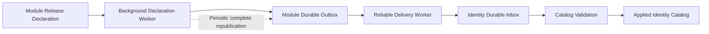
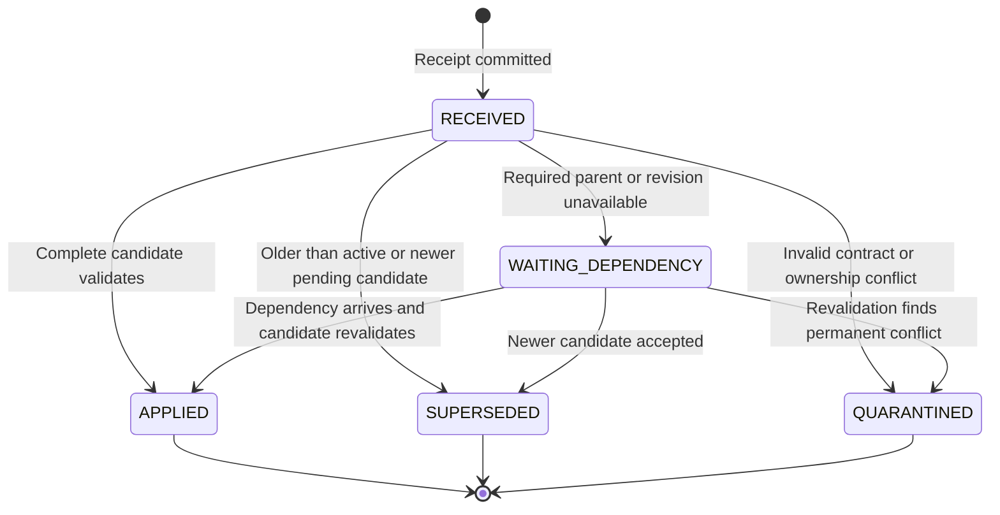
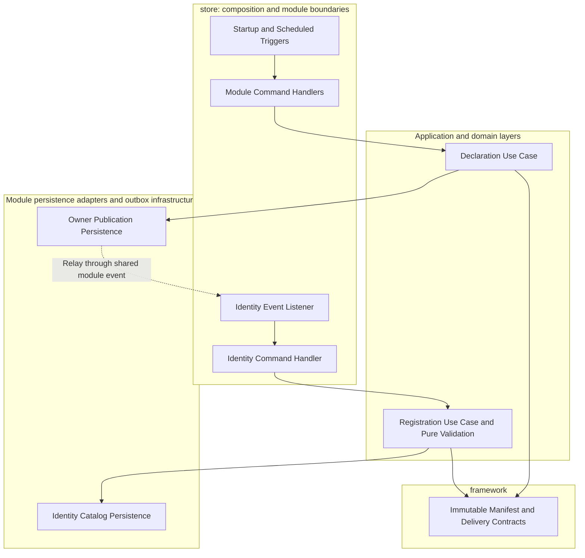

# Tech Specification: Security Manifest Consistency

> **Summary:** Module-owned security definitions converge into a durable identity catalog through versioned snapshots, transactional delivery, atomic activation, and periodic repair.
> **Status:** Implemented for local delivery; network transport and deployment-specific alert wiring remain external integration work.
> **Related ADR:** [ADR-004](../../dev/domain/identity/architecture/ADR_004-Distributed_security_manifest_catalog.md)
> **Classification:** Architectural Pattern / Cross-Cutting Concern
> **Supporting Modules:** `framework`, `manifest-adapter-persistence`, `outbox-infrastructure`, owner application/persistence modules, `identity-domain`, `identity-application`, `identity-adapter-persistence`, `store`
> **Related Specifications:** [Identity domain](../domain/identity/architecture/identity-domain-spec.md), [API security](api-security-tech-spec.md), [Transactional outbox](transactional-outbox-tech-spec.md)

## 1. Why We Need It

### Problem and implemented boundary

Each owner publishes a complete immutable declaration. Publication must survive process loss without coupling startup availability to identity. Identity must preserve catalog invariants across duplicates, conflicting payloads, old replicas, missing dependencies, and partial database failures.

The implementation replaces the JDBC coordinator with a technical publication port, moves catalog decisions into a domain aggregate, and reads persisted lifecycle metadata for runtime authorization. Legacy partial-manifest listeners and command handlers are disabled; stored legacy contracts remain readable but cannot write the authoritative catalog.

### Decision and alternatives

Adopt eventual consistency between module declarations and identity, with atomic, serialized activation inside identity. Maintain local transaction boundaries and require idempotent consumers because durable relays can redeliver after a crash; this follows the [transactional outbox](https://microservices.io/patterns/data/transactional-outbox.html) and [idempotent consumer](https://microservices.io/patterns/communication-style/idempotent-consumer.html) patterns.

| Option | Decision | Reason |
| :--- | :--- | :--- |
| Durable complete snapshots + identity inbox/catalog + repair | Adopt | Survives duplicates, disorder, process loss, and missed startup declarations. |
| Startup events alone | Replace | A process-local notification is insufficient recovery state. |
| Delta-only declarations | Reject initially | Missing a delta requires gap recovery before the catalog can be trusted. |
| Distributed transaction or boot-time acknowledgement saga | Reject | Couples availability and conflicts with independent non-blocking startup. |
| Remote catalog fetch on every module startup | Reject as primary synchronization | Makes startup dependent on identity availability. |
| Broker or CDC integration | Defer to service extraction | The current modular monolith can first reuse its module outboxes. |

The cost is additional metadata storage, background jobs, and temporary unavailability of newly introduced capabilities. There is no finite convergence guarantee during an indefinite partition; recovery guarantees assume workers resume, durable state survives, and invalid declarations are corrected.

### Scope of the guarantee

| State | Owner | Guarantee |
| :--- | :--- | :--- |
| Scope types, hierarchy edges, authority definitions | Declaring module | Immutable release declaration with one monotonically increasing security revision. |
| Applied security catalog | Identity | Each committed module snapshot is atomic and cannot be overwritten by an older revision. |
| Roles, grants, assignments, sessions | Identity | Continue using identity transactions; declarations do not grant users access. |
| Merchant/storefront/location ownership and lifecycle | Owning business module | Resource authorization remains at the composition/resource boundary. |

This design does not make business-resource projections or membership synchronization strongly consistent. Those flows still need their own versioning, idempotency, and lifecycle enforcement; missing security metadata must be a retriable prerequisite rather than a reason to grant partial permissions.

## 2. What It Is

### Core concept

Each module declares a complete security snapshot containing both its owned scopes and authorities. Identity persists incoming candidates and activates a validated candidate in one local transaction; periodic republication repairs lost notifications and rebuilds.



These diagrams describe the local runtime path. A future network adapter replaces delivery while retaining the transaction and domain contracts.

### Candidate lifecycle



The previously applied snapshot remains active while a candidate is waiting or quarantined. Quarantine is an operational issue requiring a corrected higher revision, not a reason to erase the last valid catalog.

## 3. How We Use It in This System

### Architecture and responsibilities



| Role | Placement | Responsibility |
| :--- | :--- | :--- |
| Complete security manifest | `{owner}-application/.../security/` | Declares only owned definitions and explicit external dependencies. |
| Neutral contracts and canonical digest | `framework/.../security/` | Defines immutable data without importing business modules. |
| Module-specific event | `store/.../shared/events/{owner}/` | Carries the shared manifest contract through the permitted module boundary. |
| Startup/scheduled trigger | `store/.../{owner}/internal/event/` | Schedules background publication and dispatches through `CommandBus`. |
| Declaration handler/use case | `store` / owner application | Persists publication state and outbox payload in the owner's transaction. |
| Publication port and implementation | `framework` / `manifest-adapter-persistence` | Technical `SecurityManifestPublicationPort` uses a JPA-only reusable state provider and framework eligibility policy; owner assembly supplies its transaction-bound entity manager, entity factory, and event factory. Generic outbox delivery remains in `outbox-infrastructure`. |
| Identity listener | `store/.../identity/internal/event/` | Maps immutable input and dispatches a registration command through `CommandBus`. |
| `SecurityCatalog` aggregate and pure policies | `identity-domain` | Own serialized revision, ownership, conservation, immutable parents, retirement, graph, and dependency decisions from loaded state. |
| Identity registration use case | `identity-application` | Loads registry state through ports, invokes domain rules, and persists the decision. |
| Identity write/query adapters | `identity-adapter-persistence` | Persist catalog/inbox state and return immutable view projections for reads. |

Transactions begin on owner handlers using `@{Owner}Transactional`; publication handlers use `REQUIRES_NEW` with bounded retry advice outside the transaction advisor. Registration and individual revalidation handlers use `@IdentityTransactional(propagation = REQUIRES_NEW)`, including identity self-delivery. Pure policies receive loaded data and never inject repositories; query handlers use application query ports and do not load write aggregates.

Owner publication state is loaded or initialized inside that handler transaction. A missing row is inserted and flushed before eligibility and outbox work. Concurrent inserts or updates fail and roll back the complete attempt; the retry starts a fresh transaction, reloads the committed row, and evaluates the manifest again.

### Runtime delivery

```mermaid
sequenceDiagram
    participant Module as Module Background Worker
    participant Owner as Owner Persistence
    participant Relay as Delivery Worker
    participant Listener as Identity Listener
    participant Handler as Identity Handler
    participant Catalog as Identity Persistence
    Module->>Owner: Commit declaration state and outbox snapshot
    Relay->>Owner: Claim durable publication
    Relay->>Listener: Deliver complete snapshot
    Listener->>Handler: Dispatch registration command
    Handler->>Catalog: Lock catalog; persist receipt and validated activation
    Catalog-->>Handler: Commit applied, waiting, or quarantined outcome
    Handler-->>Listener: Durable receipt completed
    Listener-->>Relay: Return successfully
    Relay->>Owner: Mark publication delivered
```

Owner and identity commits are independent. If identity commits and the relay crashes before recording delivery, replay returns the already committed outcome; if identity fails before commit, listener failure propagates and the publication remains retryable.

An acknowledgement means identity durably owns the candidate, which may still be waiting; it does not necessarily mean activation. There is no reply-event saga or startup wait.

For extracted services, replace in-process dispatch with a transport adapter: mark producer delivery after durable broker confirmation, and acknowledge consumer delivery only after the identity transaction commits. Registration semantics remain unchanged, and network I/O does not hold an identity catalog transaction open.

## 4. Technical Specification and Contracts

### Manifest contract

| Field | Contract |
| :--- | :--- |
| `eventId` | Stable unique delivery identity for one outbox message; retransmission preserves it. |
| `schemaVersion` | Wire-format revision independent of the security content revision. Identity **MUST** reject unsupported schema versions with `QUARANTINED` rather than silently ignoring unknown fields. The minimum supported schema version **MUST** be documented per release. |
| `moduleKey` | Trusted owner identity checked against an allowed producer mapping. |
| `securityRevision` | Positive monotonic release revision shared by scopes and authorities for this module. |
| `contentDigest` | Identity-recomputed SHA-256 of the canonical complete semantic payload. |
| `scopes` | Complete owned scope declarations. Each entry contains: `scopeKey` (string), `parentScopeKey` (string, nullable), and `lifecycle` (enum: `ACTIVE`, `RETIRED`). |
| `authorities` | Complete owned authority definitions. Each entry contains: `code` (string, normalized to uppercase for compatibility with existing role links), `category` (string), `name` (string), `description` (string, nullable), and `lifecycle` (enum: `ACTIVE`, `RETIRED`). |
| `dependencies` | Referenced external scope keys and any required minimum owner revisions. |
| `publishedAt` / trace metadata | Diagnostic values excluded from ordering and semantic digest. |

#### Canonical digest algorithm

The `contentDigest` is a SHA-256 hash computed by identity upon receipt, using the existing length-prefixed field encoding from `AuthorityManifest.contentDigest()`. Do not treat the existing authority-only digest as a digest of the complete security manifest.

The canonical field ordering is:

```
digest = SHA-256(
  field(moduleKey) |
  field(securityRevision as string) |
  field(schemaVersion as string) |
  for each scope sorted by scopeKey ascending:
    field(scopeKey) | field(parentScopeKey) | field(lifecycle) |
  for each authority sorted by code ascending:
    field(code) | field(category) | field(name) | field(description) | field(lifecycle) |
  for each dependency sorted by scopeKey ascending:
    field(scopeKey) | field(minRevision as string)
)

where field(value):
  if value is null: write int32(-1)
  otherwise:       write int32(byte_length) then write utf8_bytes(value)
```

Collections are sorted by their stable natural key before hashing. Module and scope keys are normalized by their contracts; authority codes remain uppercase. Descriptive fields retain their content. Null and empty string are distinct: null produces the sentinel `int32(-1)`, empty string produces `int32(0)`.

Release validation must reject cyclic minimum-revision dependencies that cannot be satisfied from already applied baselines. Keep dependency requirements minimal; a durable waiting state cannot resolve a mutually blocked deployment on its own.

Use `Id` for entity identifiers in domain/application commands; module keys, scope type keys, and authority codes remain validated business values. Integration records are immutable and defensively copy collections.

All modules, including authority-only modules, publish explicit empty scope lists. Separate legacy scope and authority version numbers are not automatically compatible; the first complete declaration **MUST** use `securityRevision = max(legacy_authority_version, legacy_scope_version) + 1` to establish a new audited baseline revision that is guaranteed to supersede any in-flight legacy message.

### Version and concurrency rules

| Incoming state | Identity decision |
| :--- | :--- |
| Same `eventId` and same payload | Return the committed inbox outcome without repeating mutations. |
| Same `eventId` and different payload | Quarantine the conflicting delivery and alert. |
| Revision below applied revision | Record `SUPERSEDED`; never overwrite active data. |
| Same module/revision/digest | Idempotent semantic replay, even with a different event ID. |
| Same module/revision with different digest | Quarantine the conflicting candidate; preserve the original immutable revision and alert. |
| Higher revision, complete and valid | Atomically activate scopes, authorities, module watermark, and catalog revision. |
| Higher revision with absent external parent | Persist `WAITING_DEPENDENCY`; keep the previous applied snapshot. |
| Higher revision with invalid graph or ownership | Persist `QUARANTINED`; keep the previous applied snapshot. |

Store applied and highest accepted candidate revisions separately. If revision 3 is waiting and revision 2 arrives, retain revision 2 as superseded rather than activating it behind revision 3; revalidate only the highest non-quarantined accepted candidate above the applied revision.

Before a catalog-dependent identity write starts its business transaction, the identity command boundary **MUST** dispatch the singleton initializer through the command bus. The initializer handler **MUST** use an independent `REQUIRES_NEW` identity transaction and commit the row before the write continues. Initialization creates only `id = 1`, catalog revision `0`, and JPA version `0`; it preserves an existing row. A PostgreSQL duplicate-primary-key race **MUST** be verified in a fresh initializer transaction after the losing insert has rolled back. Other integrity failures **MUST** propagate.

Serialize activation with the singleton identity catalog row lock, acquired before module and definition locks. The row lock prevents concurrent cross-module updates from each passing validation and jointly creating a cycle; per-module locks alone do not protect the global graph. Use `PESSIMISTIC_WRITE` without a zero-timeout hint, allowing the configured database lock timeout to govern waiting. Lock timeouts and deadlocks **MUST** propagate to the existing outbox recovery path. Database lock scheduling does not guarantee FIFO order or a fixed wait duration. A lock holder that crashes mid-activation releases the lock on connection termination.

Initialization adds one short identity transaction before each catalog-dependent write. If a caller already holds an identity transaction, the independent initializer may require another pool connection while the caller's connection is suspended; size the identity pool for that concurrency.

Concurrency acceptance is validated against PostgreSQL 16 with fresh Hibernate-created schemas. Other database engines remain unverified. Migration-specific checks are separately tagged and remain unvalidated because the Flyway source directories are empty in this checkout.

Store unique constraints on module/revision, authority code, and scope key, plus inbox event identity. Acquire the catalog lock before reading module and definition state and keep activation, receipts, and outbox writes in the same business transaction. Use one lock order for all activations; lock timeouts and deadlocks propagate to delivery recovery rather than application retries.

### Ownership, validation, and retirement

- **C-01:** Every scope key and authority code **MUST** have one persistent owner; upsert **MUST NOT** change that owner.
- **C-02:** Registration **MUST** validate the whole candidate against the proposed effective graph before any active definition changes.
- **C-03:** Duplicate keys, unknown parents, self-parenting, cycles, invalid codes, unsupported schemas, and owner impersonation **MUST NOT** activate.
- **C-04:** An absent dependency **MUST** become durable waiting state and **MUST** be reconsidered after catalog changes and by a periodic sweep. Invalid, self-owned, or permanently retired prerequisites **MUST** be quarantined before waiting eligibility is considered.
- **C-05:** Scope hierarchy edges **MUST NOT** be silently changed for an existing key; use a new key and an explicit grant/resource migration.
- **C-06:** Disappearance from a snapshot **MUST NOT** mean deletion or retirement; missing previously owned entries **MUST** reject the candidate unless explicit retirement tombstones are included.
- **C-07:** Retirement **MUST** be retained durably; existing role/grant references **MUST NOT** be physically deleted by manifest reconciliation.
- **C-08:** Retired authorities **MUST** be excluded from effective permissions, and retired scopes **MUST** reject new assignments and context authorization.
- **C-09:** A retired authority code or scope key **MUST NOT** automatically reactivate old grants; intentional reintroduction uses a new key/code or a separate audited migration.
- **C-10:** Provider lifecycle and an identity administrator's local disablement **MUST** be independent; republication **MUST NOT** clear local disablement.
- **C-11:** `global` **MUST** remain a protected platform root that module declarations cannot own, retire, or reparent.

Retiring a scope also disables authorization paths through that scope for descendant contexts, even if another module still declares those descendants active. Do not postpone a restrictive retirement merely because dependents have not yet deployed; preserve descendant declarations for later migration and expose their ineffective dependency status.

A type hierarchy describes eligible delegation paths, not ownership of particular resources. For example, `merchant.account:A` cannot authorize location `L` solely because location types descend from account types; the resource/composition boundary must verify that `L` belongs to `A` using the owning module's approved capability.

Producer authenticity is separate from digest integrity. The monolith maps concrete module events to allowed owners; an extracted transport requires authenticated producers and owner-specific publish permissions, because anyone who can publish an arbitrary payload can also compute its digest.

### Durable storage

Storage is introduced through additive Flyway migrations; existing authority identifiers and grants are preserved.

| Store | Essential state and constraints |
| :--- | :--- |
| Owner `security_manifest_publication` | Release revision/digest, last enqueue time, publication lease timestamp, and a JPA version used to detect concurrent state changes. |
| Owner outbox | Stable message identity and complete payload persisted atomically with publication state. |
| Identity `security_manifest_inbox` | Event identity, payload fingerprint, receipt outcome, and error/trace metadata. |
| Identity `security_manifest_revision` | Immutable module/revision/digest/payload, candidate state, and dependency errors. |
| Identity `security_manifest_module` | Applied revision/digest; highest accepted revision is derived from applied and waiting candidates, excluding quarantine. |
| Identity `security_catalog_state` | Demand-created singleton activation lock and monotonically increasing catalog revision. |
| Identity `security_scope_definitions` | Unique scope key, immutable owner, parent, source revision, lifecycle, and local enablement. |
| Identity `authorities` extension | Persistent owner/source revision/provider lifecycle separate from local enablement, retaining existing UUIDs and role links. |

Canonical module/revision identity **MUST NOT** change after first acceptance. Database guards protect canonical payload/event identity and publication revision/digest. Scope key uniqueness **MUST** be established only after auditing existing collisions.

Each owner publication table uses `version BIGINT NOT NULL DEFAULT 0`. The version is managed by JPA optimistic locking. A missing owner state row is created in the same transaction as its publication state update and outbox event; database seed rows are not required. Owner publication command handlers **MUST** retry optimistic-lock and state-insert conflicts up to three total attempts, with a fresh transaction and state read for each attempt. Exhausted or non-retryable failures **MUST** propagate.

Inbox receipt, active rows, watermarks, and any identity outbox event **MUST** commit atomically for an applied outcome. Waiting/quarantine outcomes **MUST** commit receipt plus candidate state without changing the active catalog. Conflicting attempts **MUST** instead commit separate conflict evidence, preserving existing canonical identity and the original receipt.

Inbox retention **MUST** exceed the supported transport replay horizon. Revision/digest history, applied watermarks, ownership, and retirement tombstones survive inbox cleanup so a new message ID cannot circumvent semantic replay protection.

### Runtime authorization and replica consistency

Start with persisted identity views and an immutable graph supplied to domain decisions. Remove the static mutable registry as the production source of authorization data; `ScopeKey` retains syntax validation while relevant use cases check catalog registration and lifecycle.

Authorization queries **MUST** read effective scope state, role/authority state, and catalog revision from a coherent database snapshot on the identity primary. The public identity lookup adapter **MUST** begin a fresh `REQUIRES_NEW`, repeatable-read transaction; its datasource **MUST** point to the primary. A read-only transaction alone does not make multiple reads at default isolation mutually consistent.

Registration/list/search query use cases **MUST** return application views, and assignment command use cases **MUST** load required domain state through ports. Unknown or ineffective scopes/authorities **MUST** fail closed even for equal scope keys or a global caller; registration absence is not bypassed by structural hierarchy shortcuts.

Requests whose identity decision starts after a retirement commit **MUST** observe the retired state. Already authorized or in-flight requests may complete; stronger cancellation or business-write commit fencing requires a separate cross-system protocol and is not claimed here.

The request filter invokes identity resolution. Lookup checks effective scope ancestry and excludes authorities with retired, locally disabled, or unestablished provider metadata. Access-token TTL is not the catalog refresh boundary; extraction **MUST** preserve online resolution for immediate retirement observation.

Identity unavailability **MUST NOT** trigger fallback to token roles, allow-all behavior, or an unbounded stale cache. Restrict affected operations through the normal authorization/dependency-error path; do not introduce a startup metadata readiness filter returning 503 or block unrelated endpoints.

Caching is deferred until measured need. Any later cache design must state a maximum stale allowance, read catalog revisions independently on every replica, reload after missing notifications, and expire to denial when freshness cannot be verified; strict post-commit retirement observation is incompatible with accepting stale cached authorization.

### Delivery, recovery, and deployment

- **C-12:** Startup **MUST** schedule publication asynchronously and return without waiting for identity; a background sweep **MUST** retry local enqueue failures.
- **C-13:** Owner declaration state and its outbox payload **MUST** share the owner transaction; the in-memory hot queue **MUST NOT** be the only delivery record.
- **C-14:** Outbox-dispatched identity listeners **MUST** use synchronous `@EventListener` processing so failures reach the existing relay.
- **C-15:** Transient identity failures **MUST** propagate before receipt commit; waiting and quarantine outcomes **MUST** have durable ownership before delivery acknowledgement. From the outbox relay's perspective, `WAITING_DEPENDENCY` and `QUARANTINED` outcomes are **successful deliveries** (identity durably owns the candidate), so the listener **MUST** return normally and the relay **MUST** mark the publication as `DELIVERED`. Only transient failures (connection errors, lock contention) propagate as exceptions to trigger relay retry.
- **C-16:** Repair **MUST** periodically republish the complete immutable snapshot, even when the revision is unchanged, using a new event ID and the same semantic digest.
- **C-17:** Older owner replicas **MUST NOT** replace the owner's newest published snapshot or identity's newer applied catalog. Publishers that do not update the JPA version **MUST NOT** overlap with optimistic publishers for the same owner table.
- **C-18:** Required security metadata **MUST NOT** cause membership/access synchronization to silently filter unknown authority codes and persist a partial grant.

Every owner replica may trigger the scheduled repair. The persisted next-publication timestamp and optimistic version ensure that only an eligible transaction commits for a given interval. Track the newest published owner revision; an old binary skips publication when it sees a newer revision, while identity's monotonic check remains the final protection against already queued old messages.

Optimistic publication does not coordinate with legacy publishers that leave the version unchanged. Switch each owner module in a coordinated sequence: stop and drain all legacy publisher workers, apply the additive version-column change, deploy the optimistic publisher, then resume its asynchronous startup and scheduled repair. Do not run old and new publishers against the same owner table at the same time.

Fresh identity databases recover from periodic complete republication; identity restarts recover immediately from identity persistence. Restoring an old backup restores its old watermark too, so latest snapshots and emergency tombstones must be replayed before enabling sensitive authorization; restored watermarks alone cannot prove current freshness.

Restore checks use an approved release baseline of required module revisions/digests stored outside the restored identity backup. Apply the same check when enabling sensitive features on a fresh environment so the first old snapshot to arrive is not mistaken for proof of currentness; this is a deployment control, not a boot-time readiness filter.

Deploy additions in expand/enable order: publish backward-compatible definitions, verify identity applied revision/digest through an operational query, then enable the feature using release controls. The deployment check is outside application startup and must verify authority references needed by system-role migrations.

For retirement, first enforce restrictive checks at the resource owner if urgent, then publish the retirement and verify identity application before removing old runtime paths. A binary rollback keeps additive definitions or publishes a new higher corrective revision; it never decrements catalog revision or reactivates retired keys.

Periodic repair is asynchronous anti-entropy, not a synchronous cross-module pull dependency. Operational status interfaces follow R10: public provider port with nested records, provider adapter delegating only to inbound query use cases with `@IdentityReadTransactional`, and consumer ACL adapters in `store`.

### Operational interfaces and defaults

Identity's public `SecurityCatalogQuery.status(moduleKey)` returns applied revision/digest, catalog revision, highest accepted revision, oldest waiting timestamp, and conflict count. Each owner exposes `{Owner}SecurityManifestPublicationQuery.status()` returning enqueued revision/digest, last enqueue time, pending count, and oldest pending timestamp. Provider adapters delegate to inbound use cases under module read transactions; consumers must use approved public interfaces.

Deployment and restore controls **MUST** compare these values with an approved external release baseline before enabling sensitive features. The baseline supplies exact revision/digest pairs and lives outside restored identity backups. There is no startup readiness wait and no stale authorization cache.

The scheduler values below are implemented defaults; latency and alert thresholds require deployment monitoring.

| Knob or signal | Initial value | Meaning |
| :--- | :--- | :--- |
| Complete republication interval | 5 minutes (`security.manifest.republish.fixed-delay-ms=300000`) | Repairs missed receipts without synchronized startup floods. |
| Pending dependency sweep | 30 seconds (`security.manifest.revalidation.fixed-delay-ms=30000`) | Revalidates waiting candidates even if a notification is lost. |
| Waiting candidate batch | 100 (`security.manifest.revalidation.batch-size`) | Bounded projection followed by independently committing commands. |
| Local enqueue retry | Next full publication sweep | Recovers enqueue failure without coupling owner startup to identity. |
| Publication transaction retry | 3 attempts; 50 ms initial delay, multiplier 2, 200 ms maximum delay | Retries optimistic state conflicts in a new owner transaction. |
| Healthy-path activation target | p99 under 30 seconds | Measures owner enqueue commit to identity activation when dependencies are available. |
| Dependency-wait alert | 5 minutes | Indicates missing owner/dependency rollout or incompatible declarations. |
| Quarantine/conflicting digest alert | Immediate | Requires release correction rather than blind retries. |
| Sensitive authorization cache | Disabled | Uses coherent identity primary reads in the first implementation. |

Reuse the current relay's supported retry controls before adding new delivery knobs. The inspected `AbstractOutboxProcessor` retries `FAILED` rows; bounded retry/dead-letter behavior described in the existing outbox spec must be verified rather than assumed to exist.

Operational queries expose enqueue/delivery timestamps, backlog count, applied module revision/digest, catalog revision, dependency-wait timestamp, and conflict count. Candidate/quarantine errors remain durable revision evidence; duplicate/stale outcomes are returned by registration. Do not use repeated identical delivery to reset activation age or hide a dependency backlog.

## 5. Implementation and rollout

| Area | Implementation |
| :--- | :--- |
| Publication | Five explicit release revisions, application use cases, technical publication/query ports, owner JPA row bindings, neutral outbox helpers, and store event factories. |
| Catalog | Non-anemic aggregate, pure validation, immutable revision payloads, independent receipts/conflicts, preserved UUIDs/grants and local disablement. |
| Retry isolation | `REQUIRES_NEW` registration and candidate commands; bounded waiting query followed by individual dispatch outside its transaction. |
| Authorization | Persisted immutable graph for query paths, loaded catalog domain state for commands, ancestor lifecycle checks, complete requested authority validation, and fresh online primary reads. |
| Recovery | Activation outbox notification, periodic repair/sweep, operational public query capabilities, migration guards, and external baseline runbook. |
| Extraction | Stable versioned envelope; authenticated network adapters and broker integration are deferred. |

### Migration and rollout details

1. Audit authority category ownership and duplicate scope keys before migration. The additive identity migration rejects ambiguous ownership or collisions; it preserves existing UUIDs, grants, local disablement, and provider tombstones. Legacy numeric large-object payload references are converted to JSON text before canonical identity is guarded.
2. Apply owner seed/guard migrations and identity ownership/lifecycle/immutability migrations. Source revision is backfilled from applied module watermarks; undeclared authority metadata is ineffective until established by a complete manifest.
3. Deploy unified consumers with legacy partial-manifest listeners and handlers disabled. Stop older identity consumers before authoritative activation; owner database guards prevent legacy publication regression during rolling deployment.
4. Compare applied module revision/digest and required references with the approved external release baseline before enabling sensitive features. Fresh or restored databases recover through full owner republication, while feature enablement remains a deployment control.
5. Exercise replay, failure recovery, and retirement before removing compatibility event contracts. A corrective rollback uses a higher revision and never reactivates retired keys.

See the [runbook](../../runbook/security-manifest-consistency.md) for operational checks. Publication outcomes are `ENQUEUED`, `NOT_DUE`, `SUPERSEDED`, or `CONFLICT`; registration returns outcome, revision/digest, error code, and whether activation occurred.

The network envelope uses logical event type `security.manifest.declared`, version `1`, producer/module identity, event ID, timestamp, supplied digest, and complete manifest. Java type names **MUST NOT** become public transport identifiers. Producer authentication and owner permissions are separate from digest verification.

### Required verification

| Scenario | Required result | Earliest phase |
| :--- | :--- | :--- |
| Duplicate event and same revision with new event ID | One effective catalog mutation and unchanged applied timestamp. | 2 |
| Revision 3 followed by revision 2 | Revision 3 remains active; older descriptive fields and lifecycle cannot overwrite it. | 2 |
| Same revision, different digest | Conflicting payload is quarantined and the previously accepted revision stays immutable. | 2 |
| Crash after owner commit before dispatch | Cold relay publishes the committed snapshot. | 3 |
| Crash after identity commit before producer acknowledgement | Replay returns durable outcome without repeating activation. | 3 |
| Identity failure midway through applying a bundle | Scopes, authorities, inbox mutation, and watermark roll back together. | 2 |
| Later invalid scope inside a candidate | No earlier scope from that candidate leaks into the active graph. | 2 |
| Inventory declaration arrives before merchant parent | Candidate waits durably and activates after the parent is available. | 2 |
| Concurrent modules propose a combined cycle | Catalog serialization permits at most a valid graph; the conflicting candidate never activates. | 2 |
| Concurrent first registration and rolling old/new owner replicas | Unique ownership holds and the newest valid revision wins without downgrade. | 3 |
| Omitted definition, owner collision, unknown schema, forged owner | Active state is preserved and the invalid candidate is observable. | 2 |
| Authority retirement with existing role references | Existing links remain stored but the retired permission is absent from new identity decisions. | 4 |
| Parent scope retirement with active descendants | Descendant context authorization fails closed without waiting for a dependent release. | 4 |
| Scope restart across two identity replicas | Both read the same durable graph with no startup event replay prerequisite. | 4 |
| Unknown authority during membership synchronization | No partial role/grant is committed; the business event remains retryable. | 4 |
| Fresh identity database and restored old backup | Complete republication rebuilds the catalog, with restored sensitive authorization held until current baselines are verified. | 5 |
| Unrelated requests during dependency delay | Startup and unrelated APIs remain available without metadata readiness filters. | 3 |

Use domain tests for manifest rules, PostgreSQL-backed integration tests for transaction rollback/locks/upserts, and fault-injection tests across the owner/identity commit gap. In-memory unit tests alone cannot establish the multi-datasource and replica guarantees.

### Acceptance boundaries

The design is complete when delivery is durable, module catalog activation is atomic and monotonic, replicas read coherent state, and recovery does not require coordinated restarts. Service extraction can retain online identity resolution initially; choosing cached/offline authorization later requires an explicit retirement-latency contract.

Resource-instance ownership checks, identity role/grant administration, and business lifecycle events remain separate responsibilities. Metadata consistency must not be presented as proof that those distributed business workflows are consistent.
