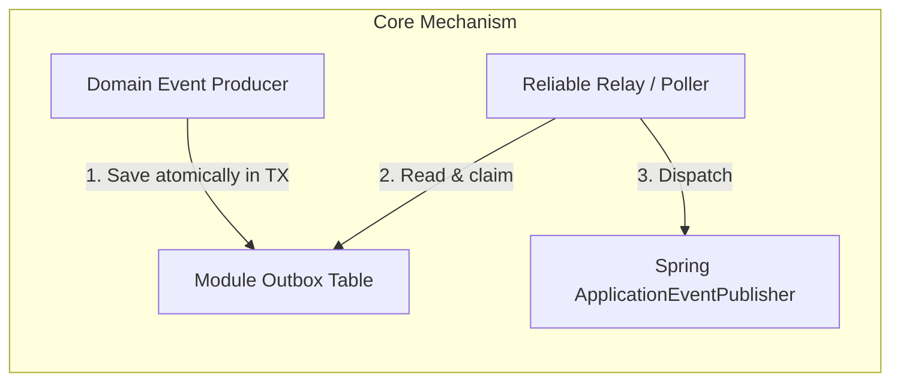
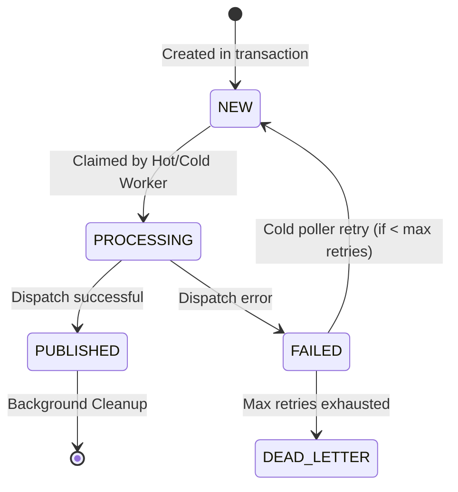
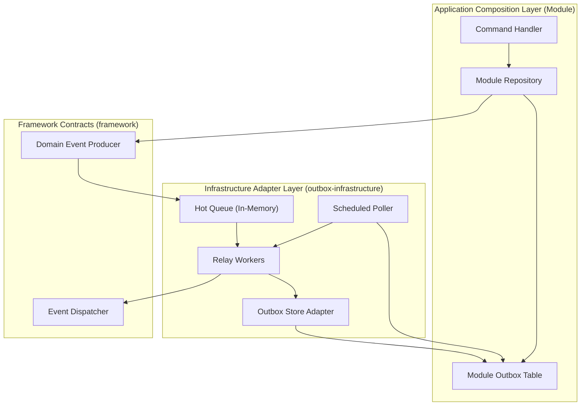
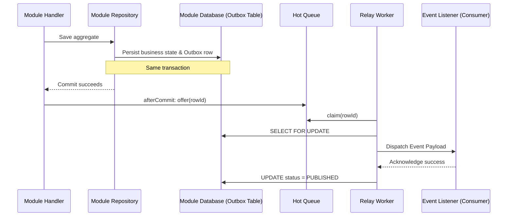
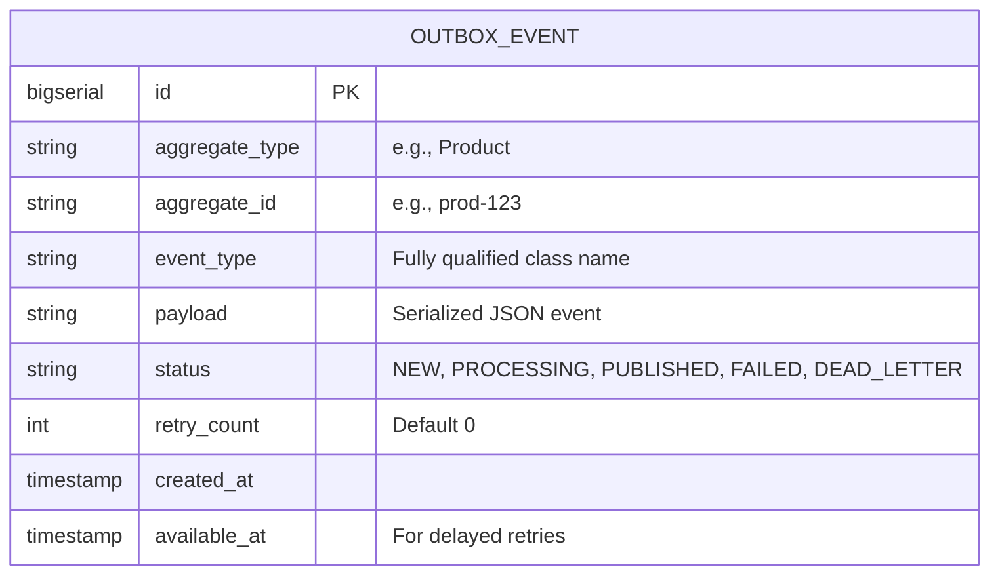

# Tech Specification: Transactional Outbox

> **Summary:** Provides reliable, at-least-once domain event publication by writing events to a module-scoped outbox table within the same transaction as business data changes.  
> **Classification:** Architectural Pattern / Platform Infrastructure  
> **Supporting Modules:** `framework` / `outbox-infrastructure`  
> **Related Architecture ADRs:** [ADR-002](../system/ADR_002-Module_scoped_outbox_architecture.md), [ADR-011](../system/ADR_011-Outbox_hot_queue.md)

---

## 1. Why We Need It

### The Problem

If a domain event is published immediately after a business transaction commits, the event is permanently lost if the process crashes before delivery completes. This prevents cross-module workflows (e.g., Saga orchestration) from making reliable progress and leaves systems in an inconsistent state.

### Technology Decision & Alternatives

| Technology Option | Decision | Evaluation Rationale |
| :--- | :--- | :--- |
| **Module-Scoped Outbox Tables** | **Adopted** | Preserves strict module boundaries. Events are saved in the same transaction as the business aggregate, ensuring zero message loss and independent retries. |
| Global Shared Outbox Table | Rejected | Weakens module ownership and forces all modules to depend on a single database schema migration path. |
| Debezium / CDC | Deferred | Overkill for a single-database modular monolith. May be reconsidered if modules are physically extracted to microservices. |
| Immediate Publication (No DB) | Rejected | High risk of data loss on application crash; cannot guarantee eventual consistency for sagas. |

### Key Benefits & Trade-offs

**Core Benefits:**
- Zero message loss across process restarts or network failures.
- Module encapsulation is preserved (each module owns its events).
- Hot queue relay ensures near-instantaneous processing (single-digit milliseconds) on the happy path.

**Known Trade-offs:**
- Requires background poller management and database storage space.
- At-least-once delivery semantics require all consumers to be idempotent.
- Hot queue worker races with the DB poller; DB claim dictates ownership.

---

## 2. What It Is

### Core Concept

The Transactional Outbox pattern guarantees message delivery by persisting the message inside the same ACID transaction as the business state change. A background processor or queue relay then reliably dispatches the persisted message and marks it complete.

### Internal Mechanics & Lifecycle

> Visual lifecycle for stateful outbox entries.

---

## 3. How We Use It in This System

### Architecture & Layer Stacking

### Component Responsibilities

| Architectural Role | Layer Location | Responsibility |
| :--- | :--- | :--- |
| `Domain Event Producer` | `framework` | Captures events from aggregates and serializes them to the outbox via the `OutboxStore`. |
| `Hot Queue Relay` | `outbox-infrastructure` | An in-memory hook triggered `afterCommit` that bypasses polling delays for near-instant dispatch. |
| `Scheduled Poller (Cold)` | `outbox-infrastructure` | Sweeps the outbox table for missed events, crashes, and retries. Acts as the safety net. |
| `Module Outbox Table` | `store` (Module DB) | The durable source of truth. Each module physically owns its table (e.g., `catalog_outbox_event`). |

### Runtime Flow

---

## 4. Technical Specification & Contracts

Normative specification. An implementation is compliant only when all MUST / MUST NOT statements are satisfied.

### Normative Rules

- **R-01:** Outbox event records **MUST** be persisted atomically within the exact same database transaction as the business aggregate state changes.
- **R-02:** Producing modules **MUST NOT** share outbox tables. Each module must own a distinct table or schema.
- **R-03:** The dispatching mechanism **MUST** guarantee at-least-once delivery to downstream consumers.
- **R-04:** Event consumers **MUST** be strictly idempotent, as crash recovery or poller overlap may result in duplicate event delivery.
- **R-05:** The hot queue mechanism **MUST NOT** delay or block the caller's HTTP request thread; dispatching MUST happen asynchronously on worker threads.
- **R-06:** The hot queue **MUST NOT** be trusted as the source of truth. The durable database row remains the authoritative record.

### Storage & Data Contract

### Configuration Knobs

| Knob Name | Default Value | Unit / Format | Description |
| :--- | :--- | :--- | :--- |
| `outbox.hot-queue.enabled` | `true` | Boolean | Toggles the near-real-time memory relay. |
| `outbox.poll.interval` | `5000` | Milliseconds | How often the cold poller sweeps the database for missed rows. |
| `outbox.poll.batch-size` | `100` | Integer count | Maximum rows claimed per cold poll iteration. |
| `outbox.retry.max-attempts` | `5` | Integer count | Number of failures before moving to `DEAD_LETTER`. |
| `outbox.cleanup.retention` | `7` | Days | How long `PUBLISHED` rows are retained before hard deletion. |
