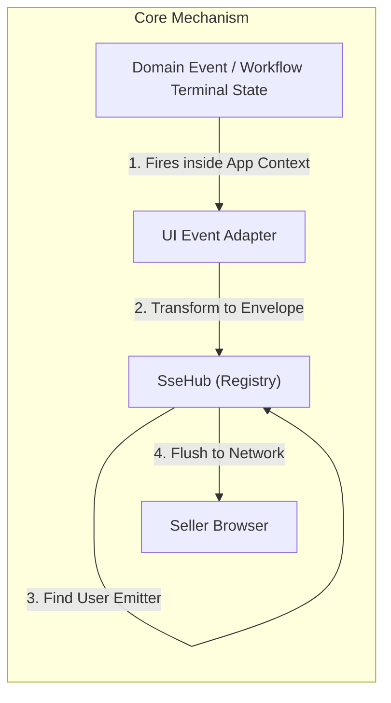
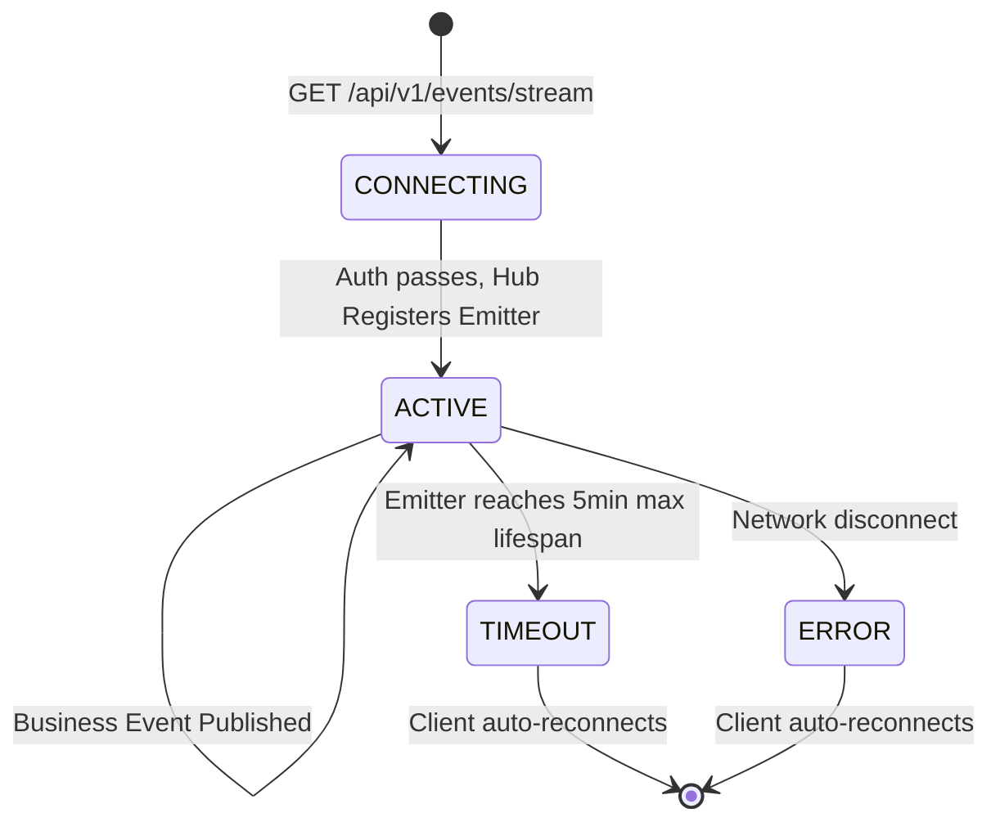
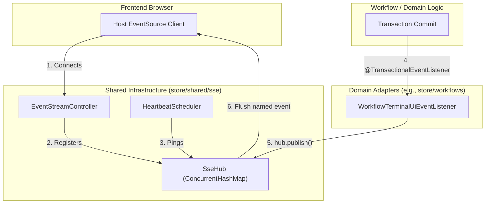
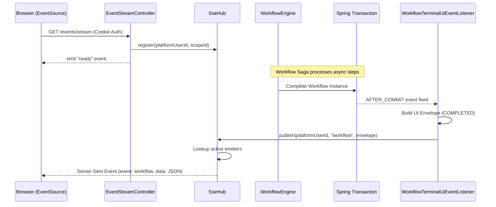

# Tech Specification: UI Event Stream & Notifications

> **Summary:** A host-owned Server-Sent Events (SSE) hub that pushes real-time terminal workflow signals and domain lifecycle events from the backend directly to the authenticated seller browser.  
> **Classification:** Cross-Cutting Concern / Platform Infrastructure  
> **Supporting Modules:** `store/shared/sse` / `store/workflows`  
> **Related Architecture ADRs:** [ADR-008](../system/ADR_008-Seller_ui_event_stream.md), [ADR-009](../system/ADR_009-Workflow_terminal_ui_notifications.md)

---

## 1. Why We Need It

### The Problem

Many domain operations (like `create-sellable-product`) are orchestrated asynchronously via the Transactional Outbox. When the initial HTTP request returns a `202 Accepted`, the frontend does not know when the downstream operations actually finish. Without a push mechanism, the frontend must aggressively poll REST APIs, wasting server resources and introducing UI latency.

### Technology Decision & Alternatives

| Technology Option | Decision | Evaluation Rationale |
| :--- | :--- | :--- |
| **Server-Sent Events (SSE) via Spring MVC** | **Adopted** | Lightweight, unidirectional (Server → Browser) text stream over HTTP. Perfect for pushing status updates. Reuses the existing cookie authentication filter. |
| WebSockets | Rejected | Unnecessary complexity. We do not need bidirectional real-time communication; the client always initiates actions via standard REST POSTs. |
| Spring WebFlux | Rejected | The store API is a standard Spring MVC servlet application. Introducing a reactive stack for a single SSE endpoint adds too much complexity. |
| Per-Module EventSource connections | Rejected | If each frontend Micro-Frontend (MFE) opens its own connection, it wastes resources and causes authentication/proxy bottlenecks. |

### Key Benefits & Trade-offs

**Core Benefits:**
- True real-time UI updates when sagas or long-running processes complete.
- Radically reduces REST polling load on the database.
- A single, centralized hub (`SseHub`) manages the connection; individual domain modules don't worry about connection state.

**Known Trade-offs:**
- Best-effort delivery. If the browser disconnects during an event emission, the event is lost (no server-side replay buffer yet). Clients must refetch state via REST upon reconnection.
- Requires proxy configurations (Nginx/Vite) to disable response buffering and idle timeouts.

---

## 2. What It Is

### Core Concept

The `SseHub` maintains an active list of `SseEmitter`s tied to authenticated users. When a user connects to `/api/v1/events/stream`, they are registered in the hub. When a background process (like a Workflow Saga) completes, a `@TransactionalEventListener(AFTER_COMMIT)` intercepts the completion event and calls `SseHub.publish()`. The hub serializes a small JSON envelope and pushes it down the active SSE connection to the browser.



### Internal Mechanics & Lifecycle

> Visual lifecycle for the SSE connection and emitter.



---

## 3. How We Use It in This System

### Architecture & Layer Stacking



### Component Responsibilities

| Architectural Role | Layer Location | Responsibility |
| :--- | :--- | :--- |
| `SseHub` | `store/shared/sse` | Manages the thread-safe registry of active emitters, keyed by user/scope. Handles network flush and error removal. |
| `EventStreamController` | `store/shared/sse` | The REST entrypoint. Handles the initial handshake, sets the 5-minute timeout, and emits the `ready` signal. |
| `HeartbeatScheduler` | `store/shared/sse` | Prevents load balancers from dropping the connection by sending an empty SSE comment (`: ping`) every 15 seconds. |
| `*UiEventListener` | `domain` or `workflows` | Adapts internal domain events into generic UI envelopes. **MUST** run `AFTER_COMMIT`. |

### Runtime Flow



---

## 4. Technical Specification & Contracts

Normative specification. An implementation is compliant only when all MUST / MUST NOT statements are satisfied.

### Normative Rules

- **R-01:** The `SseHub` **MUST NOT** be used as a durable event bus. It is strictly a best-effort transport layer. The Transactional Outbox MUST remain the sole mechanism for guaranteed inter-module delivery.
- **R-02:** Event adapters publishing to the hub **MUST** use `@TransactionalEventListener(phase = TransactionPhase.AFTER_COMMIT)`. Publishing an event to the browser before the database transaction commits causes race conditions if the UI immediately requests the resource.
- **R-03:** The SSE stream **MUST** be protected by the standard platform cookie-JWT authentication filter. No `permitAll` exceptions are allowed.
- **R-04:** The server **MUST** send periodic heartbeat comments (e.g., `: ping`) to prevent intermediary proxies from terminating the idle connection.
- **R-05:** The server **MUST** enforce a finite emitter timeout (e.g., 5 minutes) and forcefully close the connection to prevent memory leaks from zombied clients. The browser's native `EventSource` will automatically reconnect.
- **R-06:** The published UI envelope **MUST** remain small and only contain routing/status metadata. The UI MUST perform a standard REST `GET` to retrieve large domain payloads.

### Storage & Data Contract

> SSE Envelope Structure (JSON serialized in the `data:` field)

```json
{
  "producerId": "backend",
  "workflowId": "uuid-1234",
  "workflowName": "create-sellable-product",
  "status": "COMPLETED",
  "productId": "prod-5678",
  "errorMessage": null
}
```

### Configuration Knobs

| Knob Name | Default Value | Unit / Format | Description |
| :--- | :--- | :--- | :--- |
| `spring.mvc.async.request-timeout` | `360000` | Milliseconds | Global Tomcat async timeout. Must be higher than the individual emitter timeout. |
| `sse.emitter.timeout` | `300000` | Milliseconds | Max lifespan (5 mins) of an SSE connection before the server terminates it. |
| `sse.heartbeat.interval` | `15000` | Milliseconds | How often the heartbeat scheduler fires. |
