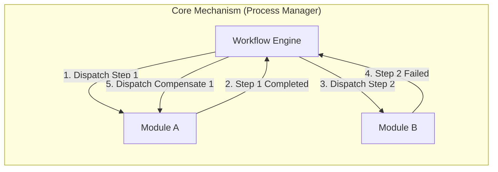
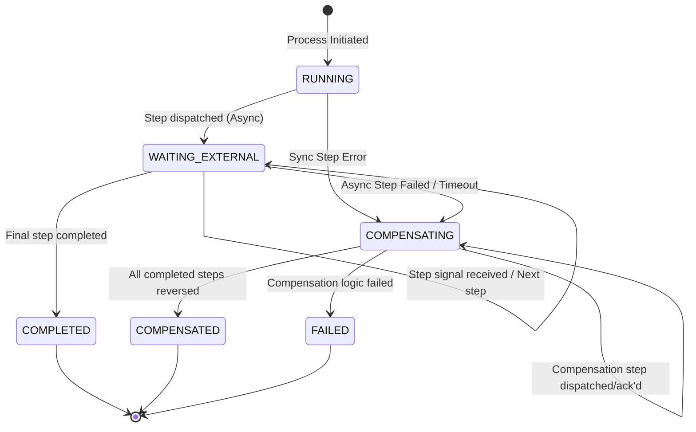
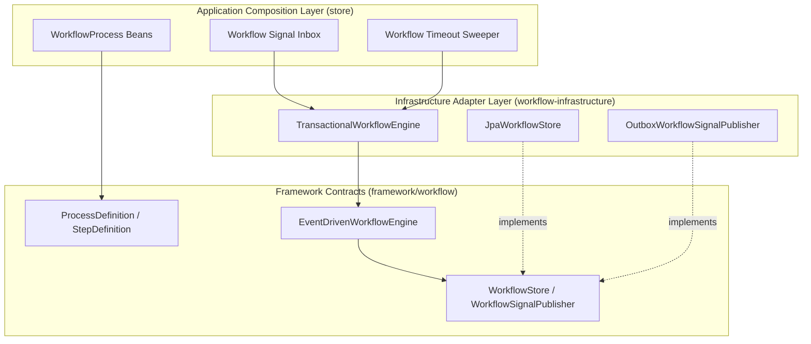
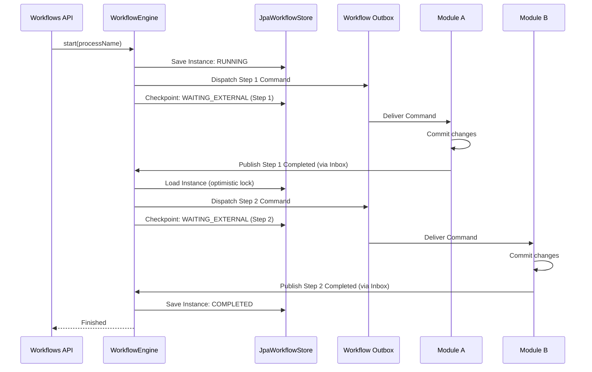
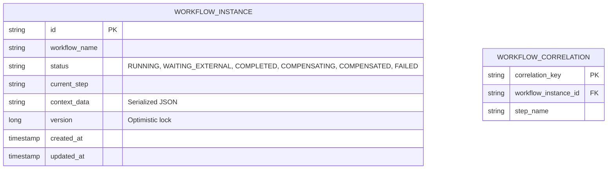

# Tech Specification: Workflow Engine & Orchestrated Saga

> **Summary:** A durable, event-driven Process Manager that orchestrates multi-step, cross-module business workflows with automatic state checkpointing, timeouts, and compensatory rollbacks.  
> **Classification:** Architectural Pattern / Platform Infrastructure  
> **Supporting Modules:** `framework/workflow` / `workflow-infrastructure` / `store/workflows`  
> **Related Architecture ADRs:** [ADR-006](../system/ADR_006-Orchestrated_saga_architecture.md), [ADR-007](../system/ADR_007-Workflow_framework_internal_design.md)

---

## 1. Why We Need It

### The Problem

Cross-module business operations (like creating a product, syncing inventory, and updating search indexes) require multiple independent database writes. If coordinated via synchronous HTTP or injected beans, a failure in step 3 leaves steps 1 and 2 committed, leading to data inconsistency and partial state. We need a way to reliably orchestrate multi-step flows and reverse (compensate) them if a downstream step fails.

### Technology Decision & Alternatives

| Technology Option | Decision | Evaluation Rationale |
| :--- | :--- | :--- |
| **Durable Process Manager (Saga)** | **Adopted** | Centralizes sequence logic and compensation order. Keeps bounded contexts completely decoupled (they only consume/emit events). |
| Event Choreography (Pure Pub/Sub) | Rejected | Hard to track the overall status of a complex flow; difficult to orchestrate ordered rollbacks across many independent listeners. |
| Two-Phase Commit (2PC) / XA | Rejected | Blocks database resources, doesn't scale in distributed/modular systems, and isn't supported across microservice boundaries. |
| Temporal / Cadence | Deferred | Extremely powerful, but introduces significant infrastructure overhead for a modular monolith. May adopt if moving to microservices. |

### Key Benefits & Trade-offs

**Core Benefits:**
- Bounded contexts remain completely ignorant of the orchestrator; they just listen to commands and emit completion events.
- Crash resilience: If the app crashes midway, the workflow safely resumes from the last checkpoint.
- Guaranteed compensatory rollback: If a step fails, prior steps are systematically reversed.

**Known Trade-offs:**
- Requires maintaining a central workflow database (instances, correlations, signal dedup).
- Eventual consistency latency instead of immediate delivery (processes communicate via the Transactional Outbox).

---

## 2. What It Is

### Core Concept

The Workflow Engine implements the **Process Manager (Orchestrated Saga)** pattern. It evaluates a defined state machine (`ProcessDefinition`), dispatches a command to a module, waits in a suspended state for a completion signal, and then advances to the next step. If an error occurs, it walks backward through the completed steps, dispatching compensation commands.

### Internal Mechanics & Lifecycle

> Visual lifecycle of a `WorkflowInstance` managed by the engine.

---

## 3. How We Use It in This System

### Architecture & Layer Stacking

### Component Responsibilities

| Architectural Role | Layer Location | Responsibility |
| :--- | :--- | :--- |
| `ProcessDefinition` | `store/workflows` | Declarative configuration defining the sequence of steps and their compensation rules. |
| `EventDrivenWorkflowEngine` | `framework/workflow` | The pure domain logic of the engine: evaluates definitions, tracks state, and coordinates retries/rollbacks. |
| `TransactionalWorkflowEngine` | `workflow-infrastructure` | Wraps engine calls in a `REQUIRES_NEW` transaction and handles optimistic locking retries. |
| `JpaWorkflowStore` | `workflow-infrastructure` | Persists `WorkflowInstance` state, step checkpoints, and correlation IDs. |
| `WorkflowSignalInbox` | `store/workflows` | Consumes `WorkflowSignalEvent`s published by modules and routes them into the engine via `onSignal`. |

### Runtime Flow

---

## 4. Technical Specification & Contracts

Normative specification. An implementation is compliant only when all MUST / MUST NOT statements are satisfied.

### Normative Rules

- **R-01:** The workflow engine **MUST NOT** share a database transaction with the participating business modules (e.g., Catalog, Inventory).
- **R-02:** The workflow engine **MUST NOT** directly invoke `@Service` beans from other bounded contexts. All cross-module communication MUST occur via dispatched outbox events.
- **R-03:** Each `WorkflowInstance` mutation **MUST** use optimistic locking (`version` field) to prevent concurrent signal processing from corrupting state.
- **R-04:** Every asynchronous step **MUST** define a `timeout()`. The `WorkflowSweeper` MUST automatically fail or resume steps that exceed this timeout.
- **R-05:** Compensation logic **MUST** be idempotent. A compensation action may be dispatched multiple times if the network or process crashes.

### Storage & Data Contract

### Configuration Knobs

| Knob Name | Default Value | Unit / Format | Description |
| :--- | :--- | :--- | :--- |
| `workflow.sweeper.enabled` | `true` | Boolean | Toggles the background sweeper that detects timed-out steps. |
| `workflow.sweeper.interval` | `30000` | Milliseconds | How often the sweeper scans for stuck instances. |
| `workflow.retry.max-optimistic-retries` | `3` | Integer | Max attempts to retry `onSignal` if `ObjectOptimisticLockingFailureException` occurs. |
