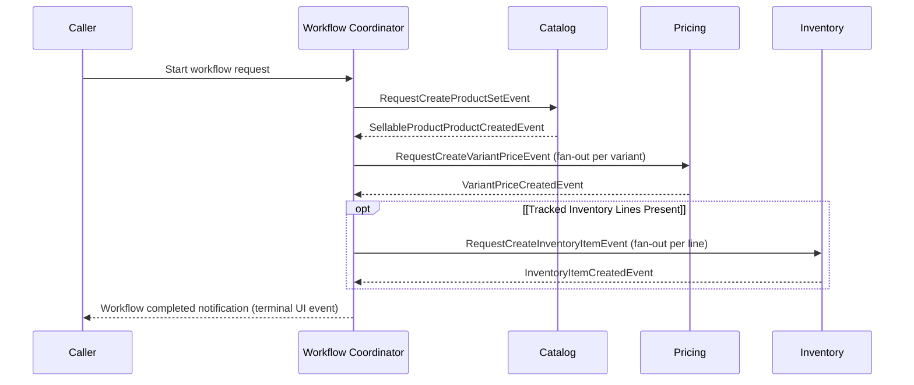

# Workflow: Create Sellable Product

> **Purpose:** Create a merchant sellable product end-to-end by creating the catalog product and variants, assigning variant prices, and initializing inventory items for tracked SKUs.
> **Starts When:** API call `POST /api/v1/workflows/create-sellable-product` is received.
> **Successful Result:** Catalog product and variants exist, price sets and variant price assignments are created, and inventory items are initialized.
> **Participating Domains:** Catalog · Pricing · Inventory
> **Related Domain Specs:**
> - [Catalog Domain Spec](../domain/catalog/architecture/product-domain-spec.md)
> - [Pricing Domain Spec](../domain/pricing/architecture/pricing-domain-spec.md)
> - [Inventory Domain Spec](../domain/inventory/architecture/inventory-item-domain-spec.md)

---

## 1. Step-by-Step Execution Path

### Normal Path (Happy Path)

| # | Step Name | Owner Domain | Business Action | Starts When | Complete When |
| :--- | :--- | :--- | :--- | :--- | :--- |
| **1** | `create-product` | Catalog | Creates the product and its variants. | Workflow initiated | `SellableProductProductCreatedEvent` received |
| **2** | `create-variant-prices` | Pricing | Creates a price set and assignment for each variant. | Step 1 completes | `VariantPriceCreatedEvent` received for every variant |
| **3** | `create-inventory-item` | Inventory | Creates inventory items for all tracked SKUs. | Step 2 completes | `InventoryItemCreatedEvent` received for every line → Workflow completes |

### Special Flows & Edge Conditions

- **Parallel fan-out:** Step 2 fans out one price creation request per variant and advances when all variant prices are created. Step 3 fans out one inventory creation request per inventory line and advances when all inventory lines are initialized.
- **Conditional / skipped steps:** Step 3 (inventory) is completely bypassed and skipped if no tracked inventory lines are provided in the payload.

### Happy Path Flow



---

## 2. Events & Signals

### Request Events (Workflow → Domain)

| Event Name | Step | Dispatched To | Intent / Payload Summary |
| :--- | :--- | :--- | :--- |
| `RequestCreateProductSetEvent` | `create-product` | Catalog | Requests creation of the product set and variants. |
| `RequestCreateVariantPriceEvent` | `create-variant-prices` | Pricing | Requests creation of a price set and assignment for a specific variant. |
| `RequestCreateInventoryItemEvent` | `create-inventory-item` | Inventory | Requests creation of an inventory item for a SKU at a specific location. |

### Completion Events (Domain → Workflow)

| Event Name | Step | Emitted By | Meaning to Workflow |
| :--- | :--- | :--- | :--- |
| `SellableProductProductCreatedEvent` | `create-product` | Catalog | Product and variants created successfully; advance to price creation. |
| `VariantPriceCreatedEvent` | `create-variant-prices` | Pricing | Price set created for a variant; step completes when all variants are priced. |
| `InventoryItemCreatedEvent` | `create-inventory-item` | Inventory | Inventory item initialized for a line; step completes when all lines exist. |

### Failure Events (Domain → Workflow)

| Event Name | Emitted By | Failure Cause | Resulting Workflow Action |
| :--- | :--- | :--- | :--- |
| `SellableProductStepFailedEvent` | Any participant | Validation error, invariant breach, or timeout | Halts forward execution and initiates compensation. |

---

## 3. Compensation & Failure Recovery

> **Starts When:** A step reports failure via `SellableProductStepFailedEvent` after one or more prior steps have already succeeded.

### Compensation Order

| Order | Completed Action | Undo Action | Request Event | Acknowledgement Event |
| :--- | :--- | :--- | :--- | :--- |
| **1** | Step 2: Create variant price sets | Delete all created price sets | `RequestDeletePriceSetCompensationEvent` | `PriceSetDeletedEvent` |
| **2** | Step 1: Create catalog product and variants | Delete the created catalog product | `RequestDeleteProductCompensationEvent` | `ProductDeletedEvent` |

### Explicitly Non-Compensated Actions

- **Inventory items:** Explicit business policy leaves created inventory items unchanged. If a workflow fails, any initialized inventory items are preserved (they are zero-stock entities).
- **Product-variant view projections:** Read model projections are internal choreography reacting to domain events rather than Saga step resources.

### Failure Flow

```mermaid
sequenceDiagram
    participant Catalog
    participant Workflow as Workflow Coordinator
    participant Pricing

    Catalog-->>Workflow: SellableProductStepFailedEvent
    Note over Workflow: Halt forward execution; initiate compensation
    Workflow->>Pricing: RequestDeletePriceSetCompensationEvent
    Pricing-->>Workflow: PriceSetDeletedEvent
    Workflow->>Catalog: RequestDeleteProductCompensationEvent
    Catalog-->>Workflow: ProductDeletedEvent
    Note over Workflow: Mark workflow COMPENSATED
```

---

## 4. Aggregate Cross-Lifecycle Matrix

| Workflow Stage | Catalog Product | Pricing PriceSet | InventoryItem |
| :--- | :--- | :--- | :--- |
| **Initial Start** | Non-existent | Non-existent | Non-existent |
| **After Step 1** | `CREATED` | Non-existent | Non-existent |
| **After Step 2** | `CREATED` | `CREATED` | Non-existent |
| **Workflow Completed** | `CREATED` | `CREATED` | `INITIALIZED` (if tracked) |
| **If Compensated** | `DELETED` | `DELETED` | Preserved (if created) |
