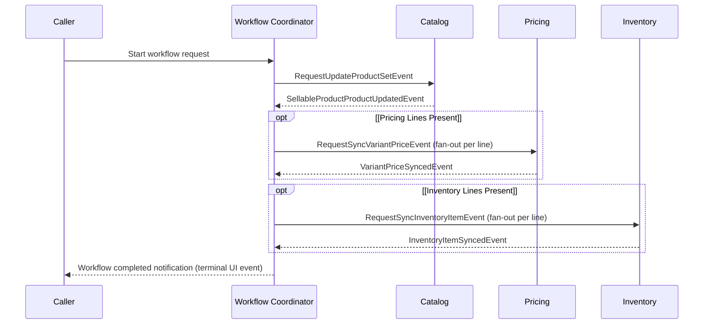
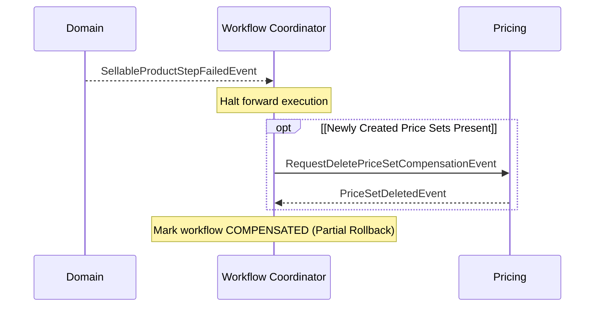

# Workflow: Update Sellable Product

> **Purpose:** Update a merchant sellable product end-to-end from a composed snapshot: catalog product and variants, sync variant prices, and sync inventory items.
> **Starts When:** API call `POST /api/v1/workflows/update-sellable-product` is received.
> **Successful Result:** Catalog product and variants are updated, variant prices are synchronized, and inventory lines are updated.
> **Participating Domains:** Catalog · Pricing · Inventory
> **Related Domain Specs:**
> - [Catalog Domain Spec](../domain/catalog/architecture/product-domain-spec.md)
> - [Pricing Domain Spec](../domain/pricing/architecture/pricing-domain-spec.md)
> - [Inventory Domain Spec](../domain/inventory/architecture/inventory-item-domain-spec.md)

---

## 1. Step-by-Step Execution Path

### Normal Path (Happy Path)

| # | Step Name | Owner Domain | Business Action | Starts When | Complete When |
| :--- | :--- | :--- | :--- | :--- | :--- |
| **1** | `update-product` | Catalog | Updates product metadata and synchronizes the variant matrix (add/remove/update variants). | Workflow initiated | `SellableProductProductUpdatedEvent` received |
| **2** | `sync-variant-prices` | Pricing | Upserts prices for each provided pricing line. | Step 1 completes | `VariantPriceSyncedEvent` received for every pricing line |
| **3** | `sync-inventory-item` | Inventory | Executes stock adjustment, damage, write-off, or reorder operations per inventory line. | Step 2 completes | `InventoryItemSyncedEvent` received for every line → Workflow completes |

### Special Flows & Edge Conditions

- **Parallel fan-out:** Step 2 fans out one price sync request per pricing line and advances when all sync. Step 3 fans out one inventory sync request per inventory line and advances when all sync.
- **Conditional / skipped steps:** Step 2 (pricing) is skipped if no pricing lines are provided. Step 3 (inventory) is skipped if no inventory lines are provided.

### Happy Path Flow

---

## 2. Events & Signals

### Request Events (Workflow → Domain)

| Event Name | Step | Dispatched To | Intent / Payload Summary |
| :--- | :--- | :--- | :--- |
| `RequestUpdateProductSetEvent` | `update-product` | Catalog | Requests update of product metadata and variant matrix. |
| `RequestSyncVariantPriceEvent` | `sync-variant-prices` | Pricing | Requests price synchronization (upsert) for a specific variant line. |
| `RequestSyncInventoryItemEvent` | `sync-inventory-item` | Inventory | Requests inventory creation, stock adjustment, damage, write-off, or reorder. |

### Completion Events (Domain → Workflow)

| Event Name | Step | Emitted By | Meaning to Workflow |
| :--- | :--- | :--- | :--- |
| `SellableProductProductUpdatedEvent` | `update-product` | Catalog | Product and variants updated successfully; advance to pricing sync. |
| `VariantPriceSyncedEvent` | `sync-variant-prices` | Pricing | Price synchronized for a variant line; step completes when all lines sync. |
| `InventoryItemSyncedEvent` | `sync-inventory-item` | Inventory | Inventory operation completed for a line; step completes when all lines sync. |

### Failure Events (Domain → Workflow)

| Event Name | Emitted By | Failure Cause | Resulting Workflow Action |
| :--- | :--- | :--- | :--- |
| `SellableProductStepFailedEvent` | Any participant | Validation error, invariant breach, or timeout | Halts forward execution and initiates compensation. |

---

## 3. Compensation & Failure Recovery

> **Starts When:** A step reports failure via `SellableProductStepFailedEvent` after one or more prior steps have already succeeded.

### Compensation Order

| Order | Completed Action | Undo Action | Request Event | Acknowledgement Event |
| :--- | :--- | :--- | :--- | :--- |
| **1** | Step 2: Create new price sets | Delete price sets that were *newly created* during this workflow run | `RequestDeletePriceSetCompensationEvent` | `PriceSetDeletedEvent` |

### Explicitly Non-Compensated Actions

- **Catalog product and variants:** The product is intentionally retained to prevent merchant data loss on transient failures, and hard-deleted variants cannot be safely restored via compensation.
- **In-place price updates:** Prior price amounts are not snapshotted for rollback. Only *newly created* price sets are deleted.
- **Inventory items and adjustments:** Stock adjustments, damage reports, write-offs, and newly created items are explicitly not rolled back by business policy.
- **Product-variant view projections:** Read model projections are internal choreography reacting to domain events rather than Saga step resources.

### Failure Flow

---

## 4. Aggregate Cross-Lifecycle Matrix

| Workflow Stage | Catalog Product | Pricing PriceSet | InventoryItem |
| :--- | :--- | :--- | :--- |
| **Initial Start** | `ACTIVE` | `ACTIVE` | `INITIALIZED` / `ACTIVE` |
| **After Step 1** | `UPDATED` | `ACTIVE` | `INITIALIZED` / `ACTIVE` |
| **After Step 2** | `UPDATED` | `UPDATED` / `CREATED` | `INITIALIZED` / `ACTIVE` |
| **Workflow Completed** | `UPDATED` | `UPDATED` / `CREATED` | `UPDATED` / `CREATED` |
| **If Compensated** | Retained (Partial Update) | Retained (Updates) / Deleted (New) | Retained (Updates) |
