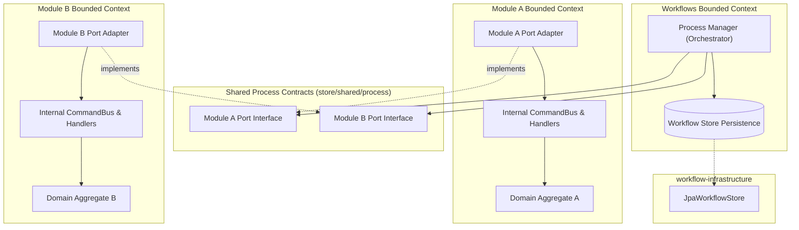
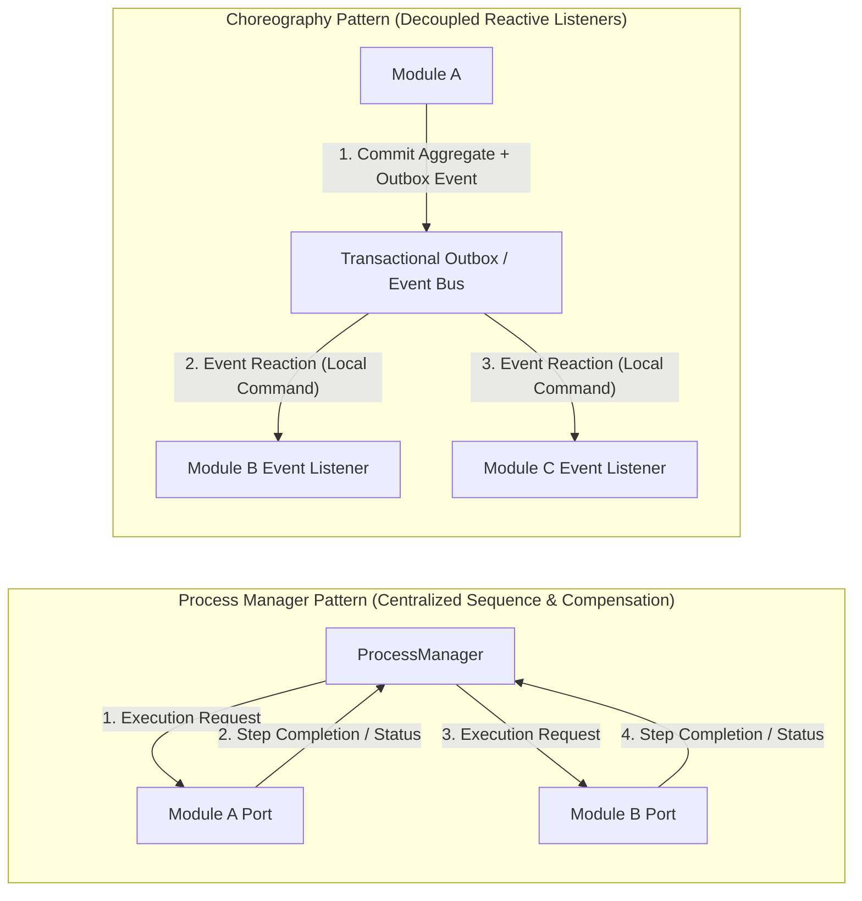
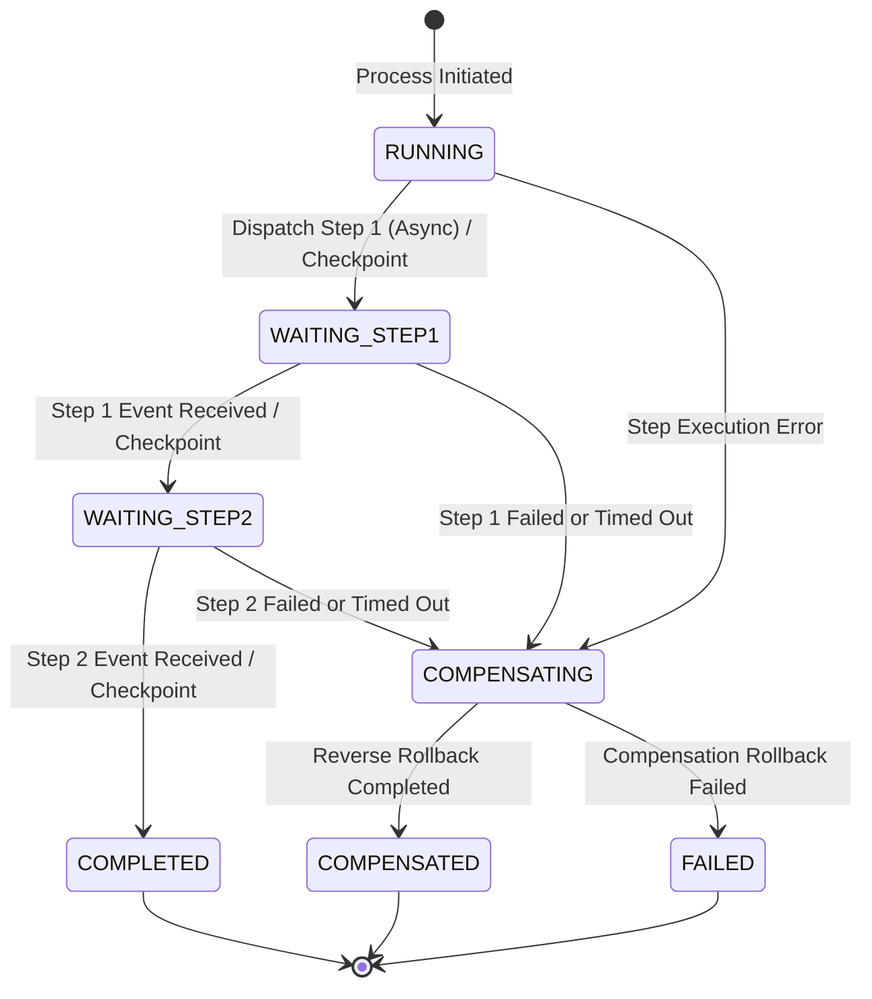
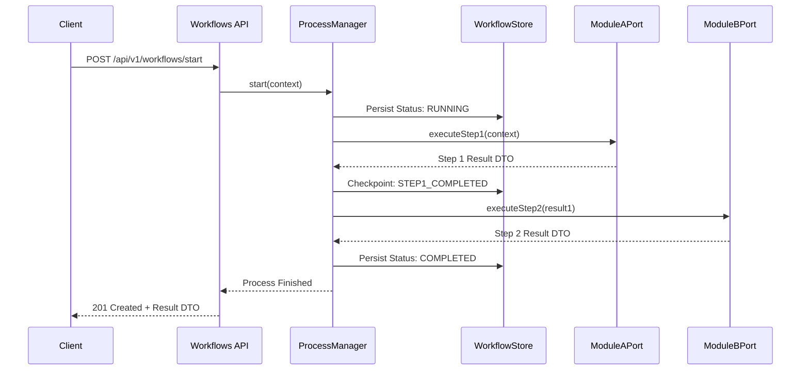
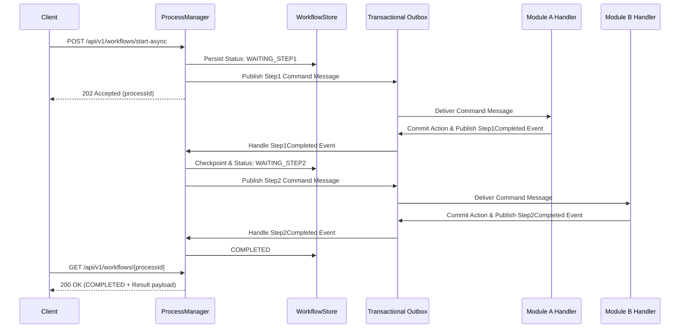

# Choreography and Orchestration Architecture

---

## 1. The Problem

**What's not working?**  
In our Spring Modulith platform, cross-module business operations requiring multiple writes were previously coordinated using in-request workflows that directly injected foreign module step beans (`WorkflowStep`). This pattern violated bounded context encapsulation, leaked module `internal` packages across domain boundaries, tightly coupled modules, and prevented clean extraction to independent microservices.

**What's at stake?**  
Without a clean separation of module boundaries and coordination patterns, cross-module operations cause domain logic fragmentation, fragile transaction management across independent `DataSource` boundaries, and unpredictable failure cascades. Continuing to couple bounded context internals increases architectural complexity and blocks future service decomposition.

---

## 2. What We Decided

**The core approach:**  
Adopt two complementary cross-module coordination patterns chosen strictly by use-case requirements: **Process Manager** (ports + persistent process store for sequence and compensation ownership) and **Event Choreography** (transactional outbox events for independent reactions).

**Key changes:**
- **Decouple Module Internals via Ports:** Replace foreign step bean injections with dedicated Process Manager orchestration. Process Managers communicate with bounded contexts exclusively through coarse-grained capability interfaces (ports) located in `store/shared/process/`.
- **Module Adapters:** Introduce port adapters in `store/{module}/internal/process/adapter/` that translate port interface invocations into module-private `CommandBus` dispatches.
- **Durable Workflow Store:** Introduce `workflow-infrastructure` for durable `WorkflowStore` persistence, wired by the `store/workflows` Modulith module. Resume-from-checkpoint is supported for `RUNNING` / `WAITING_EXTERNAL` (ADR-007).
- **Event Choreography for Decoupled Reactions:** Use module-scoped Transactional Outbox (ADR-002) integration events for event-driven reactions where no single central process owner is required.

**What stays the same:**
- **Single-Module Mutations:** Single-module write operations remain strictly within local CQRS command handlers and module-scoped database transactions (`@{Module}Transactional`).
- **Domain Invariants:** Aggregate invariants and domain validation rules stay inside their respective bounded contexts; Process Managers and event listeners only sequence work.
- **Outbox Infrastructure:** The module-scoped Transactional Outbox (ADR-002) continues to be the foundation for publishing domain and integration events.

---

## 2.1. Visual Overview

> *Diagrams illustrating the domain bounded contexts, context map, aggregate state lifecycle, and component interactions.*

### Bounded Contexts & Context Map

### High-Level Flow / Pattern Comparison

### Process Manager Aggregate / Lifecycle State Diagram

### Process Manager Sequence - Synchronous Port Execution

### Process Manager Sequence - Asynchronous Event/Outbox Messaging

---

## 3. Why This Approach

**Primary reasons:**
1. **Strict Bounded Context Decoupling:** Process Managers operate against shared port interfaces (`store/shared/process/`), preventing modules from importing each other's `internal` domain packages. Adapters map port invocations to private `CommandBus` dispatches.
2. **Clear Use-Case Selection Criteria:** Provides explicit architectural guidance for choosing between Process Manager (when a single orchestrator must own the sequence, compensation order, and status) vs Event Choreography (when modules react independently to facts with eventual consistency).
3. **Resilience & Flexible Transports:** The persistent `WorkflowStore` records checkpoints; `DefaultWorkflowRunner` can resume `RUNNING` / `WAITING_EXTERNAL` instances from the next incomplete step (ADR-007). Synchronous in-request orchestration with compensate-on-failure remains the default path.

---

## 4. Trade-offs

| Pros | Cons |
|-------|-------|
| **Encapsulated Bounded Contexts:** Modules expose coarse capability ports without leaking aggregate structures or internal CQRS command implementations. | **Workflow Store Management:** Requires maintaining dedicated workflow persistence tables, correlation IDs, and checkpoint logic in `workflow-infrastructure`. |
| **Seamless Microservice Migration:** Port interfaces can easily transition from local Spring bean calls to HTTP/gRPC clients or broker queues without refactoring Process Manager logic. | **Distributed Rollback Complexity:** Choreography requires distributed compensating event logic across listeners, making unified process tracking more complex. |
| **Dual Transport Support:** Cleanly handles synchronous immediate response requests as well as long-running asynchronous execution flows. | **Eventual Consistency Latency:** Asynchronous outbox messaging introduces eventual consistency delays between step execution events. |

---

## 5. What Needs to Change

**New components/modules to build:**
- `workflow-infrastructure/`: Durable `JpaWorkflowStore` persistence for workflow execution state.
- `store/workflows/`: Modulith module wiring datasource/Flyway and workflow runner beans; later orchestration entry points.
- `store/shared/process/`: Define shared port interfaces, capability contracts, execution status enums, and handoff DTOs (Process Manager pattern ports).
- `framework/workflow/`: Core workflow abstractions — context, definition, step, result, `WorkflowStore`, and checkpointing `WorkflowRunner`.

**Changes to existing systems:**
- `store/{module}/internal/process/adapter/`: Implement module-specific port adapters that implement shared interfaces from `store/shared/process/` and delegate to local `CommandBus` instances.
- **Deprecate Direct Step Injections:** Remove all cross-module foreign step bean imports (`::workflow`) across bounded context boundaries.
- **Outbox Event Integration:** Standardize module integration events published through the Transactional Outbox (ADR-002) for event-driven Choreography flows.

---

## 6. Implementation Plan

- **Phase 1:** Establish core workflow framework in `framework/workflow/` (checkpointing `WorkflowRunner` + `WorkflowStore` port), durable persistence in `workflow-infrastructure/`, and Modulith wiring in `store/workflows/` with a dedicated `workflows` database. *(Landed: `com.grab.framework.workflow.*`, `workflow-infrastructure` `JpaWorkflowStore`, Flyway `workflow_instance`, `workflows.datasource` — ensure `MODULE_DATABASES` includes `workflows`. Legacy non-durable runner removed.)*
- **Phase 2:** Introduce shared port contracts in `store/shared/process/`, build module port adapters (`store/{module}/internal/process/adapter/`), and migrate multi-step write flows (e.g. CreateSellableItem) to workflow orchestration or Event Choreography.
- **Phase 3:** Remove deprecated cross-module step bean imports, audit bounded contexts for strict `internal` encapsulation, and establish standard use-case pattern selection guidelines for new features.
