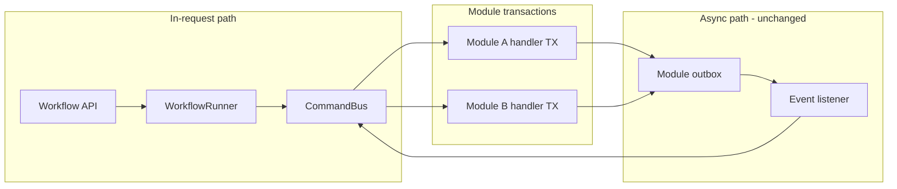
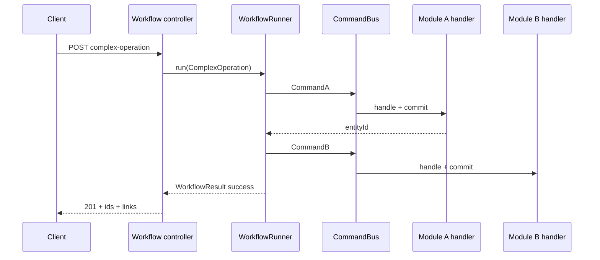
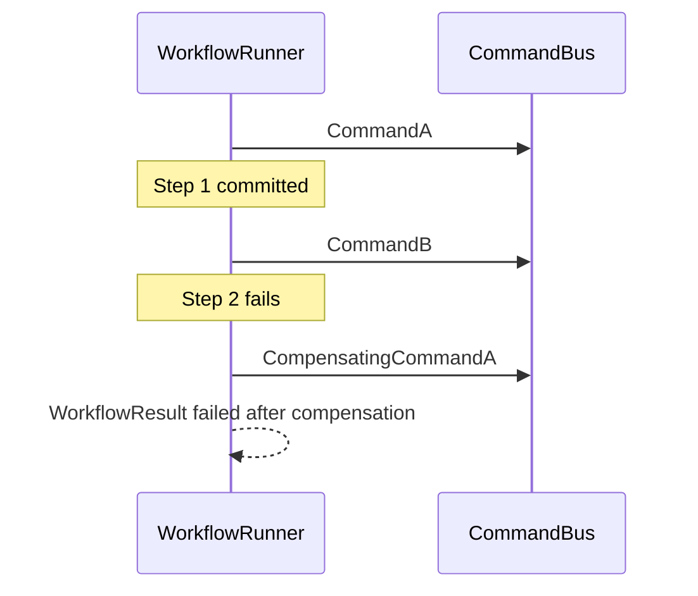

# ADR-006: Orchestrated Workflow

## Status
Proposed (July 21, 2026)

## Context

The platform is a Spring Modulith with module-scoped persistence:

- each bounded context owns its own `DataSource`, `EntityManagerFactory`, and
  `PlatformTransactionManager`
- writes go through CQRS command handlers with `@{Module}Transactional`
- cross-module side effects use the module-scoped transactional outbox
  (ADR-002) and event listeners that dispatch further commands via `CommandBus`

That design is correct for:

- single-module mutations (for example `CreateEntityCommand`)
- eventual consistency between modules (for example module A events
  projecting into module B's view)

It does not solve a different class of problem: **one user action that must
write in more than one module before the HTTP response returns**.

Example:

- create an entity in Module A
- then create dependent entities in Module B

There is no shared transaction across Module A and Module B. If step 2 fails
after step 1 committed, the system can leave inconsistent state unless the
application owns an explicit undo plan.

Frontend orchestration of multiple APIs is possible, but:

- compensation rules leak into clients
- partial failure handling is inconsistent
- HATEOAS discovery alone does not define transactional intent across modules

The repository needs a first-class application pattern for this case without
abandoning Modulith boundaries, CQRS, policies, or the outbox.

---

## Decision

Adopt an **orchestrated workflow** (also called an in-request workflow) for
cross-module write use cases that must complete as one user-facing operation.

### 1. Pattern

Use the **Workflow pattern in orchestration style**:

- one application orchestrator owns step order
- each step performs one module write by dispatching a command through
  `CommandBus` (or a read through `QueryBus` when needed)
- each completed step may register a **compensating command**
- if a later step fails, the runner executes compensations in reverse order

This is not choreography. Outbox listeners remain the choreography mechanism
for background sync and cascading reactions (ADR-002). Workflow and outbox
complement each other; workflow does not replace outbox.

### 2. Adoption levels

| Level | Name | Behavior | When |
|---|---|---|---|
| L1 | In-request workflow | Steps run inside one HTTP request; compensate on failure before response | Default starting point |
| L2 | Durable workflow | Persist workflow instance state; resume after crash | Only when long-running or crash-resume is required |

This ADR accepts **L1** now. L2 is deferred until a concrete use case needs it
(for example checkout with external payment waits).

### 3. When to use a workflow

Use a workflow when **all** of the following are true:

- one user action requires writes in two or more modules
- the client should receive success only if the whole sequence completed (or a
  documented partial policy with compensations applied)
- a single local module transaction cannot cover the work

Do **not** use a workflow when:

- the mutation stays inside one module (keep a normal command handler)
- the reaction is asynchronous eventual consistency (keep outbox + listener)
- the UI can accept two independent APIs with no server-side undo contract

### 4. Foundation placement

Shared workflow contracts live in `framework`:

```
framework/src/main/java/com/grab/framework/workflow/
  WorkflowContext
  WorkflowStep
  WorkflowDefinition
  WorkflowRunner
  WorkflowResult
```

Application workflow definitions and steps live under `store` composition root,
preferably:

```
store/src/main/java/com/grab/store/shared/workflow/
```

or a dedicated workflows package that remains outside any single bounded
context's `internal/` domain ownership.

Workflows are application orchestration. They are not domain aggregates and must
not live in `*-domain` modules.

### 5. Hard rules (must)

1. Workflow steps dispatch work only through `CommandBus` / `QueryBus`.
2. Workflow steps and runners must not inject or call repositories.
3. Workflow steps must not call other command/query handlers directly.
4. Business invariants stay in aggregates and policies; the workflow only sequences
   already-valid commands.
5. One step should target one module write boundary.
6. There is no shared transaction spanning modules; each handler keeps its own
   `@{Module}Transactional` boundary.
7. Compensations are also commands (or explicit no-ops), not ad-hoc repository
   deletes from the workflow.
8. Steps should be idempotent where retries are expected.
9. Existing single-module endpoints remain valid and are not required to route
   through a workflow.

### 6. API shape

- Keep single-module endpoints for single-module mutations.
- Add a workflow entry endpoint for the workflow, for example
  `POST /api/v1/workflows/complex-operation`.
- Expose discovery links (Tier-2 root and/or a workflows resource) so clients
  can find related operations.

Controllers stay thin: validate HTTP input, resolve security scope, call a
workflow application service, return DTO + HATEOAS links.

### 7. Relationship to existing architecture rules

| Concern | Owner after this ADR |
|---|---|
| Single-module write | Command handler + module TX |
| Cross-module async reaction | Outbox event + listener + `CommandBus` |
| Cross-module sync user action | Orchestrated workflow + compensating commands |
| Business rules | Aggregates / domain or application policies |
| Cross-module navigation | `{Owner}ApiLinks` / named `::api` interfaces |

---

## Visual Overview

### Workflow vs outbox



### Example Workflow happy path



### Failure with compensation



---

## Alternatives Considered

### Option A: Client-orchestrated multi-API calls

The client UI calls Module A create, then Module B create.

#### Advantages

- no new framework types
- each endpoint stays simple

#### Disadvantages

- compensation and partial-failure policy live in every client
- inconsistent behavior across web/mobile
- harder to enforce idempotency and audit as one business operation

#### Assessment

Acceptable for loosely related actions. Rejected as the primary approach for
operations that the product treats as one complex creation.

### Option B: Shared database transaction across modules

One `@Transactional` spanning multiple persistence units.

#### Advantages

- automatic rollback semantics

#### Disadvantages

- conflicts with module-scoped datasources and transaction managers
- blocks future extraction of modules to separate databases
- weakens Modulith persistence ownership

#### Assessment

Rejected. Workflow exists because cross-module atomic TX is intentionally avoided.

### Option C: Choreography-only (events for the whole flow)

Create entity, emit events, listeners create dependent entities automatically.

#### Advantages

- reuses outbox
- loose coupling

#### Disadvantages

- poor fit for request/response UX that needs immediate success/failure
- harder to present a single error to the caller
- compensation becomes distributed and opaque

#### Assessment

Keep for projections and cascades. Rejected as the only mechanism for
synchronous multi-module user actions.

### Option D: External workflow engine (Temporal, Camunda, Conductor)

#### Advantages

- durable execution, timers, versioning, operator tooling

#### Disadvantages

- operational and cognitive cost too high for current needs
- duplicates capabilities already provided by in-process `CommandBus`

#### Assessment

Deferred. Reconsider only for L2 durable long-running processes.

### Option E: Orchestrated in-request workflow on CommandBus

#### Advantages

- matches multi-datasource reality
- keeps module handlers and policies as the write engines
- clear compensate story
- small framework surface
- aligns with workflow ideas without copying external engines into the stack

#### Disadvantages

- process crash after a committed step and before compensation can leave
  temporary inconsistency until retry/ops handling (L1 limitation)
- requires compensating commands for each forward write

#### Assessment

Accepted for L1.

---

## Consequences

### Positive

- clear rule for when to add orchestration versus a single command versus
  outbox choreography
- cross-module user actions get explicit compensation without shared TX
- existing CQRS, Modulith, and outbox decisions remain intact
- clients can discover a single workflow entry instead of inventing multi-call
  scripts

### Negative / accepted trade-offs

- L1 does not guarantee resume-after-crash; operators or idempotent retry must
  cover rare mid-workflow process death
- each new workflow needs real compensating commands, not only happy-path commands
- more application types to learn (`WorkflowRunner`, steps, definitions)

### Follow-up work

1. ~~Implement `framework` workflow kit (`WorkflowContext`, `WorkflowStep`, `WorkflowRunner`, tests).~~ Done.
2. Add missing compensating commands where required by new workflows.
3. Implement the first concrete workflow, service, mapper, and API.
4. Add discovery links for the workflow entry.
5. Document workflow versus single-command versus outbox choice in feature specs.
6. Revisit L2 durable workflow only when a long-running process requires it.

---

## Notes

- The workflow sequences commands; it does not become the home of business rules.
- Naming in code may use `workflow`; the architectural pattern is
  orchestrated workflow either way.
