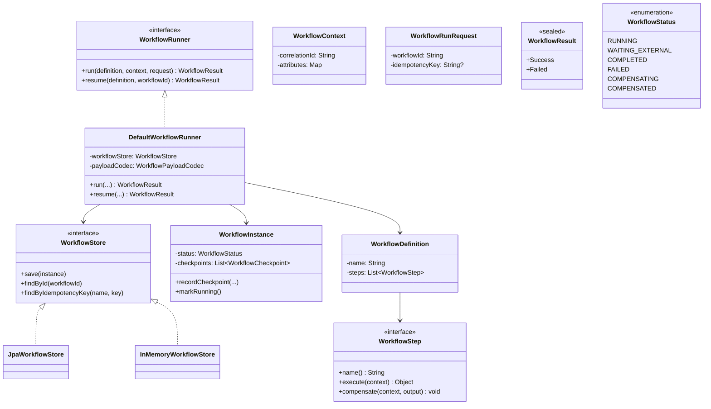
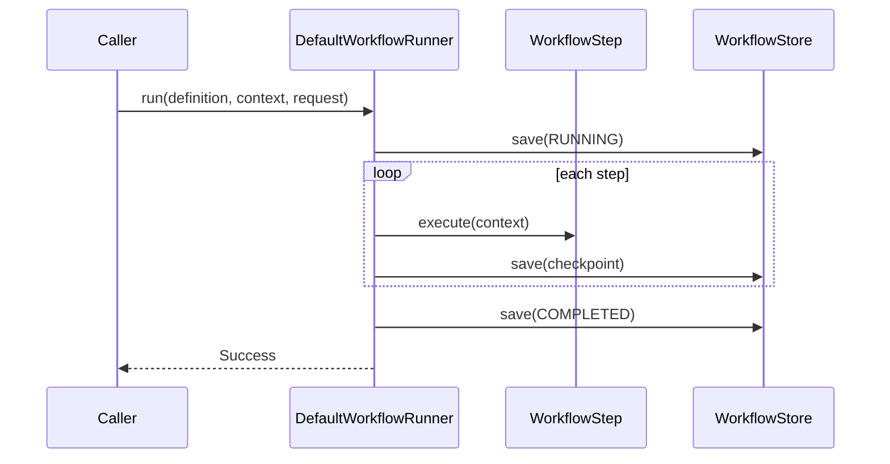
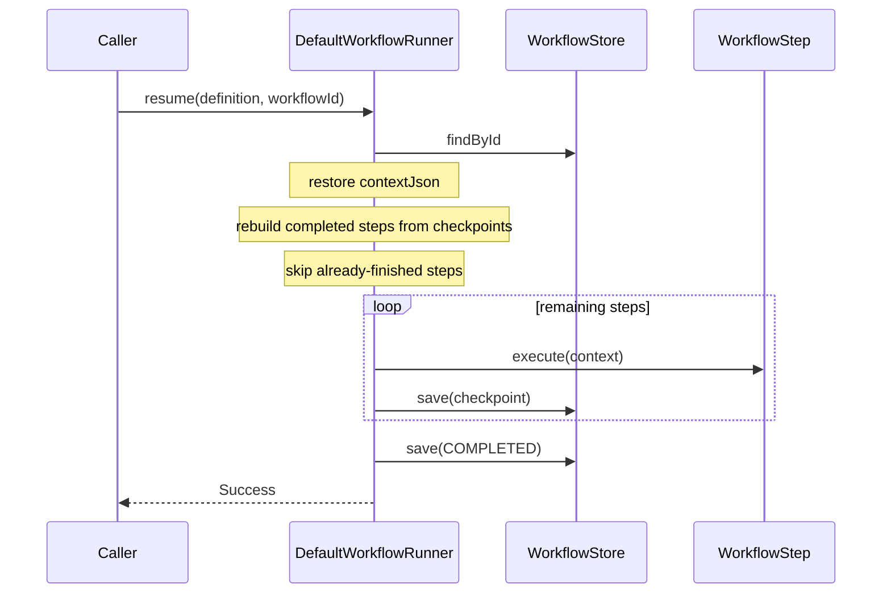
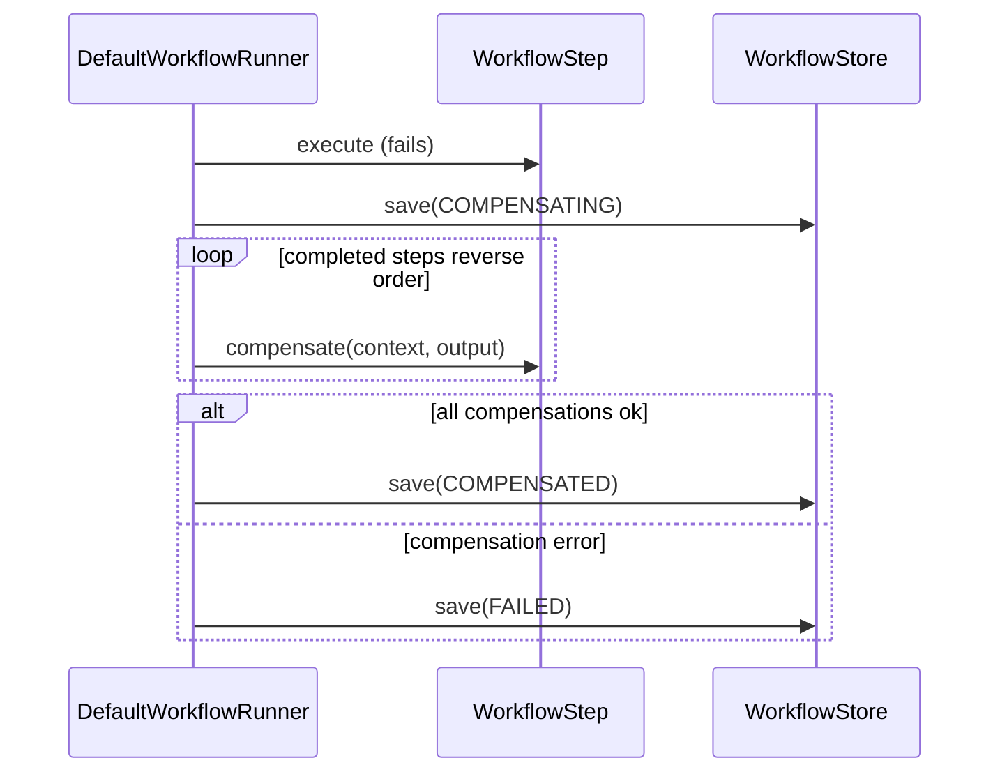
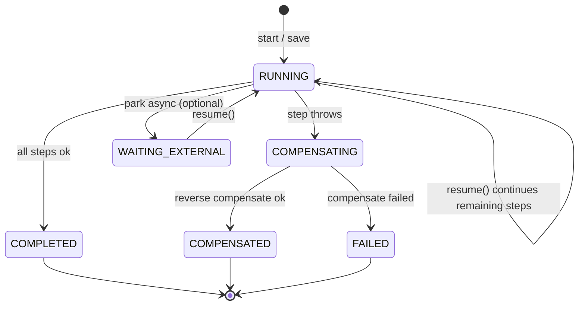

# ADR-007: Workflow Framework Internal Design

## Status
Accepted (July 22, 2026) — includes resume-from-checkpoint

## Context

ADR-006 defines **when** to use orchestrated workflows vs event choreography.
This ADR documents **how** the workflow kit is structured internally:

- `com.grab.framework.workflow` — portable runner, instance model, store port
- `workflow-infrastructure` — durable `WorkflowStore` JPA persistence
- `com.grab.store.workflows` — Modulith module wiring datasource + runner beans

---

## Decision

Keep one durable workflow kit:

| Layer | Ownership | Role |
|---|---|---|
| Framework | `framework/.../workflow` | Types + `DefaultWorkflowRunner` (checkpoint, compensate, **resume**) |
| Infrastructure | `workflow-infrastructure` | `JpaWorkflowStore` + `workflow_instance` entity/mapper |
| Store module | `store/workflows` | Datasource/Flyway wiring + `WorkflowConfiguration` |

`WorkflowRunner` always persists through `WorkflowStore`.

**Resume-from-checkpoint is supported** for `RUNNING` and `WAITING_EXTERNAL`:
- `run(...)` with an existing workflow id / idempotency key continues from the next incomplete step
- `resume(definition, workflowId)` loads the instance and continues the same way
- Completed checkpoints are not re-executed; context is restored from stored JSON
- `COMPLETED` replays success without re-running steps
- Terminal `FAILED` / `COMPENSATED` / `COMPENSATING` cannot be resumed

---

## Class Diagram



---

## How It Works

### Happy path



### Resume from checkpoint



### Failure + compensation



### Status lifecycle



---

## Package Map

```
framework/.../workflow/
  WorkflowRunner (+ resume), DefaultWorkflowRunner, WorkflowStore, …

workflow-infrastructure/
  JpaWorkflowStore, WorkflowInstanceEntity, WorkflowInstanceMapper

store/.../workflows/
  WorkflowsModuleDataSourceConfig, WorkflowConfiguration, Flyway migrations
```

---

## Consequences

**Positive**
- Crash mid-run can continue the same instance without redoing finished steps
- Idempotent `COMPLETED` replay still works
- Explicit `resume(workflowId)` for workers / ops

**Negative / follow-ups**
- Step outputs must be JSON-serializable
- Checkpoint prefix must still match the definition step order/names
- No automatic background worker yet — caller must invoke `run`/`resume`
- Cross-module steps should use shared ports/adapters (ADR-006 Phase 2)

---

## Related

- ADR-006 — when to use workflow orchestration vs choreography
- Flyway: `db/migration/workflows/V0__create_workflow_instance.sql`
