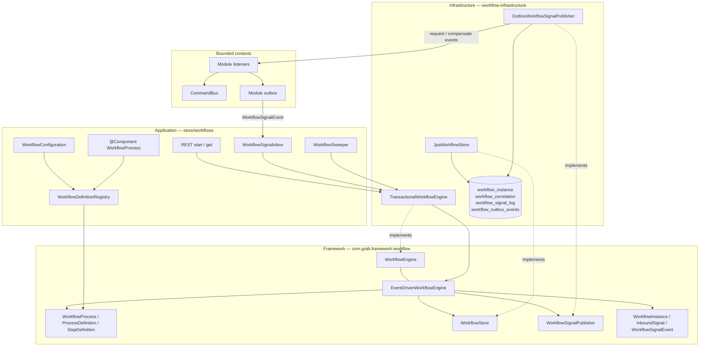
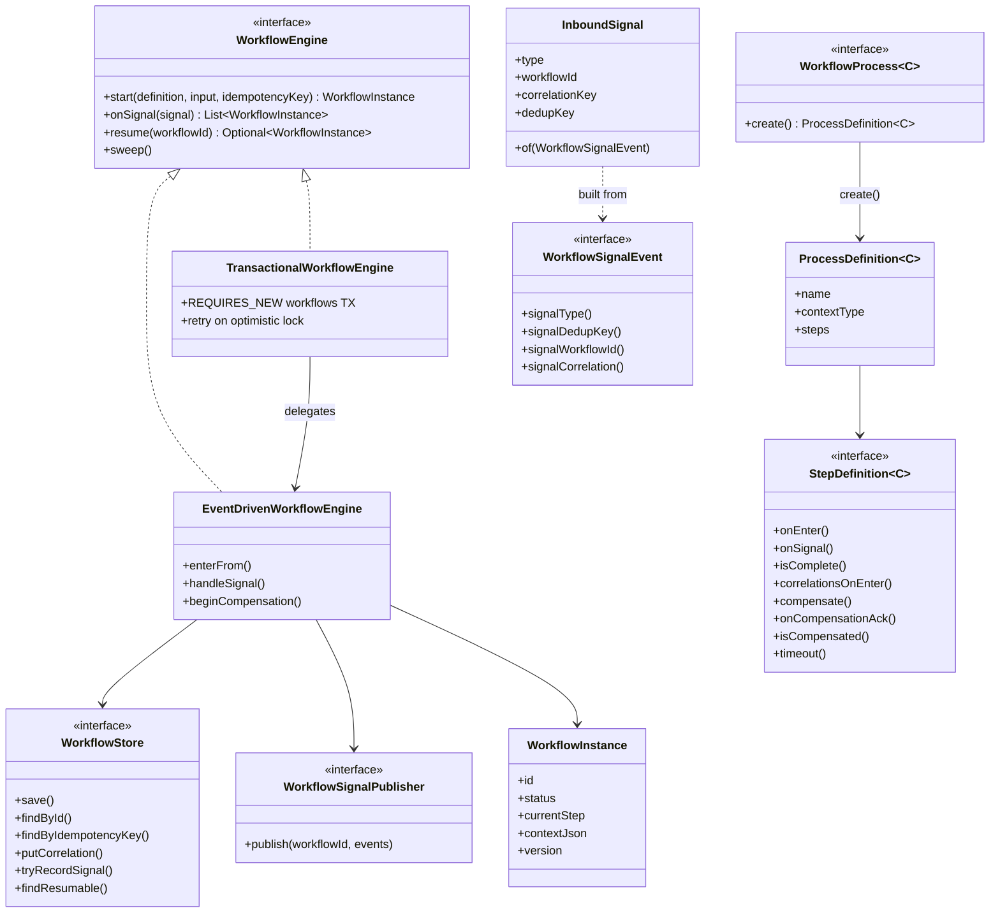
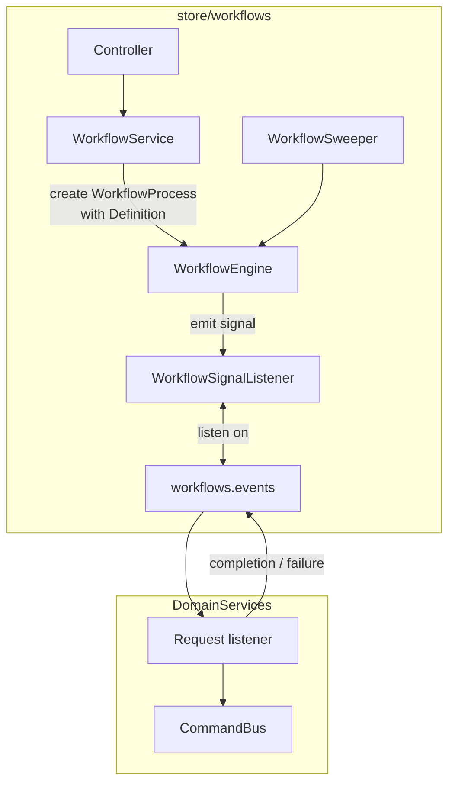
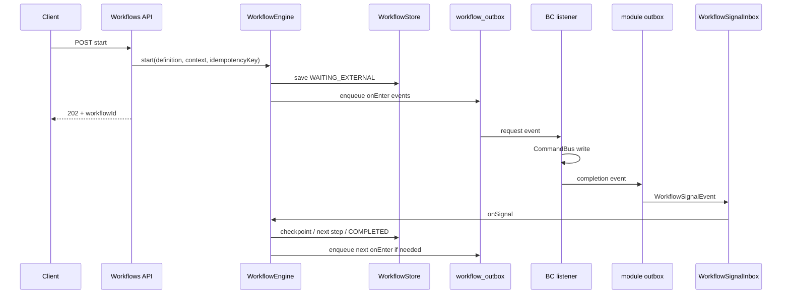
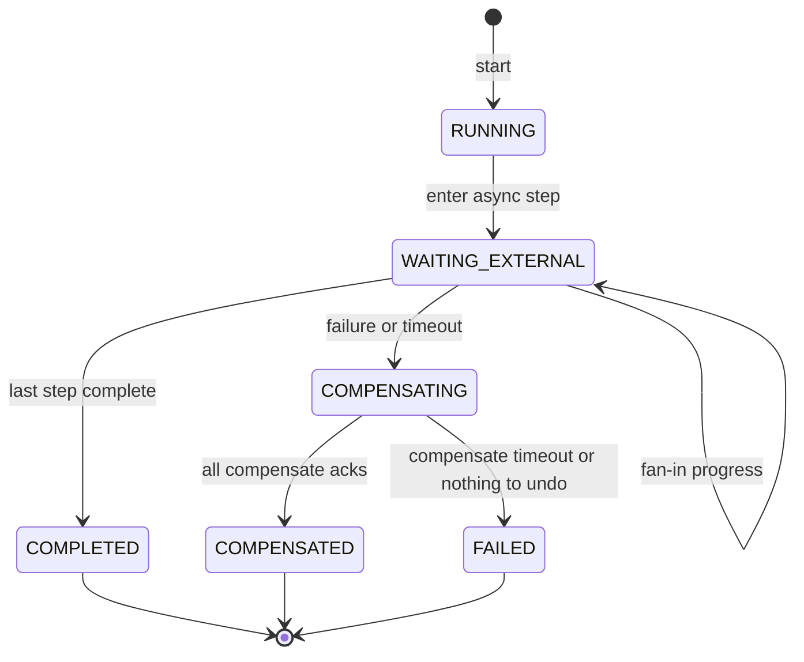
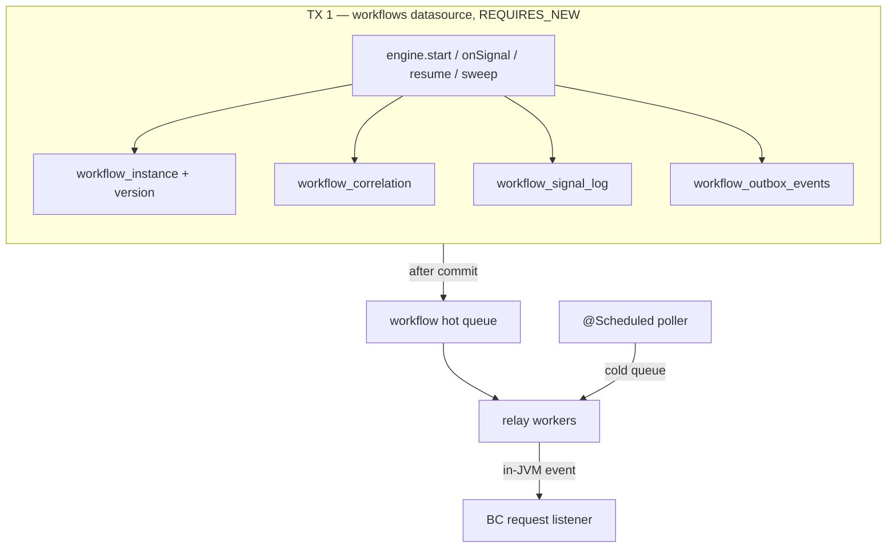
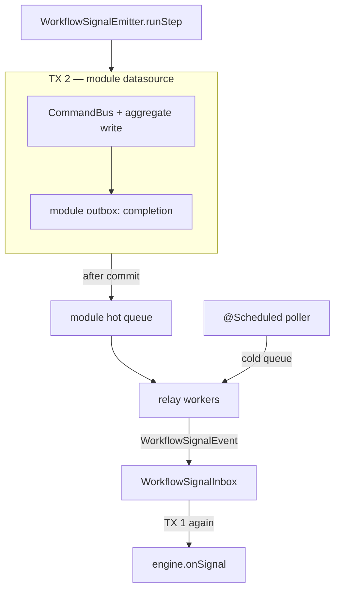
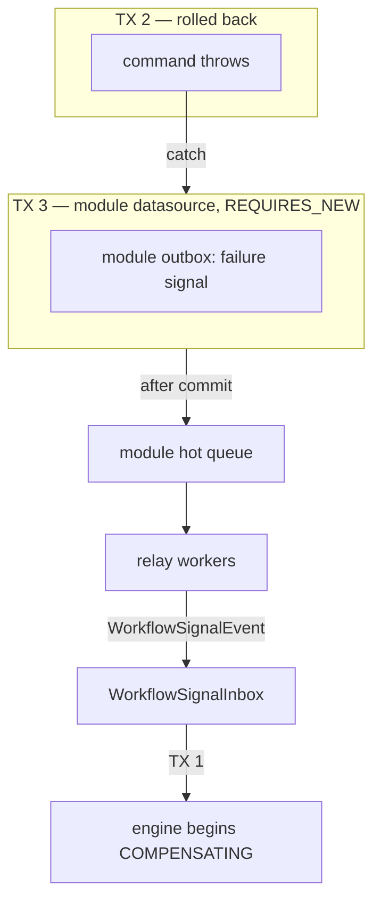
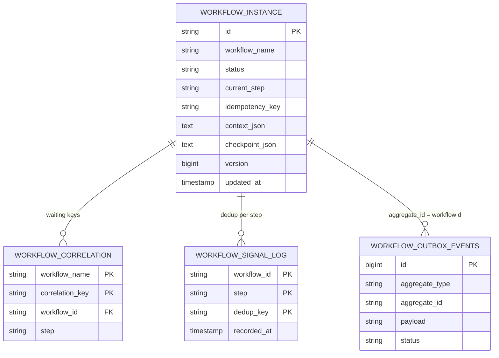

# ADR-007: Workflow Framework Internal Design

## Status
Updated September 12, 2026: outbox delivery uses a hot queue after commit; the `@Scheduled` processor is the cold fallback (ADR-011).

Production runs use `EventDrivenWorkflowEngine`. `DefaultWorkflowRunner` is deprecated and is not a bean.

## Context

ADR-006 says **when** to use an orchestrated workflow.
This ADR says **how** the workflow kit is built.

Three places own the kit:

- `com.grab.framework.workflow` — engine, definitions, ports
- `workflow-infrastructure` — JPA store, correlations, signal log, workflow outbox
- `com.grab.store.workflows` — API, process beans, inbox, sweeper

The engine must survive a crash after commit.
It must not inject another bounded context.
It must not share a transaction with catalog, pricing, or inventory.

---

## Decision

Keep **one** durable async process-manager engine.

Authors declare a `WorkflowProcess<C>`.
That bean returns a `ProcessDefinition<C>` of `StepDefinition<C>` steps.
The engine owns persistence, correlation, checkpointing, signaling, compensation, timeout, and resume.

| Layer | Package | Owns |
|---|---|---|
| Framework | `framework/.../workflow` | Ports, engine logic, definition types, instance model |
| Infrastructure | `workflow-infrastructure` | JPA store, workflow outbox, `TransactionalWorkflowEngine` |
| Application | `store/workflows` | REST, `WorkflowProcess` beans, inbox, sweeper |
| Bounded contexts | catalog / pricing / inventory | Request listeners, commands, completion signals |

`DefaultWorkflowRunner` / `WorkflowRunner` stay in the tree as deprecated sync code.
Do not wire them.
Do not use them for new workflows.

Cross-BC traffic stays on `com.grab.store.workflows.events`.
Engine → module events go through the **workflow outbox**.
Module → engine events go through the **module outbox**.
In-JVM dispatch is only the transport.
Durability comes from committed outbox rows.

---

## Layer Diagram

Framework has no Spring transactions and no JPA.
Infrastructure adapts the ports to the workflows database.
The store module is the composition root.
Other modules never call the engine.
They emit `WorkflowSignalEvent`s through their own outbox.



---

## Framework Design

The framework is a small kernel.
It does not know Spring, JPA, or any merchant module.

`WorkflowEngine` is the only runtime API:

- `start` — create a run, or return the existing one for the same idempotency key
- `onSignal` — apply a completion, failure, or compensation ack
- `resume` — re-publish the current step's events after a crash
- `sweep` — time out idle `WAITING_EXTERNAL` / `COMPENSATING` rows

`EventDrivenWorkflowEngine` is a plain class.
`TransactionalWorkflowEngine` wraps it in infrastructure and opens a workflows transaction.

Definitions are data plus callbacks.
`WorkflowProcess.create()` builds the graph once.
`ProcessDefinition` is an ordered list of steps.
Each `StepDefinition` says how to enter, complete, correlate, compensate, and time out.

Ports keep persistence and publishing out of the engine:

- `WorkflowStore` — instance, correlation, signal dedup, resumable query
- `WorkflowSignalPublisher` — enqueue events for other modules
- `WorkflowLifecycleListener` — notify the app when a run reaches a terminal status

Signals enter as `WorkflowSignalEvent`.
`InboundSignal.of(event)` copies type, workflow id or correlation, and the dedup key.
The engine looks up the definition from `instance.workflowName()`.
The inbox does not switch on event types.



---

## Application Layer Design

`store/workflows` is the composition root for the engine.
It does not own catalog, pricing, or inventory writes.

Spring collects `WorkflowProcess` beans the same way it collects `CommandHandler` beans.
`WorkflowConfiguration` builds `WorkflowDefinitionRegistry` from that list.
A new workflow is a `@Component`.
It does not need a new `@Bean` method in the config class.

The REST service starts a run with `process.create()`.
It returns `202` plus the instance.
Get reads the store. It does not call other modules.

`WorkflowSignalInbox` listens on `WorkflowSignalEvent`.
It calls `engine.onSignal`.
Adding a workflow does not change the inbox.

`WorkflowSweeper` is a scheduled job.
It calls `engine.sweep()`.

Module listeners live in their own BC.
They map a request event to a local command.
They write completion or failure events with `WorkflowSignalEmitter`.
They never import another BC's internals.



---

## Flow Diagram

### Happy path

The client gets an accepted response before any module work runs.
Each later hop commits its own outbox, then the next hop consumes it.



`WorkflowSignalInbox` does not list event classes.
Each event carries its own signal type, dedup key, and either a workflow id or a correlation key.

A module step and its completion signal commit together.
A failure signal commits in a new transaction, because the step transaction is already rollback-only.
See `WorkflowSignalEmitter`.

### Compensation

A failure or timeout moves the instance to `COMPENSATING`.
The engine publishes each step's `compensate()` events through the workflow outbox.
It stays `COMPENSATING` until every step is `isCompensated` **and** `compensate()` returns empty.
Publishing a compensate request is not proof the work was undone.
A timeout while compensating marks `FAILED`.

### Status lifecycle



---

## Transaction Boundary

There is no distributed transaction.
The workflows database and each module database commit on their own.
Outbox rows are the only link.

`TransactionalWorkflowEngine` always opens `PROPAGATION_REQUIRES_NEW` on `workflowsTransactionManager`.
`start`, `onSignal`, `resume`, and `sweep` each get a fresh workflows transaction.
`onSignal` and `resume` retry up to three times on `WorkflowOptimisticLockException`.

### TX 1 — start / signal / resume / sweep

Instance row, correlations, signal log, and workflow outbox rows commit together.
If the process crashes after this commit, the outbox processor still delivers the events.



### TX 2 — module success

The module write and the completion outbox row share the module transaction.
The engine is not in this transaction.
If the command fails, this transaction rolls back and no completion is published.



### TX 3 — module failure

The failed step transaction is rollback-only.
A new transaction writes the failure event so the engine can still compensate.



Rules:

- Never join a workflows transaction to a module transaction.
- Never publish a completion from a doomed transaction.
- Never treat an in-memory `ApplicationEventPublisher` call as durable. Persist the outbox row first.

---

## Persistence Diagram



`workflow_correlation` is scoped by workflow name so two workflows can wait on the same business key.
`workflow_instance.version` is the optimistic lock.
`workflow_signal_log` inserts with `ON CONFLICT DO NOTHING` so a duplicate signal does not poison the transaction.

---

## Package Map

```
framework/.../workflow/
  WorkflowEngine, EventDrivenWorkflowEngine
  WorkflowProcess, ProcessDefinition, StepDefinition
  InboundSignal, WorkflowSignalEvent, CorrelationKey
  WorkflowDefinitionRegistry, WorkflowStore, WorkflowInstance

workflow-infrastructure/
  TransactionalWorkflowEngine
  JpaWorkflowStore, WorkflowInstanceEntity (@Version)
  workflow_correlation, workflow_signal_log
  OutboxWorkflowSignalPublisher, WorkflowOutboxEventProcessor

outbox-infrastructure/
  DualQueueOutboxRelay, SpringOutboxCommitHook

store/.../workflows/
  WorkflowConfiguration          — registry from List<WorkflowProcess<?>>
  WorkflowSignalInbox            — one listener on WorkflowSignalEvent
  WorkflowSweeper
  WorkflowTerminalLifecycleListener
  WorkflowProcess beans          — e.g. CreateSellableProductDefinition
  rest/                          — start / get only
  events/                        — shared request, completion, failure types

store/.../{catalog|pricing|inventory}/internal/event/
  listeners + WorkflowSignalEmitter
```

---

## Consequences

**Positive**
- One engine. A new workflow is a `WorkflowProcess` bean plus thin module listeners.
- Completions find the run by `workflowId` or `workflow_correlation`. No full-table scan.
- Optimistic lock on `workflow_instance.version`. Dedup on `workflow_signal_log`.
- Compensation is confirmed before `COMPENSATED`.
- Sweeper resumes or times out stuck `WAITING_EXTERNAL` / `COMPENSATING` rows.
- A crash after persist and before dispatch is recoverable from the outbox.
- Workflows transactions never mix with module transactions.

**Negative / follow-ups**
- Context JSON must stay Jackson-serializable.
- Update-sellable-product and update-product-variant still use hand-written orchestrators until they migrate.
- Inventory compensation stays an explicit no-op where the workflow docs say so.

---

## Related

- ADR-006 — when to use orchestration vs choreography
- ADR-002 — module-scoped transactional outbox
- ADR-011 — outbox hot queue (afterCommit wake + poller fallback)
- ADR-009 — terminal UI notifications from `WorkflowLifecycleListener`
- Flyway: `db/migration/workflows/V0__create_workflow_instance.sql`, `V1__workflow_engine.sql`
