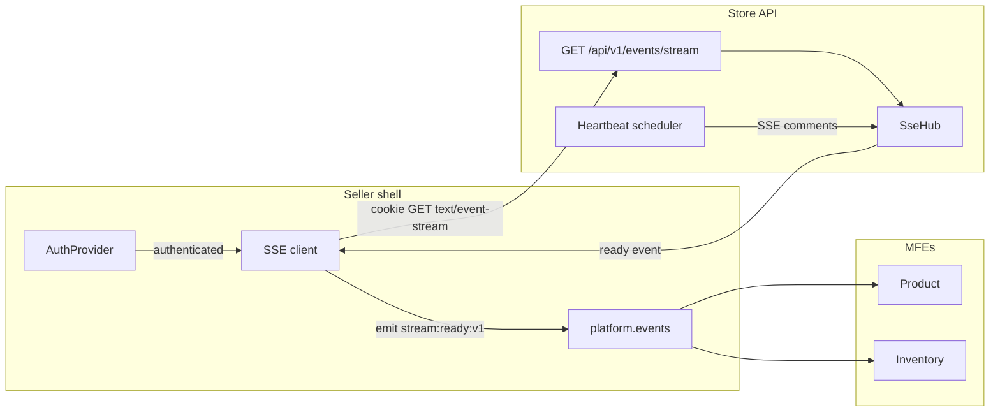
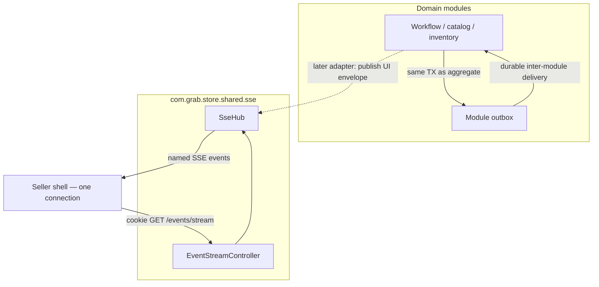

# Seller UI Event Stream: Host-Owned SSE Hub

## Status

Accepted (implemented; domain adapter is ADR_009)

**Does not replace:** [ADR_002 — Module-scoped outbox](./ADR_002-Module_scoped_outbox_architecture.md). The outbox remains the durability domain for inter-module events. This hub is a **backend → browser** transport, not a second outbox and not a substitute for REST/HATEOAS.

**Related (frontend):** `grab-web` ADR_004 — Host-owned backend event stream (`docs/decisions/ADR_004-HostOwnedBackendEventStream.md`). The seller shell owns the single browser connection; remotes never open SSE.

---

## 1. The Problem

**What's not working?**  
The store API has no authenticated, long-lived channel to push lifecycle signals into the seller browser. Domain work that finishes after a request returns (workflow `COMPLETED` / `FAILED` / `COMPENSATED`, later inventory or merchant notifications) can only be discovered by polling REST. Polling is wasteful and still races the user leaving the page.

**What's at stake?**  
Without a single host-owned stream, each MFE would be tempted to open its own EventSource or WebSocket. That multiplies cookie-authenticated connections, bypasses the existing JWT filter and 401 refresh path, and couples UI widgets to transport. Coupling the stream to the module outbox would also mix two failure domains: durable inter-module delivery vs best-effort browser fan-out.

---

## 2. What We Decided

**The core approach:**  
Put one **SSE hub** in the open shared store module (`com.grab.store.shared.sse`), not in identity and not in a domain bounded context. The seller shell opens **one** cookie-authenticated `GET /api/v1/events/stream`. Remotes do not connect. Later domain adapters call `SseHub.publish`; this slice is **transport only**.

**Key changes:**

- **`SseHub`** — `ConcurrentHashMap` of subscriber key → `CopyOnWriteArrayList<SseEmitter>`. Key = `platformUserId` plus optional access-context `scopeId`. Register on connect; remove on completion, timeout, or error.
- **`SseHub.publish(key, namedEvent, json)`** — public so a later workflow listener can publish UI envelopes without reshaping the hub.
- **`EventStreamController`** — `GET /api/v1/events/stream` producing `TEXT_EVENT_STREAM_VALUE`. Auth via the existing cookie JWT filter (`anyRequest().authenticated()`). On connect: register the emitter, send named event `ready` with an `id` and JSON `{ "producerId": "backend" }`.
- **Heartbeat** — `@Scheduled` every 15s sends SSE **comment** lines (`: ping`) so nginx / Vite do not idle-timeout. Comments are not business events and must not be mapped onto `platform.events`.
- **Emitter timeout** — ~5 minutes (`new SseEmitter(300_000L)`). The client reconnects. Avoid infinite emitters that leak on dropped clients.
- **HAL** — add `event-stream` on `ApiRootController` so the shell can discover the href.
- **Async** — set `spring.mvc.async.request-timeout` high enough that MVC’s 30s default does not kill emitters (dev yaml + a shared default). Stay on **Spring MVC `SseEmitter`**. Do not introduce WebFlux for this path.
- **Security** — no extra `permitAll`. Add a tiny `EventsSecurityConfigurer` only if a documented matcher is needed.

**What stays the same:**

- REST/HATEOAS remains the source of truth for business data.
- The module-scoped outbox ([ADR_002](./ADR_002-Module_scoped_outbox_architecture.md)) remains the durability domain for inter-module events. The hub does not read the outbox and the outbox does not write SSE.
- Cookie JWT authentication and identity resolution stay as in [ADR_005](./ADR_005-Api_security_architecture.md). The stream is another authenticated resource, not a new auth mechanism.
- Domain notification mapping, inbox persistence, and `Last-Event-ID` replay are **out of this slice**. The client may send `Last-Event-ID` as plumbing; the server does not replay yet.

### Boundary

| Owns | Does not own |
|------|----------------|
| One authenticated long-lived SSE connection per browser session | Domain event → UI envelope mapping |
| Emitter registry keyed by user (+ optional access-context scope) | Notification inbox persistence |
| Heartbeats (SSE comments) | `Last-Event-ID` replay buffer |
| Register / unregister on complete, timeout, error | WebSockets |
| Named `ready` lifecycle event on connect | Per-MFE connections |

---

## 2.1. Visual Overview

> *Diagrams to understand the architecture at a glance.*

### Transport path

### Hub ownership vs outbox

The dashed arrow is **follow-on**. This ADR only requires `publish` to exist so adapters can call it later.

---

## 3. Why This Approach

**Primary reasons:**

1. **One connection, one auth path.** Cookie JWT already authenticates every store request. The stream reuses that filter instead of a second protocol or a `permitAll` exception.
2. **Shared module, not a bounded context.** The hub is infrastructure used by many domains. Putting it in identity or catalog would make those modules own browser transport.
3. **SseEmitter stays in Spring MVC.** The store API is a servlet application. WebFlux would be a second runtime for one endpoint.
4. **Comments for keep-alive, named events for clients.** Heartbeats must not look like domain messages. `ready` is the only lifecycle event this slice maps; later adapters add named domain events.
5. **Finite emitters.** A 5-minute timeout plus client reconnect is cheaper and safer than infinite emitters that outlive dropped browsers.
6. **Outbox stays out of the browser path.** Durable module delivery and best-effort UI fan-out fail independently. REST remains how the UI loads authoritative state after a signal.

---

## 4. Trade-offs

| Pros | Cons |
|------|------|
| Single hub reused by later workflow / inventory / merchant adapters | This slice delivers no domain notifications until an adapter calls `publish` |
| Cookie auth matches the rest of the store API | Proxies (nginx, Vite) must disable buffering / idle timeout or the stream dies |
| MVC `SseEmitter` needs no WebFlux | Servlet async timeout and emitter timeout must be configured explicitly |
| Heartbeat comments are invisible to `platform.events` | Comments still consume scheduler and write I/O |
| Finite timeout limits leaked emitters | Clients must reconnect; brief gaps are expected |
| `Last-Event-ID` accepted as plumbing only | No replay: events published while disconnected are lost until REST refetch |

---

## 5. What Needs to Change

**New components (this ADR):**

- `com.grab.store.shared.sse.SseHub` — registry + `publish`.
- `EventStreamController` — `GET /api/v1/events/stream`.
- Heartbeat scheduler sending `: ping` every 15s.
- HAL `event-stream` link on `ApiRootController`.
- `spring.mvc.async.request-timeout` raised in dev yaml and a shared default.

**Tests:**

- Controller requires authentication.
- Register / unregister on complete.
- Heartbeat send does not throw after the emitter completes.
- `ready` event is written on connect.

**Explicitly not this slice:**

- Inbox persistence or server-side replay.

Domain mapping lives in [ADR_009](./ADR_009-Workflow_terminal_ui_notifications.md).

**Proxy requirements (frontend / gateway, not this repo’s Java):**

Vite and nginx must not buffer or idle-cut `/api/v1/events/stream`. Those changes live in `grab-web` and are recorded in frontend ADR_004.

---

## 6. Related Documents

- [ADR_002 — Module-scoped outbox](./ADR_002-Module_scoped_outbox_architecture.md) — separate durability domain
- [ADR_005 — API security](./ADR_005-Api_security_architecture.md) — cookie JWT filter; stream is an authenticated resource
- [ADR_006 — Orchestrated saga](./ADR_006-Orchestrated_saga_architecture.md) — later adapters may publish workflow terminal states
- Identity [ADR_002 — API security and cookies](../identity/architecture/ADR_002-API_security&cookie_architecture.md)
- Frontend ADR_004 — Host-owned backend event stream (`grab-web` repo: `docs/decisions/ADR_004-HostOwnedBackendEventStream.md`)
- [ADR_009 — Workflow terminal UI notifications](./ADR_009-Workflow_terminal_ui_notifications.md)
- Frontend ADR_003 — Host-mediated session-durable event bus (`grab-web` repo: `docs/decisions/ADR_003-HostMediatedSessionDurableEventBus.md`) — in-page bus; this hub is complementary, not a replacement

---

## 7. Alternative Methods Considered & Rejected

**Rejected: WebSockets**  
SSE is enough for server → browser named events. WebSockets add a bidirectional protocol, different proxy settings, and no extra value for this slice.

**Rejected: Spring WebFlux / reactive SSE**  
The store API is Spring MVC. A second stack for one stream is not justified.

**Rejected: Hub inside identity or a domain module**  
Identity already owns cookies and principals; it should not own browser fan-out. Catalog / inventory / merchant should publish through adapters, not own the connection table.

**Rejected: Couple the hub to the module outbox**  
Outbox delivery is durable and module-scoped. Browser connections are best-effort and process-local. Mixing them would make UI disconnects look like domain delivery failures (and the reverse).

**Rejected: Per-MFE EventSource connections**  
Multiplies authenticated long-lived sockets and hides transport from the host refresh mutex.

**Rejected: Infinite `SseEmitter` timeout**  
Dropped clients leak until process restart. A ~5 minute timeout plus reconnect is the leak bound.

**Rejected: `Last-Event-ID` replay in this slice**  
Replay needs a buffer and a retention policy. Pass the header as plumbing; implement replay only when a domain adapter needs it.

**Rejected: SSE as the in-page extension-slot bus**  
Already rejected on the frontend (ADR_003). This ADR is the complementary **backend → browser** path, not slot hydrate / pricing draft sync.
