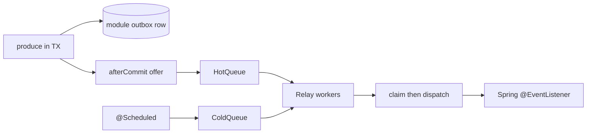

# ADR-011: Outbox Hot Queue

## Status

Accepted (implemented)

**Does not replace:** [ADR-002 — Module-scoped transactional outbox](./ADR_002-Module_scoped_outbox_architecture.md). Each module still owns its outbox table, processor, and transaction manager. Rows remain the source of truth.

**Does not replace:** [ADR-007 — Workflow framework](./ADR_007-Workflow_framework_internal_design.md). Cross-BC traffic still goes through committed outbox rows. This ADR only changes **when** those rows are relayed.

---

## 1. The Problem

Module processors woke only on `@Scheduled` (~5s). A create-sellable-product saga is several durable hops (workflow → catalog → workflow → pricing → …). Each hop waited for a poll even though the row was already committed. Shortening the poll wastes empty `SELECT`s; publishing from `afterCommit` with no row loses events on crash.

## 2. What We Decided

Keep the module-scoped JPA outbox. Add a **hot queue** under the existing `DomainEventProducer.produce()` call:

- After the business transaction **commits**, the producing thread `offer()`s row ids onto that module’s hot queue.
- Relay workers claim the row, deserialize, and dispatch through the existing `OutboxEventDispatcher` (`ApplicationEventPublisher`).
- The `@Scheduled` processor stays as the **cold** path: crash recovery, missed wakes, and `FAILED` retries whose `available_at` is due.
- Workers drain hot first (2:1 vs cold) so user-visible workflows are not stuck behind the poller.

Authors do not declare `@Hot` or write `afterCommit` hooks. `produce()` is enough. `{module}.outbox.hot-queue.enabled` defaults to true.

**What stays the same:**

- Outbox tables, `OutboxEntry` / `OutboxStatus`, claim-retry-cleanup
- Spring `@EventListener` fan-out
- At-least-once delivery; consumers stay idempotent

## 2.1 Visual Overview

## 3. Why This Approach

1. The durable write was already correct. The missing piece was a wake, not a new outbox product.
2. Enqueue on the business thread, process on workers: HTTP `start()` still returns after the workflows commit. Nested saga hops do not run on the request stack.
3. Bounded queues + drop-hot (row stays `NEW`) give backpressure without losing events. The poller recovers.
4. Delayed / not-yet-available rows skip the hot queue so retries stay on the cold path.

## 4. Trade-offs

- Typical hop latency drops from seconds to milliseconds on one JVM.
- Two in-memory queues and a few worker threads per module.
- Hot worker and poller can race; DB claim plus in-process inflight keeps at-least-once, not exactly-once.
- `PESSIMISTIC_WRITE` without `SKIP LOCKED` can still block; left for a later store change.
- No dead letter / exponential backoff in this pass.

## 5. Alternatives Considered

### afterCommit `processAvailableEvents()` on the business thread

Rejected: blocks HTTP, nests catalog/pricing/inventory onto the request, can recurse.

### afterCommit `publishEvent` with no row

Rejected by ADR-007: a crash between commit and publish loses the event.

### Adopt leonlee/outbox wholesale

Rejected: one `DataSource`, 1:1 `ListenerRegistry`, ULID/`DONE`/`DEAD` schema. Conflicts with module-scoped JPA and Spring fan-out. The SPEC is the pattern source, not a dependency.

### Postgres LISTEN/NOTIFY or Debezium

Deferred until multiple instances or extracted services already have a broker.
