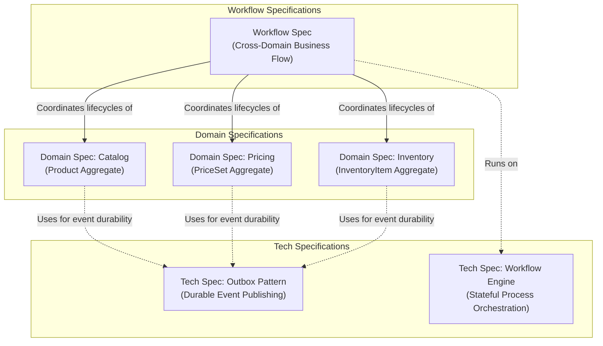

# Specification Architecture Guide

This guide establishes the standard specification architecture for the platform. Specifications are divided into three cohesive, complementary tiers:

---

## The 3 Specification Types

| Specification | Focus | Core Question Answered | Template |
| :--- | :--- | :--- | :--- |
| **Domain Spec** | Domain Aggregate Model | *What are the business concepts, boundaries, invariants, and lifecycle states within this bounded context?* | [`domain-spec-template.md`](file:///Users/khinemyaezin/Repository/grab/docs/templates/domain-spec-template.md) |
| **Workflow Spec** | Cross-Domain Business Flow | *What are the ordered steps, events, and compensation actions required to complete an end-to-end business case across aggregates?* | [`workflow-spec-template.md`](file:///Users/khinemyaezin/Repository/grab/docs/templates/workflow-spec-template.md) |
| **Tech Spec** | Technical Platform Capability | *Why is this specific platform technology needed, how does it work internally, and how is it structured in this project?* | [`tech-spec-template.md`](file:///Users/khinemyaezin/Repository/grab/docs/templates/tech-spec-template.md) |

---

## Golden Authoring Rules

1. **Explain with diagrams, not massive text blocks:** Keep paragraphs under 3 sentences. Replace long explanations with clear Mermaid flowcharts, sequence diagrams, and state machines.
2. **Cap diagram complexity:** Cap diagrams at ~7–9 nodes. Do not create tangled webs; split diagrams into focused views when necessary.
3. **Use role names in diagrams:** In diagrams, use logical participant and architectural roles (e.g. `Workflow Coordinator`, `Pricing Service`, `Outbox Poller`), **never** framework classes, Java types, or table schema names.
4. **Precise tables:** Use concise tables for invariants, steps, events, properties, and configuration. Keep each cell to 1 clear, unambiguous sentence.
5. **Strict boundaries:** In Domain Specs, show composition inside an aggregate root vs. ID-only references across aggregates and contexts. Never show direct cross-aggregate navigation.
6. **Normative contracts:** In Tech Specs, define non-negotiable rules using MUST / MUST NOT.

---

## File Placement & Naming Conventions

### 1. Domain Specifications
Place domain aggregate specifications in the corresponding module directory:
- `docs/spec/{domain}/architecture/{aggregate}-domain-spec.md`
- *Example:* `docs/spec/catalog/architecture/product-domain-spec.md`

### 2. Workflow Specifications
Place all cross-domain workflows in the central workflows directory:
- `docs/spec/workflows/{kebab-case-workflow-name}.md`
- *Example:* `docs/spec/workflows/create-sellable-product.md`

### 3. Tech Specifications
Place technical capabilities and pattern specifications in `docs/system/` or `docs/spec/`:
- `docs/spec/system/{kebab-case-tech-name}-tech-spec.md`
- *Example:* `docs/spec/system/transactional-outbox-tech-spec.md`

---

## Navigation & Cross-Linking

- **Workflow Specs** MUST link to the **Domain Specs** of all participating aggregates.
- **Domain Specs** MUST link to relevant **Workflow Specs** where the aggregate participates.
- Both **Domain Specs** and **Workflow Specs** link to supporting **Tech Specs** (e.g. Outbox pattern or Saga engine).
