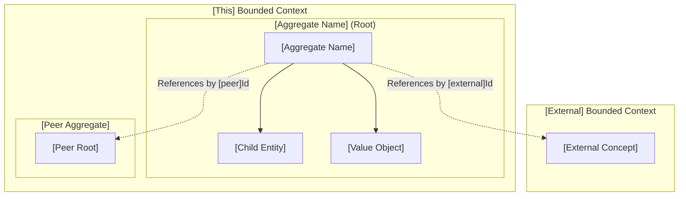
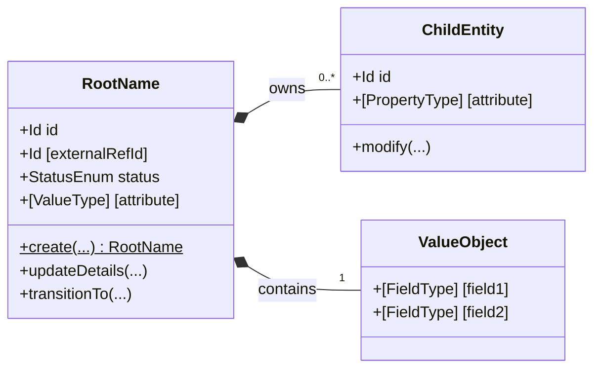
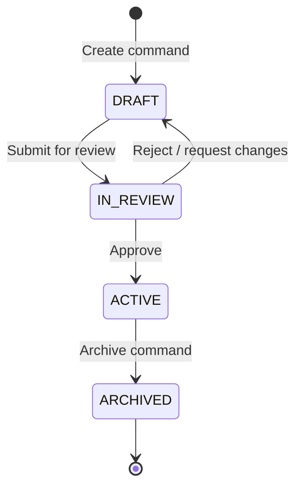

You are writing a Domain Specification for a business domain aggregate model.

The goal is to explain the business model, boundaries, invariants, and lifecycle clearly and simply without requiring the reader to inspect source code.

**Author rules:**
- Talk less and explain with diagrams and structured tables. Avoid massive paragraphs.
- In diagrams, use pure domain concepts and business roles. Never include Java types, framework annotations, or database table names.
- Keep diagrams clean and readable. Cap each diagram at ~7–9 nodes.
- Explicit boundaries: show composition inside the aggregate root vs. ID-only references across other aggregates or bounded contexts. Cross-aggregate object navigation is strictly forbidden.
- In Section 3, every property shown on the aggregate diagram MUST appear in the Property Rationale table with a business justification (never "needed for database/JPA").
- In Section 4, state invariants in business language and name the aggregate method or domain policy that enforces each invariant.
- In Section 5, show states and allowable transitions visually.
- Replace every `[placeholder]` before publishing.

---

# Domain Specification: [Aggregate Name]

> **Bounded Context:** [e.g. Catalog, Inventory, Pricing, Identity]  
> **Primary Purpose:** [1–2 sentences explaining the core business concept this aggregate models and protects.]  
> **Module Root:** `[e.g. catalog-domain / catalog-infrastructure / store]`  
> **Related Workflows:** [[Workflow Name 1]](../workflows/[file.md]), [[Workflow Name 2]](../workflows/[file.md])

---

## 1. Boundary & Context Map

### Ownership

- **This aggregate OWNS:** [Core entities, value objects, and lifecycle state it is source-of-truth for]
- **This aggregate DOES NOT OWN:** [Related business concepts that belong to other aggregates or contexts]

### Context Map

> Show this aggregate, its internal entities/value objects, and external relationships (ID references only).

---

## 2. Ubiquitous Language

| Business Term | Domain Concept | Business Definition |
| :--- | :--- | :--- |
| **[Term 1]** | `[ClassName]` (Aggregate Root) | [Exact business definition used by users and domain experts] |
| **[Term 2]** | `[EntityName]` (Entity) | [Child entity with independent identity within this aggregate] |
| **[Term 3]** | `[ValueObjectName]` (Value Object) | [Immutable attribute or value structure without separate identity] |
| **[State Term]** | `[StatusEnum.VALUE]` | [What this status signifies in the business lifecycle] |

---

## 3. Domain Aggregate Model

### Model Diagram

> Show the aggregate root, child entities, value objects, and method operations. Cap diagram at ~7–9 nodes.

### Property & Attribute Rationale

| Property | Type | Belongs To | Business Rationale |
| :--- | :--- | :--- | :--- |
| `[id]` | `Id` | Root | Unique aggregate identity across the platform. |
| `[externalRefId]` | `Id` | Root | Loosely couples to [External Domain] without cross-aggregate object loading. |
| `[status]` | Enum | Root | Tracks the lifecycle stage and guards allowable business actions. |
| `[attribute]` | String / Value | Root / Child | [Specific business reason this attribute exists; not "for DB"]. |

---

## 4. Business Invariants & Rules

> Invariants are non-negotiable business rules that must ALWAYS hold. If an invariant is violated, the aggregate rejects the command.

| Rule ID | Invariant Rule | Violation Outcome | Enforced By |
| :--- | :--- | :--- | :--- |
| **INV-01** | [e.g. A product must have at least one variant before it can be activated.] | Operation rejected; aggregate remains unchanged. | `Product.activate()` |
| **INV-02** | [e.g. Variant SKU must be unique across all active variants within the catalog.] | Operation rejected with duplicate SKU error. | `SkuUniquenessPolicy` |
| **INV-03** | [e.g. Price amount cannot be negative.] | Creation rejected with invalid argument exception. | `PriceAmount` Value Object |

---

## 5. State Lifecycle & Transitions

### State Machine

### Transition Matrix

| Current State | Trigger / Event | Next State | Guard Condition / Prerequisite |
| :--- | :--- | :--- | :--- |
| `[State 1]` | `[Command / Action]` | `[State 2]` | [Condition that must be satisfied before transition is allowed] |
| `[State 2]` | `[Command / Action]` | `[State 3]` | [Condition that must be satisfied] |
| `[State 2]` | `[Cancel / Reject]` | `[State 1]` | [Allowed rollback or reversion condition] |

---

## 6. Domain Events

### Emitted Events (What Happened)

| Event Name | Trigger | Key Attributes | Target Consumers |
| :--- | :--- | :--- | :--- |
| `[AggregateCreatedEvent]` | Initial creation | `aggregateId`, `tenantId`, `timestamp` | Workflows, Search Projections, Notifications |
| `[StateChangedEvent]` | State transition | `aggregateId`, `oldState`, `newState` | Downstream modules via Outbox |

### Consumed Events (Cross-Domain Signals)

| Consumed Event | Emitted By | Aggregate Action | Business Impact |
| :--- | :--- | :--- | :--- |
| `[ExternalEvent]` | `[External Domain]` | `[Execute Command]` | [How this aggregate reacts to external business events] |
