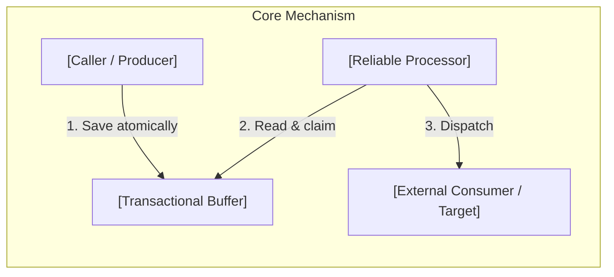
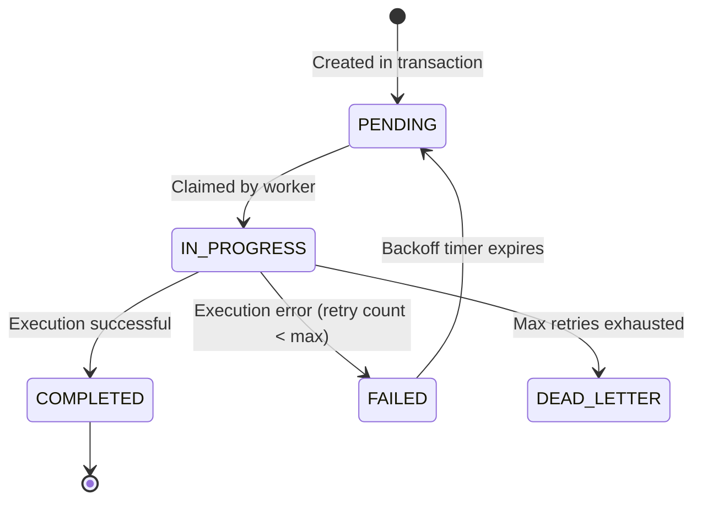
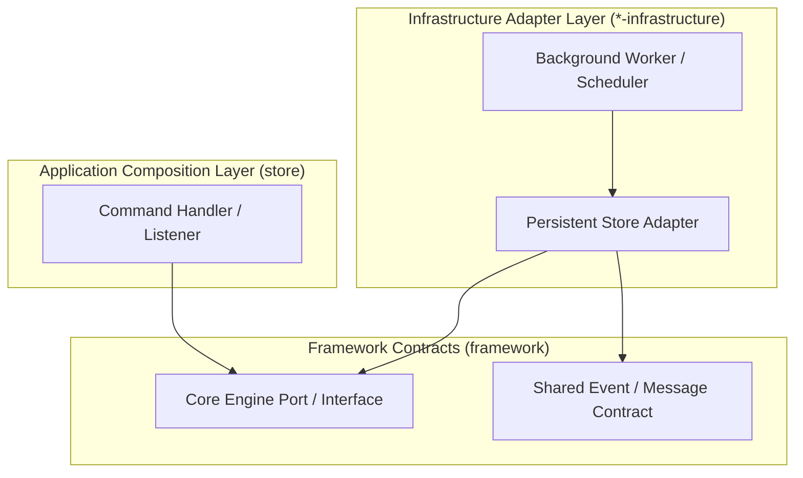
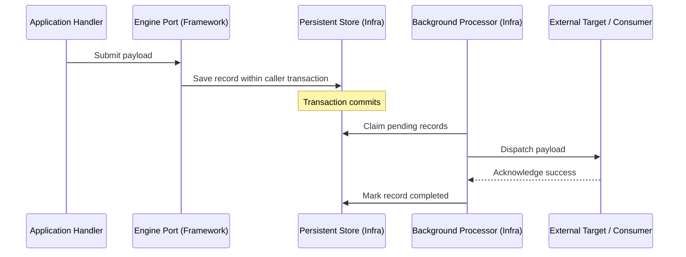
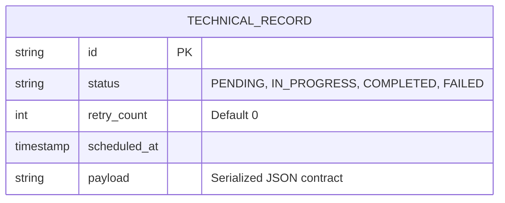

You are writing a Tech Specification (Architecture Pattern Specification): a living technical specification for one platform technology, infrastructure pattern, or cross-cutting mechanism.

A Tech Spec is a **contract**. Sections 1–3 explain the rationale and mechanics. Section 4 states what must be true for an implementation to be compliant.

**Flow:** Why We Need It → What It Is → How We Use It in This System → Specification & Contracts.

**Author rules:**
- Use role names in diagrams (e.g. `Event Producer`, `Outbox Poller`, `Message Dispatcher`). Never Java class types or database table names.
- Required diagrams:
  1. Concept flowchart (core pattern abstraction).
  2. State lifecycle diagram (omit if completely stateless).
  3. Project architecture stacking flowchart (how layers interact: `framework` → `infrastructure` → `store`).
  4. Runtime flow sequence diagram.
- Cap each diagram at ~7–9 nodes. No messy tangled graphs.
- No complex massive sentences. Explain simply and show it with diagrams and tables.
- Section 4 uses normative MUST / MUST NOT statements. Knobs are logical names and defaults.
- Replace every `[placeholder]` before publishing.

---

# Tech Specification: [Technology / Pattern Name]

> **Summary:** [One clear sentence anyone on the team can repeat explaining what this tech does.]  
> **Classification:** [Platform Infrastructure / Architectural Pattern / Cross-Cutting Concern]  
> **Supporting Modules:** `[e.g. framework / outbox-infrastructure / store]`  
> **Related Architecture ADRs:** [[ADR Reference]](../system/[file.md])

---

## 1. Why We Need It

### The Problem

[What breaks or degrades without this technology — concrete, direct, under 150 words.]

### Technology Decision & Alternatives

| Technology Option | Decision | Evaluation Rationale |
| :--- | :--- | :--- |
| **[Chosen Option]** | **Adopted** | [Why this is the best fit for our architecture] |
| [Alternative A] | Rejected | [Why rejected: complexity, coupling, lack of fit, etc.] |
| [Alternative B] | Deferred | [Under what future conditions we would reconsider] |

### Key Benefits & Trade-offs

**Core Benefits:**
- [Benefit 1: e.g. Zero message loss across process restarts]
- [Benefit 2: e.g. Eliminates dual-write race conditions]

**Known Trade-offs:**
- [Trade-off 1: e.g. Eventual consistency latency instead of immediate delivery]
- [Trade-off 2: e.g. Requires background poller management and database storage]

---

## 2. What It Is

### Core Concept

[The pattern in plain language without project-specific module names.]

### Internal Mechanics & Lifecycle

> Visual lifecycle for stateful entities or tasks managed by this technology.

---

## 3. How We Use It in This System

### Architecture & Layer Stacking

> Show how this capability lives across repository layers. Use role names.

### Component Responsibilities

| Architectural Role | Layer Location | Responsibility |
| :--- | :--- | :--- |
| `[Producer / Caller]` | `store` or domain | Initiates the action within the local transaction boundary. |
| `[Engine / Core]` | `framework` | Defines contracts, state machines, and pure processing logic. |
| `[Persistence Adapter]` | `*-infrastructure` | Manages database persistence, schema bindings, and queries. |
| `[Dispatcher / Poller]` | `*-infrastructure` | Polls, claims, and delivers messages to external sinks. |

### Runtime Flow

> Show a realistic request trace through the stacked architecture.

---

## 4. Technical Specification & Contracts

Normative specification. An implementation is compliant only when all MUST / MUST NOT statements are satisfied.

### Normative Rules

- **R-01:** The system **MUST** persist state changes atomically within the initiating command's database transaction.
- **R-02:** The system **MUST NOT** perform remote network I/O inside the active database transaction boundary.
- **R-03:** The processor **MUST** guarantee at-least-once delivery.
- **R-04:** Consumers **MUST** be idempotent or handle duplicate delivery safely.

### Storage & Data Contract

### Configuration Knobs

| Knob Name | Default Value | Unit / Format | Description |
| :--- | :--- | :--- | :--- |
| `[batch-size]` | `50` | Integer count | Maximum number of records claimed in a single polling run. |
| `[poll-interval]` | `1000` | Milliseconds | Interval between background polling cycles. |
| `[max-retries]` | `5` | Integer count | Maximum failed attempts before moving to dead letter status. |
