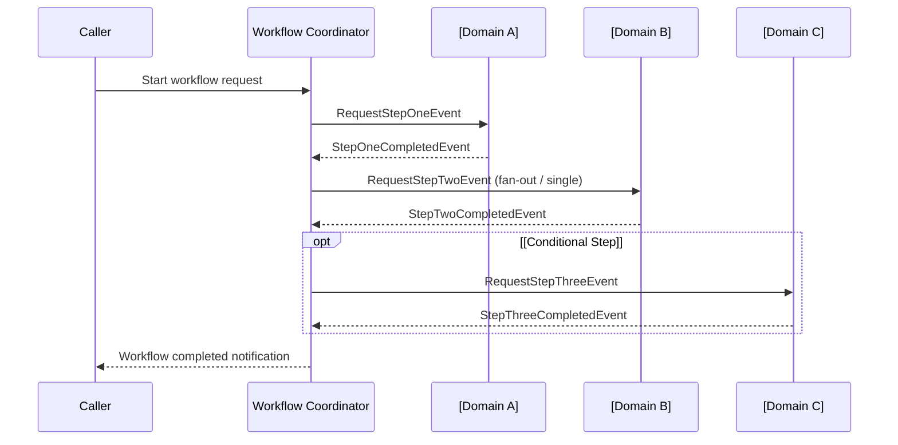

You are writing a Workflow Specification for an event-driven cross-domain business process.

A workflow orchestrates or choreographs steps across multiple domain aggregate lifecycles to complete one business case or feature.

Keep the document cohesive and answer four core questions:
1. What happens step by step across domain aggregates?
2. Which events move the workflow forward or report failure?
3. What is undone when the workflow fails?
4. How do participating domain aggregate states transition across the flow?

**Author rules:**
- Describe the business flow across bounded contexts, not workflow framework internals.
- List steps in exact execution order with precise step and event names.
- Keep each table cell to one clear sentence.
- In sequence diagrams, use participant roles and module names (e.g. `Workflow Coordinator`, `Catalog`, `Pricing`, `Inventory`), never Java class names.
- List compensation undo actions in reverse execution order unless a specific business policy dictates otherwise.
- Explicitly state why any completed action is intentionally not compensated.
- Link participating Domain Specifications instead of repeating domain model details.
- Replace every `[placeholder]` before publishing.

---

# Workflow: [Workflow Display Name]

> **Purpose:** [The business outcome delivered when this cross-domain workflow completes.]  
> **Starts When:** [API call, scheduled trigger, or upstream business event.]  
> **Successful Result:** [State of the system and created/updated aggregates after all steps complete.]  
> **Participating Domains:** [Catalog] · [Pricing] · [Inventory]  
> **Related Domain Specs:**
> - [[Catalog Domain Spec]](../catalog/architecture/product-domain-spec.md)
> - [[Pricing Domain Spec]](../pricing/architecture/pricing-domain-spec.md)
> - [[Inventory Domain Spec]](../inventory/architecture/inventory-domain-spec.md)

---

## 1. Step-by-Step Execution Path

### Normal Path (Happy Path)

| # | Step Name | Owner Domain | Business Action | Starts When | Complete When |
| :--- | :--- | :--- | :--- | :--- | :--- |
| **1** | `[step-one]` | [Domain A] | [Action performed on Aggregate A] | Workflow initiated | `[StepOneCompletedEvent]` received |
| **2** | `[step-two]` | [Domain B] | [Action performed on Aggregate B] | Step 1 completes | `[StepTwoCompletedEvent]` received |
| **3** | `[step-three]` | [Domain C] | [Action performed on Aggregate C] | Step 2 completes | `[StepThreeCompletedEvent]` received → Workflow completes |

### Special Flows & Edge Conditions

- **Parallel fan-out:** [Describe if a step fans out multiple parallel requests, e.g. one per variant/line item.]
- **Conditional / skipped steps:** [Describe when a step is intentionally bypassed, e.g. when no inventory lines are tracked.]

### Happy Path Flow

> Keep the diagram clean. Use participant roles and module names, not class names.



---

## 2. Events & Signals

### Request Events (Workflow → Domain)

| Event Name | Step | Dispatched To | Intent / Payload Summary |
| :--- | :--- | :--- | :--- |
| `[RequestStepOneEvent]` | `[step-one]` | [Domain A] | Requests creation or state mutation of [Aggregate A]. |
| `[RequestStepTwoEvent]` | `[step-two]` | [Domain B] | Requests creation or state mutation of [Aggregate B]. |

### Completion Events (Domain → Workflow)

| Event Name | Step | Emitted By | Meaning to Workflow |
| :--- | :--- | :--- | :--- |
| `[StepOneCompletedEvent]` | `[step-one]` | [Domain A] | Step 1 succeeded; advance workflow to step 2. |
| `[StepTwoCompletedEvent]` | `[step-two]` | [Domain B] | Step 2 succeeded; advance workflow to step 3. |

### Failure Events (Domain → Workflow)

| Event Name | Emitted By | Failure Cause | Resulting Workflow Action |
| :--- | :--- | :--- | :--- |
| `[StepFailedEvent]` | [Any participant] | Validation error, invariant breach, or timeout | Halts forward execution and initiates compensation. |

---

## 3. Compensation & Failure Recovery

> **Starts When:** A step reports failure via `[StepFailedEvent]` after one or more prior steps have already succeeded.

### Compensation Order

| Order | Completed Action | Undo Action | Request Event | Acknowledgement Event |
| :--- | :--- | :--- | :--- | :--- |
| **1** | Step 2: [Action B] | [Revert, delete, or cancel Action B] | `[RequestUndoStepTwoEvent]` | `[StepTwoUndoneEvent]` |
| **2** | Step 1: [Action A] | [Revert, delete, or cancel Action A] | `[RequestUndoStepOneEvent]` | `[StepOneUndoneEvent]` |

### Explicitly Non-Compensated Actions

- **[Action / Resource]:** [Explicit business policy why this is intentionally left unchanged, e.g. read model projections or audit log records.]

### Failure Flow

```mermaid
sequenceDiagram
    participant DomainB as [Domain B]
    participant Workflow as Workflow Coordinator
    participant DomainA as [Domain A]

    DomainB-->>Workflow: StepFailedEvent
    Note over Workflow: Halt forward execution; initiate compensation
    Workflow->>DomainA: RequestUndoStepOneEvent
    DomainA-->>Workflow: StepOneUndoneEvent
    Note over Workflow: Mark workflow COMPENSATED
```

---

## 4. Aggregate Cross-Lifecycle Matrix

| Workflow Stage | [Aggregate A] State | [Aggregate B] State | [Aggregate C] State |
| :--- | :--- | :--- | :--- |
| **Initial Start** | Non-existent | Non-existent | Non-existent |
| **After Step 1** | `CREATED / DRAFT` | Non-existent | Non-existent |
| **After Step 2** | `CREATED / DRAFT` | `ACTIVE / ASSIGNED` | Non-existent |
| **Workflow Completed** | `ACTIVE` | `ACTIVE / ASSIGNED` | `INITIALIZED` |
| **If Compensated** | `DELETED / CANCELLED`| `DELETED / VOIDED` | Non-existent |
