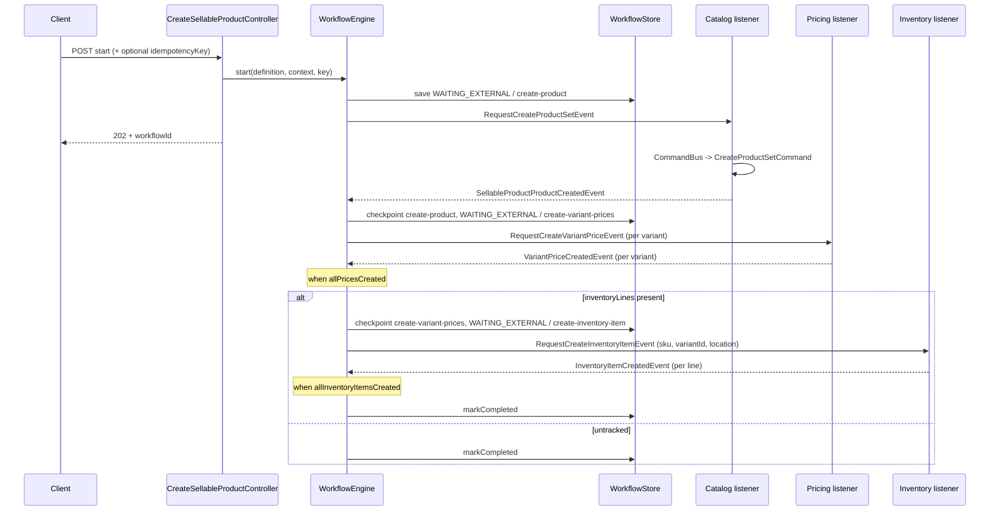
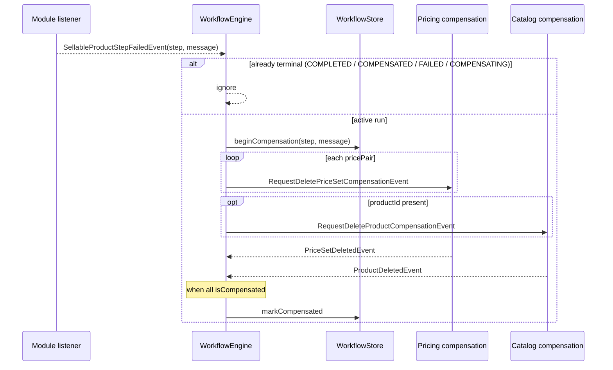

# Workflow: Create Sellable Product

| Field | Value |
|-------|-------|
| Workflow name | `create-sellable-product` |
| Package | `store/.../workflows/internal/workflows/createsellableproduct/` |
| Orchestrator | `CreateSellableProductDefinition` + `EventDrivenWorkflowEngine` |
| Pattern | Process Manager (`WAITING_EXTERNAL` + engine `onSignal`) |
| Idempotent start | Yes (`idempotencyKey`) |
| Client API | `POST/GET /api/v1/workflows/create-sellable-product` |

**Intent (one sentence):**  
Create a merchant sellable product end-to-end: catalog product + variants, assign variant prices, then create inventory items for tracked SKUs.

**Participating BCs:**  
Catalog · Pricing · Inventory

**Related docs:**  
- ADR: `docs/workflows/architecture/ADR_001-Create_Sellable_Product_workflow.md`
- Source: `store/src/main/java/com/grab/store/workflows/internal/workflows/createsellableproduct/`

This workflow does **not** wait on inventory's product-variant view. Catalog completion already returns `variantId`; inventory create on this path uses that id. `ProductVariantViewProjectedEvent` remains inventory choreography (and update-sellable-product until that migrates).

---

## 1. Step Sequence

> Ordered list only. Later steps must not start until earlier steps have checkpointed (or `isComplete` was already true and the step was skipped).

| # | Step name (`currentStep`) | Owner BC | What the step does | Enter when | Done when | Checkpoint output |
|---|---------------------------|----------|--------------------|------------|-----------|-------------------|
| 1 | `create-product` | Catalog | Create product set (product + variants) | `start()` | `SellableProductProductCreatedEvent` | `productId` |
| 2 | `create-variant-prices` | Pricing | Create price set + variant link per variant | step 1 done | `allPricesCreated()` | `pricePairs` |
| 3 | `create-inventory-item` | Inventory | Create inventory item per inventory line | step 2 done | `allInventoryItemsCreated()` → `COMPLETED` | `inventoryItemIds` |

**Fan-out / fan-in notes:**  
- Step 1 publishes **one** `RequestCreateProductSetEvent`.
- Step 2 fans out **one** `RequestCreateVariantPriceEvent` per `variantRefs` entry; advances when every `variantRef.variantId` has a `pricePair`.
- Step 3 fans out **one** `RequestCreateInventoryItemEvent` per `inventoryLines` entry (includes `variantId`); skipped when `inventoryLines` is empty; completes when every line `(sku, locationId)` has an item.

**Statuses used:**

| Status | When |
|--------|------|
| `WAITING_EXTERNAL` | Parked on a step until completion event(s) |
| `COMPLETED` | Last step fan-in satisfied (or last remaining step skipped) |
| `COMPENSATING` | Failure received; compensation requests publishing |
| `COMPENSATED` | Rollback requests issued (product and/or price sets present) |
| `FAILED` | Failure with nothing meaningful to compensate |

---

## 2. Event Catalog

> All events live under `com.grab.store.workflows.events` unless noted. Include `workflowId`, `occurredAt`, `version` on every event. Events the engine consumes implement `WorkflowSignalEvent`.

### 2.1 Request events (Orchestrator → Module)

| Event | Published from step | Consumed by | Maps to local command | Key fields |
|-------|---------------------|-------------|----------------------|------------|
| `RequestCreateProductSetEvent` | `create-product` | Catalog `CreateSellableProductCatalogEventListener` | `CreateProductSetCommand` | `workflowId`, `merchantId`, `product`, `variantTypes` |
| `RequestCreateVariantPriceEvent` | `create-variant-prices` | Pricing `CreateSellableProductPricingEventListener` | `CreateVariantPriceAssignmentCommand` | `workflowId`, `variantId`, `sku`, `productId`, `merchantId`, price fields, `rules` |
| `RequestCreateInventoryItemEvent` | `create-inventory-item` | Inventory `CreateSellableProductInventoryEventListener` | `CreateInventoryCommand` | `workflowId`, `sku`, `variantId`, `merchantId`, `locationId`, stock fields, `createdBy`, `scopeKey`, `scopeId` |

### 2.2 Completion events (Module → Orchestrator)

| Event | Produced after | Orchestrator handler | Advances / progresses |
|-------|----------------|----------------------|------------------------|
| `SellableProductProductCreatedEvent` | `CreateProductSetCommand` success | engine `onSignal` | `create-product` → `create-variant-prices` |
| `VariantPriceCreatedEvent` | `CreateVariantPriceAssignmentCommand` success | engine `onSignal` | fan-in on `create-variant-prices`; when `allPricesCreated()` → `create-inventory-item` (or `COMPLETED` if no inventory lines) |
| `InventoryItemCreatedEvent` | `CreateInventoryCommand` success | engine `onSignal` | fan-in on `create-inventory-item`; when `allInventoryItemsCreated()` → `COMPLETED` |

### 2.3 Failure event

| Event | Published by | When | Orchestrator handler |
|-------|--------------|------|----------------------|
| `SellableProductStepFailedEvent` | Catalog / Pricing / Inventory listeners, or engine (`onEnter` throw) | Command/validation failure | failure signal → compensate |

**Failure payload:** `workflowId`, `step`, `message`, `occurredAt`, `version`

API rejects start when a variant SKU has no pricing line (`@ValidPricingCoverage`).

### 2.4 Compensation events (Engine → Module)

| Event | Order | Consumed by | Maps to | Ack |
|-------|-------|-------------|---------|-----|
| `RequestDeletePriceSetCompensationEvent` | 1 | Pricing `CreateSellableProductPricingEventListener` | `DeletePriceSetCommand` | `PriceSetDeletedEvent` |
| `RequestDeleteProductCompensationEvent` | 2 | Catalog `CreateSellableProductCatalogEventListener` | `DeleteProductCommand` | `ProductDeletedEvent` |

**Compensation order (required):**  
1. Delete price sets (all pairs in context)  
2. Delete catalog product  

Stay `COMPENSATING` until those acks satisfy `isCompensated`.

**Not compensated (document why):**  
- Inventory items — explicit policy: no compensation delete. `CreateInventoryItemStep.isCompensated` is always true.
- Product-variant view projections — inventory read models; not a saga step.

---

## 3. Sequence — Happy Path



### 3.1 Per-step detail

#### Step `create-product`

```
ENTER:  start()
PUBLISH: RequestCreateProductSetEvent (count: 1)
WAIT:    WAITING_EXTERNAL, currentStep=create-product
ON:      SellableProductProductCreatedEvent
UPDATE:  productId, variantRefs
GATE:    productId != null
THEN:    checkpoint(create-product, productId) → markWaitingExternal(create-variant-prices)
         → publish RequestCreateVariantPriceEvent per variantRef
```

#### Step `create-variant-prices`

```
ENTER:  create-product checkpointed
PUBLISH: RequestCreateVariantPriceEvent (count: per variantRefs)
WAIT:    WAITING_EXTERNAL, currentStep=create-variant-prices
ON:      VariantPriceCreatedEvent
UPDATE:  pricePairs (variantId, sku, priceSetId)
GATE:    allPricesCreated() — every variantRef.variantId has a pricePair
THEN:    checkpoint(create-variant-prices, pricePairs)
         → markWaitingExternal(create-inventory-item) and publish inventory requests
         → or COMPLETED when inventoryLines is empty
```

#### Step `create-inventory-item`

```
ENTER:  create-variant-prices fan-in satisfied + inventoryLines non-empty
PUBLISH: RequestCreateInventoryItemEvent (count: per inventoryLines; includes variantId)
WAIT:    WAITING_EXTERNAL, currentStep=create-inventory-item
ON:      InventoryItemCreatedEvent
UPDATE:  inventoryItems (inventoryItemId, sku, locationId)
GATE:    allInventoryItemsCreated()
THEN:    checkpoint(create-inventory-item, inventoryItemIds) → markCompleted
```

---

## 4. Sequence — Failure & Compensation



**Guards (required):**
- Ignore completion events unless `status == WAITING_EXTERNAL` and `currentStep` matches.
- Ignore failure if already terminal or `COMPENSATING`.
- Idempotent start: same `idempotencyKey` returns existing instance.
- Replays are suppressed by `workflow_signal_log` on `(workflow_id, step, dedup_key)`.
- `COMPENSATED` requires every step to report `isCompensated` **and** to have an empty `compensate()`.

---

## 5. Context Progress Fields

> Only fields the orchestrator mutates across steps (input vs progress).

| Field | Set at | Used by |
|-------|--------|---------|
| `merchantId`, `createdBy`, `scopeKey`, `scopeId` | start | step requests / compensation |
| `product`, `variantTypes`, `inventoryLines`, `pricingLines` | start | create-product / pricing / inventory requests |
| `productId` | `create-product` completion | price requests, product compensation |
| `variantRefs` | `create-product` completion | price fan-out / inventory `variantId` / `allPricesCreated()` |
| `pricePairs` | price completion events | inventory gate advance / price compensation |
| `compensatedPriceSetIds` | `PriceSetDeletedEvent` | `allPriceSetsCompensated()` |
| `productDeleted` | `ProductDeletedEvent` | `isProductCompensated()` |
| `inventoryItems` | inventory completion events | `allInventoryItemsCreated()` → complete |
