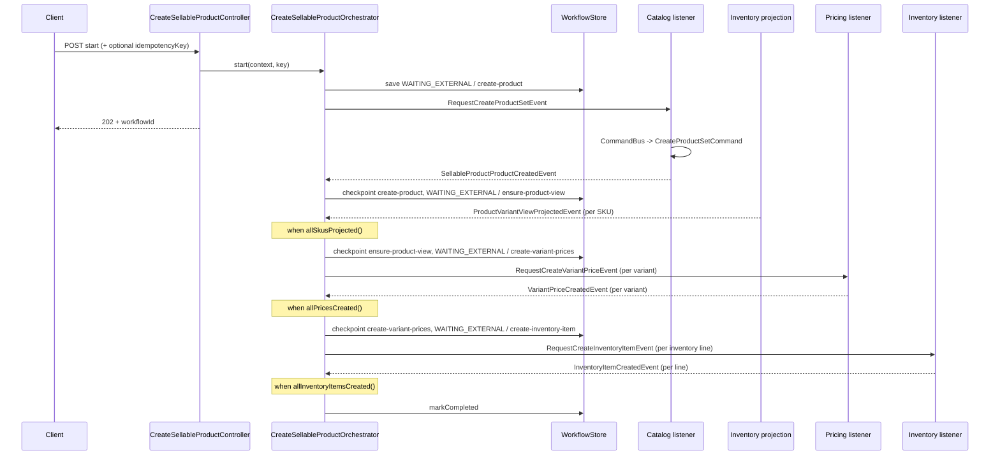
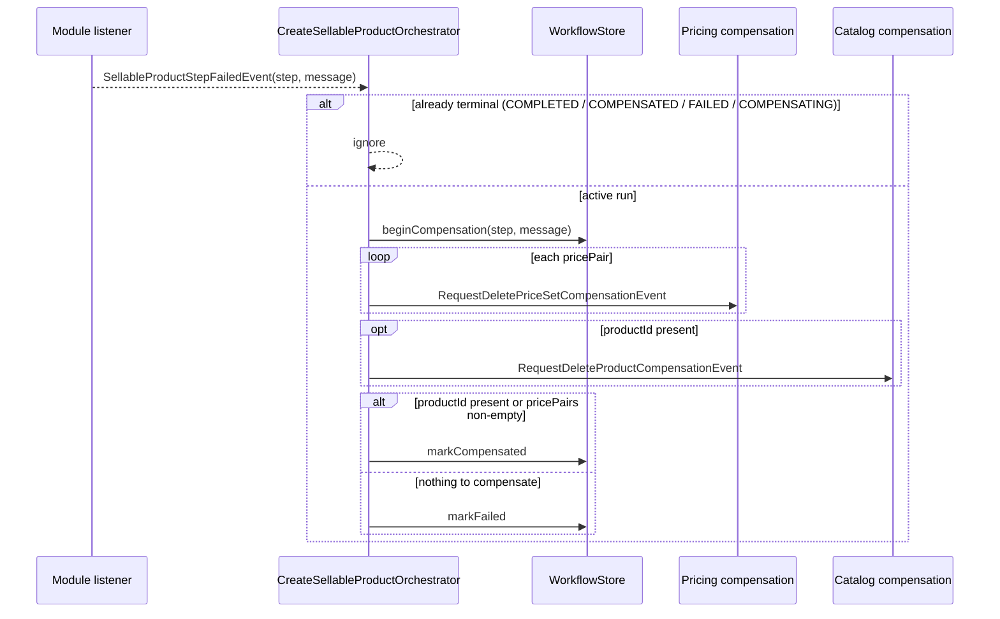

# Workflow: Create Sellable Product

| Field | Value |
|-------|-------|
| Workflow name | `create-sellable-product` |
| Package | `store/.../workflows/internal/createsellableproduct/` |
| Orchestrator | `CreateSellableProductOrchestrator` |
| Pattern | Process Manager (`WAITING_EXTERNAL` + completion events) |
| Idempotent start | Yes (`idempotencyKey`) |
| Client API | `POST/GET /api/v1/workflows/create-sellable-product` |

**Intent (one sentence):**  
Create a merchant sellable product end-to-end: catalog product + variants, wait for inventory product-variant view projection, assign variant prices, then create inventory items.

**Participating BCs:**  
Catalog · Pricing · Inventory

**Related docs:**  
- ADR: `docs/workflows/architecture/ADR_001-Create_Sellable_Product_workflow.md`
- Source: `store/src/main/java/com/grab/store/workflows/internal/createsellableproduct/`

---

## 1. Step Sequence

> Ordered list only. Later steps must not start until earlier steps have checkpointed (or their fan-in rule is true).

| # | Step name (`currentStep`) | Owner BC | What the step does | Enter when | Done when | Checkpoint output |
|---|---------------------------|----------|--------------------|------------|-----------|-------------------|
| 1 | `create-product` | Catalog | Create product set (product + variants) | `start()` | `SellableProductProductCreatedEvent` | `productId` |
| 2 | `ensure-product-view` | Inventory (projection) | Wait until every expected SKU is projected into product-variant view | step 1 done | `allSkusProjected()` | `projectedSkus` |
| 3 | `create-variant-prices` | Pricing | Create price set + variant link per variant | step 2 done | `allPricesCreated()` | `pricePairs` |
| 4 | `create-inventory-item` | Inventory | Create inventory item per inventory line | step 3 done | `allInventoryItemsCreated()` → `COMPLETED` | `inventoryItemIds` |

**Fan-out / fan-in notes:**  
- Step 1 publishes **one** `RequestCreateProductSetEvent`.
- Step 2 does **not** publish a request; it waits on `ProductVariantViewProjectedEvent` (one event per SKU) until `allSkusProjected()`.
- Step 3 fans out **one** `RequestCreateVariantPriceEvent` per `variantRefs` entry; advances when `allPricesCreated()`.
- Step 4 fans out **one** `RequestCreateInventoryItemEvent` per `inventoryLines` entry; completes when `allInventoryItemsCreated()`.

**Statuses used:**

| Status | When |
|--------|------|
| `WAITING_EXTERNAL` | Parked on a step until completion event(s) |
| `COMPLETED` | Last step fan-in satisfied |
| `COMPENSATING` | Failure received; compensation requests publishing |
| `COMPENSATED` | Rollback requests issued (product and/or price sets present) |
| `FAILED` | Failure with nothing meaningful to compensate |

---

## 2. Event Catalog

> All events live under `com.grab.store.workflows.events` unless noted. Include `workflowId`, `occurredAt`, `version` on every event (projection completion omits `workflowId` and is matched by `productId` + `sku`).

### 2.1 Request events (Orchestrator → Module)

| Event | Published from step | Consumed by | Maps to local command | Key fields |
|-------|---------------------|-------------|----------------------|------------|
| `RequestCreateProductSetEvent` | `create-product` | Catalog `CreateSellableProductCatalogEventListener` | `CreateProductSetCommand` | `workflowId`, `merchantId`, `product`, `variantTypes` |
| `RequestCreateVariantPriceEvent` | `create-variant-prices` | Pricing `CreateSellableProductPricingEventListener` | `CreateVariantPriceAssignmentCommand` | `workflowId`, `variantId`, `sku`, `productId`, `merchantId`, price fields, `rules` |
| `RequestCreateInventoryItemEvent` | `create-inventory-item` | Inventory `CreateSellableProductInventoryEventListener` | `CreateInventoryCommand` | `workflowId`, `sku`, `merchantId`, `locationId`, stock fields, `createdBy`, `scopeKey`, `scopeId` |

### 2.2 Completion events (Module → Orchestrator)

| Event | Produced after | Orchestrator handler | Advances / progresses |
|-------|----------------|----------------------|------------------------|
| `SellableProductProductCreatedEvent` | `CreateProductSetCommand` success | `onProductCreated` | `create-product` → `ensure-product-view` |
| `ProductVariantViewProjectedEvent` | Inventory projects product-variant view | `onProductViewProjected` | fan-in on `ensure-product-view`; when `allSkusProjected()` → `create-variant-prices` |
| `VariantPriceCreatedEvent` | `CreateVariantPriceAssignmentCommand` success | `onVariantPriceCreated` | fan-in on `create-variant-prices`; when `allPricesCreated()` → `create-inventory-item` |
| `InventoryItemCreatedEvent` | `CreateInventoryCommand` success | `onInventoryItemCreated` | fan-in on `create-inventory-item`; when `allInventoryItemsCreated()` → `COMPLETED` |

### 2.3 Failure event

| Event | Published by | When | Orchestrator handler |
|-------|--------------|------|----------------------|
| `SellableProductStepFailedEvent` | Catalog / Pricing / Inventory listeners, or orchestrator (missing pricing line) | Command/validation failure | `onStepFailed` → compensate |

**Failure payload:** `workflowId`, `step`, `message`, `occurredAt`, `version`

### 2.4 Compensation events (Orchestrator → Module)

| Event | Order | Consumed by | Maps to | Condition |
|-------|-------|-------------|---------|-----------|
| `RequestDeletePriceSetCompensationEvent` | 1 | Pricing `CreateSellableProductPricingEventListener` | `DeletePriceSetCommand` | each `pricePairs[].priceSetId` present |
| `RequestDeleteProductCompensationEvent` | 2 | Catalog `CreateSellableProductCatalogEventListener` | `DeleteProductCommand` | `productId` present |

**Compensation order (required):**  
1. Delete price sets (all pairs in context)  
2. Delete catalog product  

**Not compensated (document why):**  
- Inventory items — no compensation delete today; inventory creates are last and are left as-is if a later failure is not modeled, or if failure happens before inventory then nothing to undo there.
- Product-variant view projections — read models; not rolled back.

---

## 3. Sequence — Happy Path



### 3.1 Per-step detail

#### Step `create-product`

```
ENTER:  start()
PUBLISH: RequestCreateProductSetEvent (count: 1)
WAIT:    WAITING_EXTERNAL, currentStep=create-product
ON:      SellableProductProductCreatedEvent
UPDATE:  productId, expectedSkus, variantRefs
GATE:    (none)
THEN:    checkpoint(create-product, productId) → markWaitingExternal(ensure-product-view)
```

#### Step `ensure-product-view`

```
ENTER:  create-product checkpointed
PUBLISH: (none — waits on projection)
WAIT:    WAITING_EXTERNAL, currentStep=ensure-product-view
ON:      ProductVariantViewProjectedEvent (matched by productId + sku ∈ expectedSkus)
UPDATE:  projectedSkus
GATE:    allSkusProjected()
THEN:    checkpoint(ensure-product-view, projectedSkus)
         → markWaitingExternal(create-variant-prices)
         → publish RequestCreateVariantPriceEvent per variantRef
         (or SellableProductStepFailedEvent if pricingLineForSku missing)
```

#### Step `create-variant-prices`

```
ENTER:  ensure-product-view fan-in satisfied + price requests published
PUBLISH: RequestCreateVariantPriceEvent (count: per variantRefs)
WAIT:    WAITING_EXTERNAL, currentStep=create-variant-prices
ON:      VariantPriceCreatedEvent
UPDATE:  pricePairs (variantId, sku, priceSetId)
GATE:    allPricesCreated()
THEN:    checkpoint(create-variant-prices, pricePairs)
         → markWaitingExternal(create-inventory-item)
         → publish RequestCreateInventoryItemEvent per inventoryLine
```

#### Step `create-inventory-item`

```
ENTER:  create-variant-prices fan-in satisfied + inventory requests published
PUBLISH: RequestCreateInventoryItemEvent (count: per inventoryLines)
WAIT:    WAITING_EXTERNAL, currentStep=create-inventory-item
ON:      InventoryItemCreatedEvent
UPDATE:  inventoryItemIds
GATE:    allInventoryItemsCreated()
THEN:    checkpoint(create-inventory-item, inventoryItemIds) → markCompleted
```

---

## 4. Sequence — Failure & Compensation



**Guards (required):**
- Ignore completion events unless `status == WAITING_EXTERNAL` and `currentStep` matches (projection step also matches `productId` / `sku`).
- Ignore failure if already terminal or `COMPENSATING`.
- Idempotent start: same `idempotencyKey` returns existing instance.

---

## 5. Context Progress Fields

> Only fields the orchestrator mutates across steps (input vs progress). Full context shape belongs in the ADR.

| Field | Set at | Used by |
|-------|--------|---------|
| `merchantId`, `createdBy`, `scopeKey`, `scopeId` | start | step requests / compensation |
| `product`, `variantTypes`, `inventoryLines`, `pricingLines` | start | create-product / pricing / inventory requests |
| `productId` | `create-product` completion | projection match, price requests, product compensation |
| `expectedSkus` | `create-product` completion | `allSkusProjected()` gate |
| `projectedSkus` | projection events | `allSkusProjected()` gate |
| `variantRefs` | `create-product` completion | price fan-out / `allPricesCreated()` |
| `pricePairs` | price completion events | inventory gate advance / price compensation |
| `inventoryItemIds` | inventory completion events | `allInventoryItemsCreated()` → complete |
