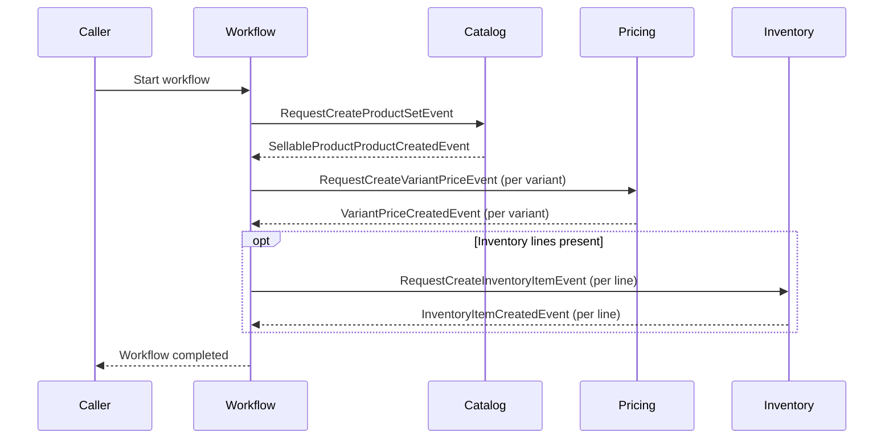
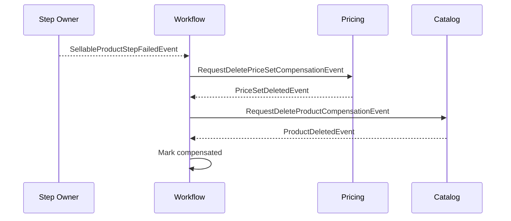

# Workflow: Create Sellable Product

**Purpose:** Create a merchant sellable product end-to-end by creating the catalog product and variants, assigning variant prices, and creating inventory items for tracked SKUs.

**Starts when:** API call `POST /api/v1/workflows/create-sellable-product` is received.

**Successful result:** Catalog product and variants exist, price sets and variant price assignments are created, and inventory items are initialized.

**Participants:** Catalog · Pricing · Inventory

**Related docs:**
- [ADR-001: Create Sellable Product Workflow](architecture/ADR_001-Create_Sellable_Product_workflow.md)
- [Workflow Source Code](../../store/src/main/java/com/grab/store/workflows/internal/workflows/createsellableproduct/)

---

## 1. Steps

> List the normal path in order. Add a note below the table only for a branch, loop, parallel work, or skipped step.

| # | Step | Owner | Action | Starts when | Complete when |
|---|------|-------|--------|-------------|---------------|
| 1 | `create-product` | Catalog | Create the product and its variants. | Workflow starts | `SellableProductProductCreatedEvent` is received |
| 2 | `create-variant-prices` | Pricing | Create a price set and assignment for each variant. | Step 1 completes | `VariantPriceCreatedEvent` is received for every variant |
| 3 | `create-inventory-item` | Inventory | Create inventory items for all tracked SKUs. | Step 2 completes | `InventoryItemCreatedEvent` is received for every line → workflow completes |

**Special flow:**
- Step 2 fans out one price creation request per variant and advances when all variant prices are created.
- Step 3 fans out one inventory creation request per inventory line and is skipped when no inventory lines are provided.

### Happy path

> Keep the diagram small. Use participant roles, not class names.

---

## 2. Events

### Request events

| Event | Step | Sent by | Received by | Purpose |
|-------|------|---------|-------------|---------|
| `RequestCreateProductSetEvent` | `create-product` | Workflow | Catalog | Request creation of the product set and variants. |
| `RequestCreateVariantPriceEvent` | `create-variant-prices` | Workflow | Pricing | Request creation of a price set and assignment for a variant. |
| `RequestCreateInventoryItemEvent` | `create-inventory-item` | Workflow | Inventory | Request creation of an inventory item for a SKU at a location. |

### Completion events

| Event | Step | Sent by | Meaning |
|-------|------|---------|---------|
| `SellableProductProductCreatedEvent` | `create-product` | Catalog | Product and variants created; continue to price creation. |
| `VariantPriceCreatedEvent` | `create-variant-prices` | Pricing | Price set created for a variant; advances when all variants are priced. |
| `InventoryItemCreatedEvent` | `create-inventory-item` | Inventory | Inventory item created for a line; workflow completes when all lines exist. |

### Failure events

| Event | Sent by | When | Result |
|-------|---------|------|--------|
| `SellableProductStepFailedEvent` | Catalog, Pricing, or Inventory | Command execution, validation, or timeout fails | Stop normal steps and start compensation. |

---

## 3. Compensation

**Starts when:** A step reports failure via `SellableProductStepFailedEvent` after earlier steps have completed.

> List undo actions in the order they run. Normally this is the reverse of the completed steps.

| Order | Completed action | Undo action | Request event | Acknowledgement event |
|-------|------------------|-------------|---------------|-----------------------|
| 1 | Create variant price sets | Delete all created price sets | `RequestDeletePriceSetCompensationEvent` | `PriceSetDeletedEvent` |
| 2 | Create catalog product and variants | Delete the created catalog product | `RequestDeleteProductCompensationEvent` | `ProductDeletedEvent` |

**Not compensated:**
- Inventory items — Explicit policy leaves created inventory items unchanged.
- Product-variant view projections — Read model projections are internal choreography rather than saga step resources.

**Final result:** All created price sets and the catalog product are deleted, and the workflow is marked compensated.

### Failure path

