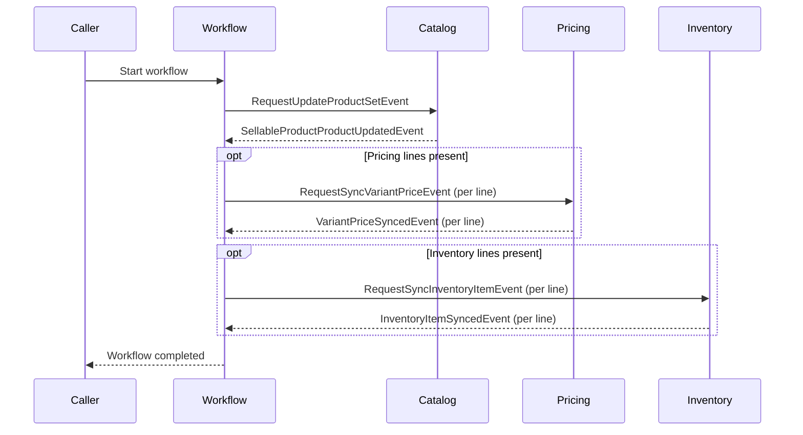
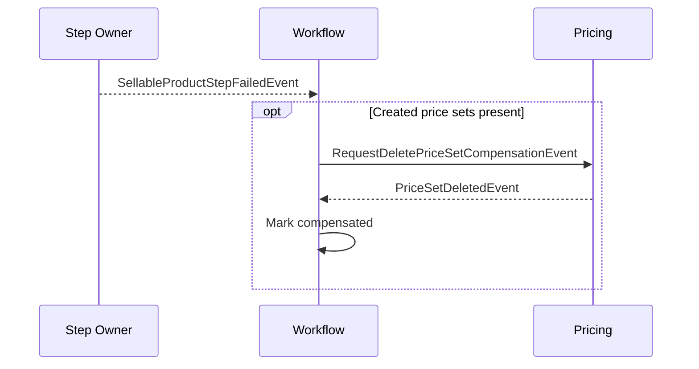

# Workflow: Update Sellable Product

**Purpose:** Update a merchant sellable product end-to-end from a composed snapshot: catalog product and variants, sync variant prices, and sync inventory items.

**Starts when:** API call `POST /api/v1/workflows/update-sellable-product` is received.

**Successful result:** Catalog product and variants are updated, variant prices are synchronized, and inventory lines are updated.

**Participants:** Catalog · Pricing · Inventory

**Related docs:**
- [ADR-002: Update Sellable Product Workflow](architecture/ADR_002-Update_Sellable_Product_workflow.md)
- [Workflow Source Code](../../store/src/main/java/com/grab/store/workflows/internal/workflows/updatesellableproduct/)

---

## 1. Steps

> List the normal path in order. Add a note below the table only for a branch, loop, parallel work, or skipped step.

| # | Step | Owner | Action | Starts when | Complete when |
|---|------|-------|--------|-------------|---------------|
| 1 | `update-product` | Catalog | Update product metadata and sync the variant matrix. | Workflow starts | `SellableProductProductUpdatedEvent` is received |
| 2 | `sync-variant-prices` | Pricing | Upsert prices for each variant line. | Step 1 completes | `VariantPriceSyncedEvent` is received for every pricing line |
| 3 | `sync-inventory-item` | Inventory | Execute stock or reorder operations per inventory line. | Step 2 completes | `InventoryItemSyncedEvent` is received for every line → workflow completes |

**Special flow:**
- Step 2 is skipped when no pricing lines are provided; otherwise it fans out one request per pricing line and waits for all to sync.
- Step 3 is skipped when no inventory lines are provided; otherwise it fans out one request per inventory line and waits for all to sync.

### Happy path

> Keep the diagram small. Use participant roles, not class names.

---

## 2. Events

### Request events

| Event | Step | Sent by | Received by | Purpose |
|-------|------|---------|-------------|---------|
| `RequestUpdateProductSetEvent` | `update-product` | Workflow | Catalog | Request updating product metadata and variant matrix. |
| `RequestSyncVariantPriceEvent` | `sync-variant-prices` | Workflow | Pricing | Request price synchronization for a variant. |
| `RequestSyncInventoryItemEvent` | `sync-inventory-item` | Workflow | Inventory | Request inventory creation, stock adjustment, damage, write-off, or reorder. |

### Completion events

| Event | Step | Sent by | Meaning |
|-------|------|---------|---------|
| `SellableProductProductUpdatedEvent` | `update-product` | Catalog | Catalog product and variants updated; continue to pricing sync. |
| `VariantPriceSyncedEvent` | `sync-variant-prices` | Pricing | Price synchronized for a variant line; advances when all lines sync. |
| `InventoryItemSyncedEvent` | `sync-inventory-item` | Inventory | Inventory operation completed for a line; workflow completes when all lines sync. |

### Failure events

| Event | Sent by | When | Result |
|-------|---------|------|--------|
| `SellableProductStepFailedEvent` | Catalog, Pricing, or Inventory | Command execution, validation, or timeout fails | Stop normal steps and start compensation. |

---

## 3. Compensation

**Starts when:** A step reports failure via `SellableProductStepFailedEvent` after new price sets were created during the workflow.

> List undo actions in the order they run. Normally this is the reverse of the completed steps.

| Order | Completed action | Undo action | Request event | Acknowledgement event |
|-------|------------------|-------------|---------------|-----------------------|
| 1 | Create new price sets | Delete price sets created during this workflow run | `RequestDeletePriceSetCompensationEvent` | `PriceSetDeletedEvent` |

**Not compensated:**
- Catalog product and variants — The product is intentionally retained to prevent merchant data loss, and hard-deleted variants cannot be safely restored.
- In-place price updates — Prior price amounts are not snapshotted for rollback.
- Inventory items and adjustments — Stock adjustments, damage, write-offs, and created items are not rolled back by policy.
- Product-variant view projections — Read model projections are internal choreography rather than saga step resources.

**Final result:** Any price sets newly created during this run are deleted, existing product and inventory changes remain partially applied, and the workflow terminates.

### Failure path

