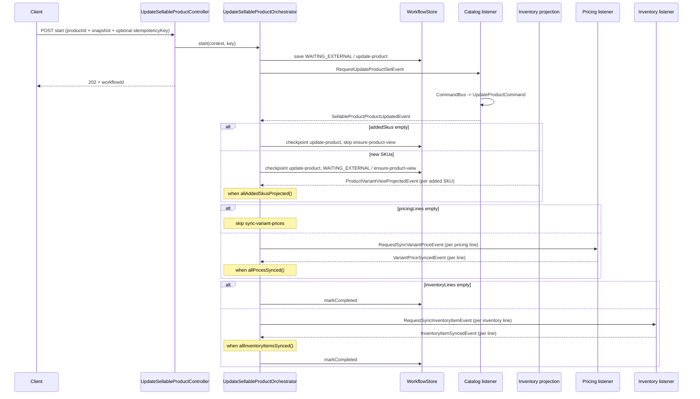
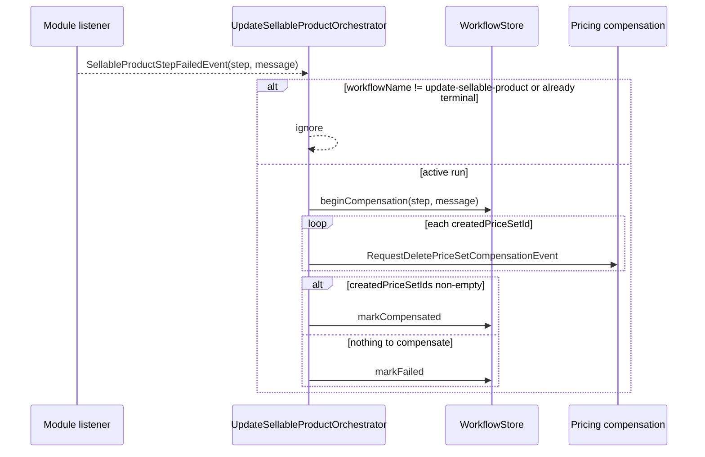

# Workflow: Update Sellable Product

| Field | Value |
|-------|-------|
| Workflow name | `update-sellable-product` |
| Package | `store/.../workflows/internal/updatesellableproduct/` |
| Orchestrator | `UpdateSellableProductOrchestrator` |
| Pattern | Process Manager (`WAITING_EXTERNAL` + completion events) |
| Idempotent start | Yes (`idempotencyKey`) |
| Client API | `POST/GET /api/v1/workflows/update-sellable-product` |

**Intent (one sentence):**  
Update a merchant sellable product end-to-end from a composed snapshot: catalog product + variants, wait for new-SKU inventory projections when needed, sync variant prices, then sync inventory items.

**Participating BCs:**  
Catalog · Pricing · Inventory

**Related docs:**  
- ADR: `docs/workflows/architecture/ADR_002-Update_Sellable_Product_workflow.md`
- Source: `store/src/main/java/com/grab/store/workflows/internal/updatesellableproduct/`

---

## 1. Step Sequence

> Ordered list only. Later steps must not start until earlier steps have checkpointed (or their fan-in rule is true). Empty pricing or inventory lists skip those steps. `ensure-product-view` is skipped when `addedSkus` is empty.

| # | Step name (`currentStep`) | Owner BC | What the step does | Enter when | Done when | Checkpoint output |
|---|---------------------------|----------|--------------------|------------|-----------|-------------------|
| 1 | `update-product` | Catalog | Update product metadata + variant matrix | `start()` | `SellableProductProductUpdatedEvent` | `productId`, `addedSkus`, `variantRefs` |
| 2 | `ensure-product-view` | Inventory (projection) | Wait until every **added** SKU is projected | step 1 done and `addedSkus` non-empty | `allAddedSkusProjected()` | `projectedSkus` |
| 3 | `sync-variant-prices` | Pricing | Update existing prices or create assignments for new variants | step 2 done (or skipped) and pricing lines present | `allPricesSynced()` | `pricePairs`, `createdPriceSetIds` |
| 4 | `sync-inventory-item` | Inventory | Create, adjust, damage, write-off, or reorder per inventory line `op` | step 3 done (or skipped) and inventory lines present | `allInventoryItemsSynced()` → `COMPLETED` | `inventoryItemIds`, `createdInventoryItemIds` |

**Fan-out / fan-in notes:**  
- Step 1 publishes **one** `RequestUpdateProductSetEvent`.
- Step 2 does **not** publish a request; it waits on `ProductVariantViewProjectedEvent` until `allAddedSkusProjected()`. Skipped when `addedSkus` is empty (SKU-only / metadata-only edits do not publish projection events).
- Step 3 fans out **one** `RequestSyncVariantPriceEvent` per `pricingLines` entry; advances when `allPricesSynced()`. Skipped when `pricingLines` is empty.
- Step 4 fans out **one** `RequestSyncInventoryItemEvent` per `inventoryLines` entry; completes when `allInventoryItemsSynced()`. Skipped when `inventoryLines` is empty.

**Statuses used:**

| Status | When |
|--------|------|
| `WAITING_EXTERNAL` | Parked on a step until completion event(s) |
| `COMPLETED` | Last required step fan-in satisfied (or product-only update with empty price/inventory lists) |
| `COMPENSATING` | Failure received; compensation requests publishing |
| `COMPENSATED` | Rollback requests issued (newly created price sets present) |
| `FAILED` | Failure with nothing meaningful to compensate |

---

## 2. Event Catalog

> All events live under `com.grab.store.workflows.events` unless noted. Include `workflowId`, `occurredAt`, `version` on every event (projection completion omits `workflowId` and is matched by `productId` + `sku`).

### 2.1 Request events (Orchestrator → Module)

| Event | Published from step | Consumed by | Maps to local command | Key fields |
|-------|---------------------|-------------|----------------------|------------|
| `RequestUpdateProductSetEvent` | `update-product` | Catalog `UpdateSellableProductCatalogEventListener` | `UpdateProductCommand` | `workflowId`, `merchantId`, `productId`, metadata, `variantSync` |
| `RequestSyncVariantPriceEvent` | `sync-variant-prices` | Pricing `UpdateSellableProductPricingEventListener` | `UpdatePriceOnPriceSetCommand` if `priceSetId`+`priceId` present, else `CreateVariantPriceAssignmentCommand` | `workflowId`, `variantId`, `sku`, `productId`, optional price ids, price fields |
| `RequestSyncInventoryItemEvent` | `sync-inventory-item` | Inventory `UpdateSellableProductInventoryEventListener` | `op`: `CREATE` → `CreateInventoryCommand`; `ADJUST` → `AdjustStockCommand`; `DAMAGE` → `MarkDamagedCommand`; `WRITE_OFF` → `WriteOffStockCommand`; `REORDER` → `UpdateReorderConfigCommand`. Optional `reorder` after a stock op also dispatches `UpdateReorderConfigCommand`. | `workflowId`, `sku`, `locationId`, `op`, nested payload, optional `inventoryItemId` |

### 2.2 Completion events (Module → Orchestrator)

| Event | Produced after | Orchestrator handler | Advances / progresses |
|-------|----------------|----------------------|------------------------|
| `SellableProductProductUpdatedEvent` | `UpdateProductCommand` success | `onProductUpdated` | `update-product` → `ensure-product-view` or skip to prices/inventory/complete |
| `ProductVariantViewProjectedEvent` | Inventory projects a newly added SKU | `onProductViewProjected` | fan-in on `ensure-product-view`; when `allAddedSkusProjected()` → prices (or skip) |
| `VariantPriceSyncedEvent` | update or create price success | `onVariantPriceSynced` | fan-in on `sync-variant-prices`; when `allPricesSynced()` → inventory (or complete) |
| `InventoryItemSyncedEvent` | create / adjust / damage / write-off / reorder success | `onInventoryItemSynced` | fan-in on `sync-inventory-item`; when `allInventoryItemsSynced()` → `COMPLETED` |

### 2.3 Failure event

| Event | Published by | When | Orchestrator handler |
|-------|--------------|------|----------------------|
| `SellableProductStepFailedEvent` | Catalog / Pricing / Inventory listeners, or orchestrator (missing pricing line / variant ref) | Command/validation failure | `onStepFailed` → compensate **if this instance's workflow name is `update-sellable-product`** |

**Failure payload:** `workflowId`, `step`, `message`, `occurredAt`, `version`

### 2.4 Compensation events (Orchestrator → Module)

| Event | Order | Consumed by | Maps to | Condition |
|-------|-------|-------------|---------|-----------|
| `RequestDeletePriceSetCompensationEvent` | 1 | Pricing listeners | `DeletePriceSetCommand` | each `createdPriceSetIds` entry |

**Compensation order (required):**  
1. Delete price sets created in this run  

**Not compensated (document why):**  
- Catalog product / in-place variant sync — deleting the product would destroy merchant data; in-place updates are left as-is.
- In-place price updates — previous amount is not snapshotted.
- Inventory items (new, adjusted, damaged, or written off) — same as create; no inventory compensation today. `idempotencyKey` is the duplicate-POST guard; damage/write-off are not naturally idempotent if the listener re-ran the command.
- Product-variant view projections — read models; not rolled back.
- Removed variants — catalog `FULL_SYNC` already removed them; inventory and pricing cascade via `ProductVariantDeletedIntegrationEvent` choreography, not this saga.

---

## 3. Sequence — Happy Path



### 3.1 Per-step detail

#### Step `update-product`

```
ENTER:  start()
PUBLISH: RequestUpdateProductSetEvent (count: 1)
WAIT:    WAITING_EXTERNAL, currentStep=update-product
ON:      SellableProductProductUpdatedEvent
UPDATE:  productId, variantRefs, addedSkus
GATE:    (none)
THEN:    checkpoint(update-product, productId)
         → if addedSkus empty: advanceAfterProductViewReady()
         → else markWaitingExternal(ensure-product-view)
```

#### Step `ensure-product-view`

```
ENTER:  update-product checkpointed and addedSkus non-empty
PUBLISH: (none — waits on projection)
WAIT:    WAITING_EXTERNAL, currentStep=ensure-product-view
ON:      ProductVariantViewProjectedEvent (matched by productId + sku ∈ addedSkus)
UPDATE:  projectedSkus
GATE:    allAddedSkusProjected()
THEN:    checkpoint(ensure-product-view, projectedSkus)
         → advanceAfterProductViewReady()
```

#### Step `sync-variant-prices`

```
ENTER:  product view ready (or skipped) and pricingLines non-empty
PUBLISH: RequestSyncVariantPriceEvent (count: per pricingLines)
WAIT:    WAITING_EXTERNAL, currentStep=sync-variant-prices
ON:      VariantPriceSyncedEvent
UPDATE:  pricePairs; createdPriceSetIds when created=true
GATE:    allPricesSynced()
THEN:    checkpoint(sync-variant-prices, pricePairs)
         → advanceAfterPricesReady()
         (or SellableProductStepFailedEvent if variantRef/pricing line sku missing)
```

#### Step `sync-inventory-item`

```
ENTER:  prices ready (or skipped) and inventoryLines non-empty
PUBLISH: RequestSyncInventoryItemEvent (count: per inventoryLines; each line carries op + nested payload)
WAIT:    WAITING_EXTERNAL, currentStep=sync-inventory-item
ON:      InventoryItemSyncedEvent
UPDATE:  inventoryItemIds; createdInventoryItemIds when created=true (op=CREATE)
GATE:    allInventoryItemsSynced()
THEN:    checkpoint(sync-inventory-item, inventoryItemIds) → markCompleted
```

---

## 4. Sequence — Failure & Compensation



**Guards (required):**
- Ignore completion events unless `status == WAITING_EXTERNAL`, `currentStep` matches, and `workflowName == update-sellable-product`.
- Ignore failure if already terminal or `COMPENSATING`, or if `workflowName` is not this workflow.
- Idempotent start: same `idempotencyKey` returns existing instance.
- Pricing routing: IDs present on a line → update command; IDs absent → create command.
- Inventory routing: `op` is explicit (`CREATE` / `ADJUST` / `DAMAGE` / `WRITE_OFF` / `REORDER`). Omit lines with no inventory intent. At most one stock operation per `inventoryItemId` per request.

---

## 5. Context Progress Fields

> Only fields the orchestrator mutates across steps (input vs progress). Full context shape belongs in the ADR.

| Field | Set at | Used by |
|-------|--------|---------|
| `merchantId`, `createdBy`, `scopeKey`, `scopeId` | start | step requests / compensation |
| `productId`, `product`, `inventoryLines`, `pricingLines` | start | update-product / pricing / inventory requests |
| `variantRefs` | `update-product` completion | price fan-out (sku → variantId) |
| `addedSkus` | `update-product` completion | `allAddedSkusProjected()` gate / skip projection |
| `projectedSkus` | projection events | `allAddedSkusProjected()` gate |
| `pricePairs` | price completion events | response / `allPricesSynced()` |
| `createdPriceSetIds` | price completion with `created=true` | compensation delete list |
| `inventoryItemIds` | inventory completion events | `allInventoryItemsSynced()` → complete |
| `createdInventoryItemIds` | inventory completion with `created=true` | documented; not compensated |
