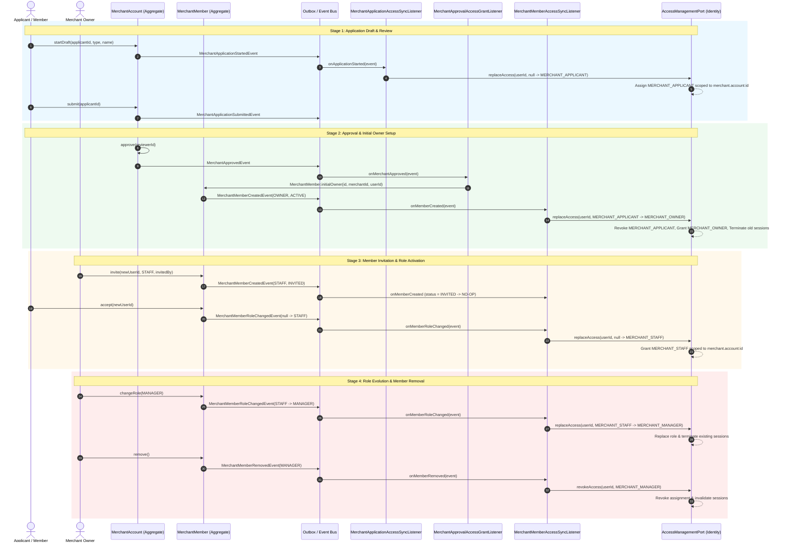

# Implementation Plan: Three-Way Lifecycle Bridge (Merchant Application, Merchant Member, & Identity Access)

Link the three interrelated lifecycles across the Grab e-commerce platform:
1. **Merchant Application Lifecycle** (`MerchantAccount` onboarding from `DRAFT` $\to$ `PENDING_REVIEW` $\to$ `ACTIVE` / `REJECTED` / `SUSPENDED` / `CLOSED`)
2. **Merchant Member Aggregate Lifecycle** (`MerchantMember` business team management: `initialOwner` $\to$ `invite` $\to$ `accept` $\to$ `changeRole` $\to$ `remove`)
3. **Identity Access Control Lifecycle** (`AccessAssignment` role transitions via `AccessManagementPort` & `ReplaceAccessService`: `MERCHANT_APPLICANT` $\to$ `MERCHANT_OWNER` / `MERCHANT_MANAGER` / `MERCHANT_STAFF` $\to$ revocation & session invalidation)

---

## User Review Required

> [!IMPORTANT]
> **Flowchart & Architectural Bridge**:
> Below is the complete flowchart and sequence model bridging the onboarding application, organizational membership, and Identity access controls.
> - **Separation of Listeners**: `MerchantApplicationAccessSyncListener` strictly manages applicant-stage access prior to membership creation, while `MerchantMemberAccessSyncListener` manages team member access post-approval.

---

## 1. End-to-End Lifecycle Flowchart

```mermaid
flowchart TD
    classDef app fill:#e1f5fe,stroke:#0288d1,stroke-width:2px;
    classDef member fill:#e8f5e9,stroke:#388e3c,stroke-width:2px;
    classDef iam fill:#fff3e0,stroke:#f57c00,stroke-width:2px;
    classDef event fill:#f3e5f5,stroke:#7b1fa2,stroke-width:1.5px,stroke-dasharray: 5 5;
    classDef terminal fill:#ffebee,stroke:#d32f2f,stroke-width:2px;

    %% ----------------------------------------------------
    %% STAGE 1: MERCHANT APPLICATION (ONBOARDING)
    %% ----------------------------------------------------
    subgraph S1 ["Stage 1: Merchant Application (Onboarding)"]
        direction TB
        StartApp["1. MerchantAccount.startDraft()<br><b>Status: DRAFT</b>"]:::app
        E_AppStarted["MerchantApplicationStartedEvent"]:::event
        GrantApplicant["MerchantApplicationAccessSyncListener<br>replaceAccess(role = MERCHANT_APPLICANT)"]:::iam
        IAM_Applicant["Identity: AccessAssignment<br><b>MERCHANT_APPLICANT</b><br>Scope: merchant.account:id"]:::iam

        SubmitApp["2. MerchantAccount.submit()<br><b>Status: PENDING_REVIEW</b>"]:::app
        E_AppSubmitted["MerchantApplicationSubmittedEvent"]:::event
        Review{"Review & KYC Decision"}:::app

        StartApp --> E_AppStarted
        E_AppStarted --> GrantApplicant
        GrantApplicant --> IAM_Applicant
        IAM_Applicant -.->|Applicant fills profile & KYC| SubmitApp
        SubmitApp --> E_AppSubmitted
        E_AppSubmitted --> Review
    end

    %% Rejection Path
    subgraph S1_Reject ["Application Rejection"]
        RejectApp["3a. MerchantAccount.reject()<br><b>Status: REJECTED</b>"]:::terminal
        E_AppRejected["MerchantRejectedEvent"]:::event
        RevokeApplicant["MerchantApplicationAccessSyncListener<br>revokeAccess(MERCHANT_APPLICANT)"]:::iam
        IAM_ApplicantRevoked["Identity: Assignment Revoked<br>& Sessions Terminated"]:::terminal

        Review -->|Rejected| RejectApp
        RejectApp --> E_AppRejected
        E_AppRejected --> RevokeApplicant
        RevokeApplicant --> IAM_ApplicantRevoked
    end

    %% Approval Path
    subgraph S2 ["Stage 2: Approval & Initial Owner Provisioning"]
        direction TB
        ApproveApp["3b. MerchantAccount.approve()<br><b>Status: ACTIVE</b>"]:::app
        E_AppApproved["MerchantApprovedEvent"]:::event
        GrantOwnerListener["MerchantApprovalAccessGrantListener<br>creates initialOwner()"]:::member
        CreateOwnerMember["MerchantMember Aggregate<br><b>Role: OWNER, Status: ACTIVE</b>"]:::member
        E_OwnerCreated["MerchantMemberCreatedEvent<br>(OWNER, ACTIVE)"]:::event
        SyncOwnerIAM["MerchantMemberAccessSyncListener<br>replaceAccess(<br>  prev = MERCHANT_APPLICANT,<br>  new = MERCHANT_OWNER<br>)"]:::iam
        IAM_OwnerActive["Identity: AccessAssignment<br><b>MERCHANT_OWNER</b><br>Applicant role retired & sessions refreshed"]:::iam

        Review -->|Approved| ApproveApp
        ApproveApp --> E_AppApproved
        E_AppApproved --> GrantOwnerListener
        GrantOwnerListener --> CreateOwnerMember
        CreateOwnerMember --> E_OwnerCreated
        E_OwnerCreated --> SyncOwnerIAM
        SyncOwnerIAM --> IAM_OwnerActive
    end

    %% ----------------------------------------------------
    %% STAGE 3: TEAM MEMBERSHIP LIFECYCLE
    %% ----------------------------------------------------
    subgraph S3 ["Stage 3: Team Expansion & Membership Management"]
        direction TB
        InviteMember["4. MerchantMember.invite()<br>by Owner or Manager"]:::member
        MemberInvited["MerchantMember Aggregate<br><b>Status: INVITED</b><br>(Role: MANAGER or STAFF)"]:::member
        E_MemberInvited["MerchantMemberCreatedEvent<br>(Status: INVITED)"]:::event
        NoIAM["No IAM Grant Yet<br>(Awaiting user acceptance)"]:::iam

        AcceptInvite["5. MerchantMember.accept()<br>by invited user"]:::member
        MemberActive["MerchantMember Aggregate<br><b>Status: ACTIVE</b>"]:::member
        E_MemberAccepted["MerchantMemberRoleChangedEvent<br>(prev = null, new = role)"]:::event
        GrantMemberIAM["MerchantMemberAccessSyncListener<br>replaceAccess(role = MANAGER/STAFF)"]:::iam
        IAM_MemberActive["Identity: AccessAssignment<br><b>MERCHANT_MANAGER / STAFF</b><br>Active store access granted"]:::iam

        ChangeRole["6. MerchantMember.changeRole()<br>guarded by MerchantOwnershipPolicy"]:::member
        E_RoleChanged["MerchantMemberRoleChangedEvent<br>(prevRole, newRole)"]:::event
        SyncRoleChange["MerchantMemberAccessSyncListener<br>replaceAccess(prevRole, newRole)"]:::iam
        IAM_RoleReplaced["Identity: Role Replaced<br>Old role revoked, sessions refreshed,<br>New role active"]:::iam

        RemoveMember["7. MerchantMember.remove()<br>guarded by MerchantOwnershipPolicy"]:::terminal
        E_MemberRemoved["MerchantMemberRemovedEvent"]:::event
        SyncRemoval["MerchantMemberAccessSyncListener<br>revokeAccess(role)"]:::iam
        IAM_MemberRevoked["Identity: Assignment Revoked<br>& Member Sessions Terminated"]:::terminal

        IAM_OwnerActive -.->|Owner manages team| InviteMember
        InviteMember --> MemberInvited
        MemberInvited --> E_MemberInvited
        E_MemberInvited --> NoIAM

        NoIAM -.->|Invited user receives notification| AcceptInvite
        AcceptInvite --> MemberActive
        MemberActive --> E_MemberAccepted
        E_MemberAccepted --> GrantMemberIAM
        GrantMemberIAM --> IAM_MemberActive

        IAM_MemberActive -.->|Promotion / Demotion| ChangeRole
        ChangeRole --> E_RoleChanged
        E_RoleChanged --> SyncRoleChange
        SyncRoleChange --> IAM_RoleReplaced

        IAM_MemberActive -.->|Removal / Resignation| RemoveMember
        RemoveMember --> E_MemberRemoved
        E_MemberRemoved --> SyncRemoval
        SyncRemoval --> IAM_MemberRevoked
    end

    %% ----------------------------------------------------
    %% STAGE 4: ACCOUNT LIFECYCLE SUSPENSION & CLOSURE
    %% ----------------------------------------------------
    subgraph S4 ["Stage 4: Account Lifecycle Enforcement"]
        direction TB
        SuspendClose["8. MerchantAccount Suspended or Closed"]:::app
        E_Lifecycle["MerchantSuspendedEvent / MerchantClosedEvent"]:::event
        SyncScopeRevoke["MerchantLifecycleMemberSyncListener<br>revokeSessionsByScope(SELLER_PORTAL, merchant.account:id)"]:::iam
        IAM_ScopeRevoked["Identity: All Active Sessions Across<br>Entire Merchant Scope Terminated"]:::terminal

        SuspendClose --> E_Lifecycle
        E_Lifecycle --> SyncScopeRevoke
        SyncScopeRevoke --> IAM_ScopeRevoked
    end
```



---

## 2. End-to-End Sequence Diagram



---

## 3. The Three-Way Lifecycle Alignment Matrix

| Step | Business Action | Domain Aggregate & Event | Member Status & Role | Identity Access Role (`SELLER_PORTAL`) | Identity Scope | Event Listener |
|---|---|---|---|---|---|---|
| **1. Start Draft** | User initiates onboarding | `MerchantAccount.startDraft(...)`<br>$\to$ `MerchantApplicationStartedEvent` | *None yet* | **`MERCHANT_APPLICANT`** (Granted) | `merchant.account` : `merchantId` | `MerchantApplicationAccessSyncListener` |
| **2. Submit Application** | Applicant submits KYC / profile | `MerchantAccount.submit(...)`<br>$\to$ `MerchantApplicationSubmittedEvent` | *None yet* | `MERCHANT_APPLICANT` (Retained) | `merchant.account` : `merchantId` | `MerchantAccountSubmitStatusEventListener` (checks auto-approve) |
| **3a. Reject Application** | Admin rejects application | `MerchantAccount.reject(...)`<br>$\to$ `MerchantRejectedEvent` | *None yet* | **Revoked** (All sessions invalidated) | `merchant.account` : `merchantId` | `MerchantApplicationAccessSyncListener` |
| **3b. Approve Application** | Admin or policy approves | `MerchantAccount.approve(...)`<br>$\to$ `MerchantApprovedEvent` | *None yet* | *(In transition)* | `merchant.account` : `merchantId` | `MerchantApprovalAccessGrantListener` |
| **4. Provision Initial Owner** | System provisions applicant as owner | `MerchantMember.initialOwner(...)`<br>$\to$ `MerchantMemberCreatedEvent` | `ACTIVE`<br>`OWNER` | **`MERCHANT_OWNER`**<br>(Replaces `MERCHANT_APPLICANT`, applicant sessions revoked) | `merchant.account` : `merchantId` | `MerchantMemberAccessSyncListener` |
| **5. Invite Member** | Owner/Manager invites colleague | `MerchantMember.invite(...)`<br>$\to$ `MerchantMemberCreatedEvent` | `INVITED`<br>`MANAGER` / `STAFF` | *None yet* (Pending acceptance) | *N/A* | `MerchantMemberAccessSyncListener` (ignores `INVITED`) |
| **6. Accept Invitation** | Colleague accepts invite | `MerchantMember.accept(...)`<br>$\to$ `MerchantMemberRoleChangedEvent(prev=null)` | `ACTIVE`<br>`MANAGER` / `STAFF` | **`MERCHANT_MANAGER`** or **`MERCHANT_STAFF`** (Granted) | `merchant.account` : `merchantId` | `MerchantMemberAccessSyncListener` |
| **7. Change Member Role** | Owner promotes/demotes member | `MerchantMember.changeRole(...)`<br>$\to$ `MerchantMemberRoleChangedEvent(prev, new)` | `ACTIVE`<br>New Role | **Replaces Role** in Identity (Old role revoked, old sessions terminated, new role granted) | `merchant.account` : `merchantId` | `MerchantMemberAccessSyncListener` |
| **8. Remove Member** | Member removed or resigns | `MerchantMember.remove(...)`<br>$\to$ `MerchantMemberRemovedEvent` | `REMOVED`<br>Role | **Revoked** (Assignment revoked, member sessions terminated) | `merchant.account` : `merchantId` | `MerchantMemberAccessSyncListener` |
| **9. Suspend / Close Account** | Merchant violates policy or closes | `MerchantSuspendedEvent` / `MerchantClosedEvent` | Unchanged (historical) | **Revoke all active sessions** across entire scope | `merchant.account` : `merchantId` | `MerchantLifecycleMemberSyncListener` |

---

## 4. Proposed Changes

### Documentation Layer

#### [MODIFY] [ADR_003-Merchant_member_aggregate_architecture.md](file:///Users/khinemyaezin/Repository/grab-ecommerce/grab/docs/dev/domain/merchant/architecture/ADR_003-Merchant_member_aggregate_architecture.md)
- Incorporate the complete **Three-Way Lifecycle Bridge** section with the Mermaid flowchart, sequence diagram, and alignment matrix above.
- Expand Context Map and Integration sections to document all listener relationships.

---

### Store / Application Integration Layer

#### [NEW] [MerchantApplicationAccessSyncListener.java](file:///Users/khinemyaezin/Repository/grab-ecommerce/grab/store/src/main/java/com/grab/store/merchant/internal/event/MerchantApplicationAccessSyncListener.java)
- `@EventListener` on `MerchantApplicationStartedEvent`:
  - Dispatches `accessManagementPort.replaceAccess(...)` granting `MERCHANT_APPLICANT`.
- `@EventListener` on `MerchantRejectedEvent`:
  - Dispatches `accessManagementPort.revokeAccess(...)` revoking `MERCHANT_APPLICANT`.

#### [NEW] [MerchantApplicationAccessSyncListenerTest.java](file:///Users/khinemyaezin/Repository/grab-ecommerce/grab/store/src/test/java/com/grab/store/merchant/internal/event/MerchantApplicationAccessSyncListenerTest.java)
- Unit tests verifying:
  1. `onApplicationStarted`: triggers `replaceAccess` for applicant.
  2. `onApplicationRejected`: triggers `revokeAccess` for applicant.

---

## 5. Verification Plan

### Automated Tests
1. Run listener unit test suite:
   ```bash
   ./mvnw test -pl merchant-domain,merchant-application,store '-Dtest=*ListenerTest' -Dsurefire.failIfNoSpecifiedTests=false
   ```
2. Run full merchant and store unit test suite:
   ```bash
   ./mvnw test -pl merchant-domain,merchant-application,merchant-adapter-persistence,store -Dtest=com.merchant.**,com.grab.store.merchant.** -Dsurefire.failIfNoSpecifiedTests=false
   ```

### Manual Verification
- Review updated `ADR_003-Merchant_member_aggregate_architecture.md` against `.agent/skills/adr-template.md` rules.
